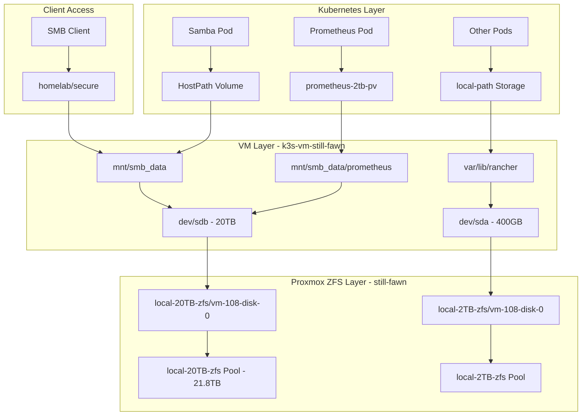
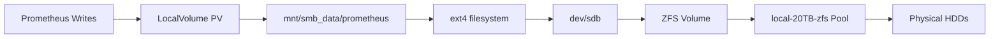
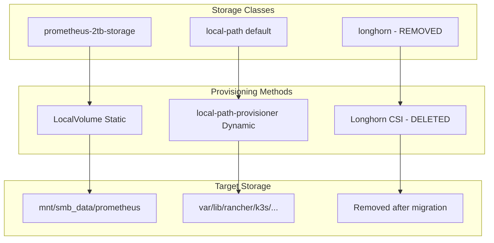
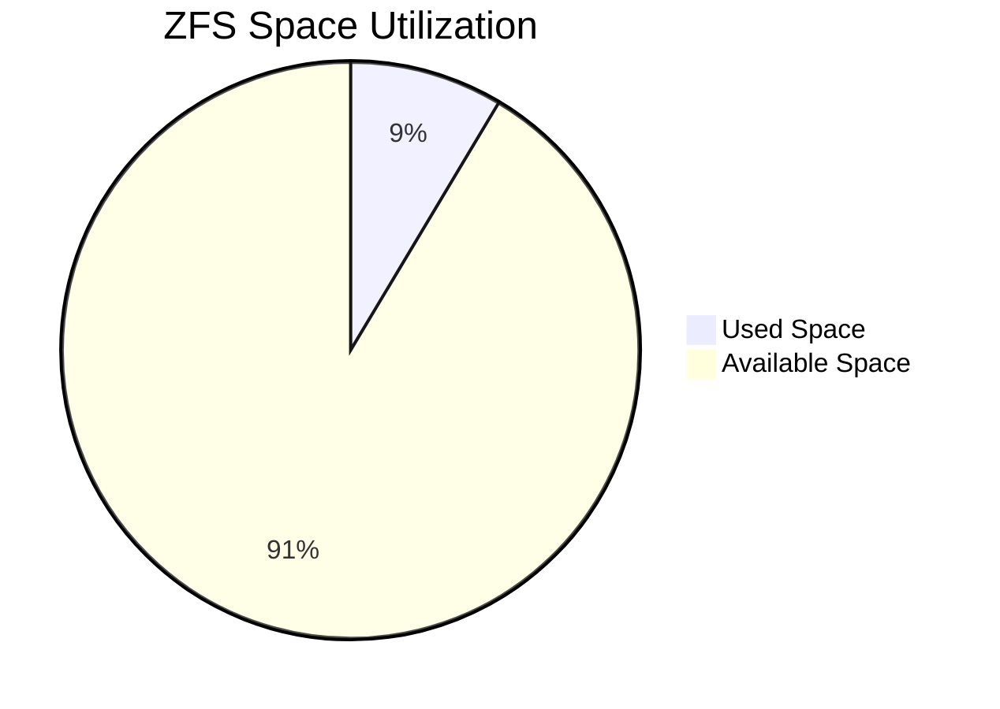
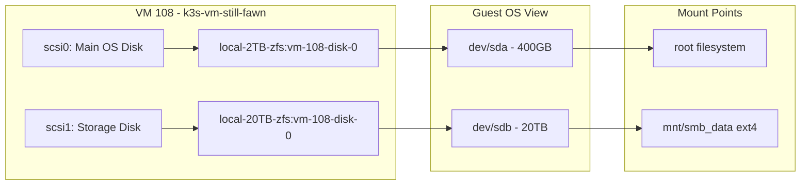
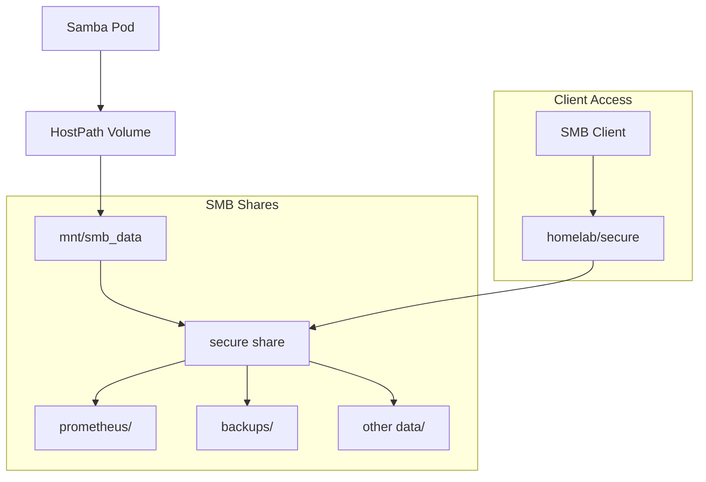
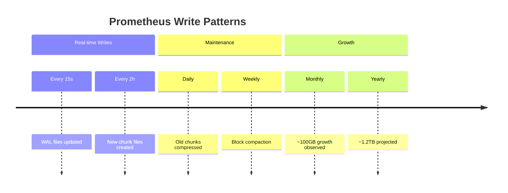
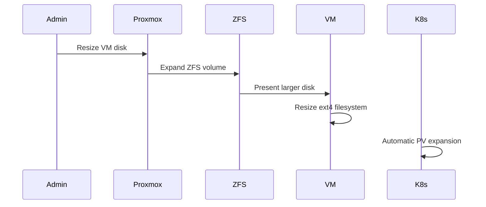

# Homelab Storage Architecture

## Overview

This document describes the complete storage architecture of the homelab infrastructure, focusing on the ZFS-backed storage solution for Kubernetes workloads, particularly Prometheus time-series data storage.

## Architecture Summary

The homelab uses a multi-layered storage approach combining Proxmox ZFS pools, Kubernetes persistent volumes, and Samba file sharing to provide scalable, efficient storage for monitoring and data workloads.

## High-Level Architecture



## Detailed Storage Flow

### Prometheus Storage Path



### Storage Classes and Provisioning



## ZFS Configuration Details

### Pool Configuration

| Property | Value | Description |
|----------|-------|-------------|
| Pool Name | `local-20TB-zfs` | Primary storage pool |
| Total Size | 21.8TB | Raw pool capacity |
| Used Space | 1.87TB | Actually allocated |
| Free Space | 19.9TB | Available for expansion |
| Fragmentation | 0% | Optimal performance |
| Health | ONLINE | Pool status |

### Volume Configuration

| Property | Value | Description |
|----------|-------|-------------|
| Dataset | `local-20TB-zfs/vm-108-disk-0` | VM disk dataset |
| Volume Size | 19.5TB | Allocated to VM |
| Referenced | 1.87TB | Actually used data |
| Block Size | 16K | ZFS volume block size |
| Compression | OFF | Currently disabled |
| Compression Ratio | 1.00x | No compression benefit yet |

### Thin Provisioning Status



**Key Thin Provisioning Features:**
- **Sparse**: Enabled in Proxmox (`sparse 1`)
- **Reservation**: None (thin provisioning active)
- **Reference Reservation**: 19.8TB (space protection)
- **Expandable**: Online expansion supported

## Kubernetes Storage Integration

### Persistent Volume Configuration

```yaml
# prometheus-2tb-pv configuration
apiVersion: v1
kind: PersistentVolume
metadata:
  name: prometheus-2tb-pv
spec:
  capacity:
    storage: 1000Gi
  accessModes:
    - ReadWriteOnce
  persistentVolumeReclaimPolicy: Retain
  storageClassName: prometheus-2tb-storage
  local:
    path: /mnt/smb_data/prometheus
  nodeAffinity:
    required:
      nodeSelectorTerms:
      - matchExpressions:
        - key: kubernetes.io/hostname
          operator: In
          values:
          - k3s-vm-still-fawn
```

### Storage Class Definitions

```yaml
# prometheus-2tb-storage StorageClass
apiVersion: storage.k8s.io/v1
kind: StorageClass
metadata:
  name: prometheus-2tb-storage
provisioner: rancher.io/local-path
volumeBindingMode: WaitForFirstConsumer
reclaimPolicy: Retain
```

## VM Disk Configuration

### Proxmox VM 108 Disks



### VM Configuration Details

```ini
# Relevant VM config from qm config 108
scsi0: local-2TB-zfs:vm-108-disk-0,size=400G
scsi1: local-20TB-zfs:vm-108-disk-0,backup=0,replicate=0,size=20000G
```

## Samba Integration

### Directory Structure

```
/mnt/smb_data/
├── prometheus/                    # Active Prometheus TSDB
│   └── prometheus-db/
│       ├── 01K2JTKDVXXTTHF23219RCSMEB/  # Data blocks
│       └── wal/                   # Write-ahead logs
├── elements_backup/               # Backup data
├── elements_data_backup/
├── opencloud/
└── guest-data.txt
```

### Samba Pod Configuration



## Performance Characteristics

### Storage Tiers

| Storage Tier | Technology | Use Case | Performance |
|--------------|------------|----------|-------------|
| SSD (local-2TB-zfs) | ZFS on SSD | OS, hot data | High IOPS |
| HDD (local-20TB-zfs) | ZFS on HDD | Bulk storage | High throughput |

### Prometheus Storage Patterns



## Optimization Opportunities

### Current State
- **Compression**: OFF (1.00x ratio)
- **Deduplication**: OFF (1.00x ratio)
- **Snapshots**: None configured

### Recommendations

1. **Enable Compression**
   ```bash
   zfs set compression=lz4 local-20TB-zfs/vm-108-disk-0
   ```
   - Expected savings: 30-50% for time-series data
   - No performance impact with lz4

2. **Configure Snapshots**
   ```bash
   # Daily snapshots for backup
   zfs snapshot local-20TB-zfs/vm-108-disk-0@daily-$(date +%Y%m%d)
   ```

3. **Monitor Growth**
   ```bash
   # Track compression effectiveness
   zfs get compressratio local-20TB-zfs/vm-108-disk-0
   ```

## Expansion Procedures

### Online Disk Expansion



### Steps for Expansion

1. **Expand ZFS volume** (if needed)
   ```bash
   zfs set volsize=25T local-20TB-zfs/vm-108-disk-0
   ```

2. **Resize VM disk in Proxmox**
   ```bash
   qm resize 108 scsi1 +5000G
   ```

3. **Expand filesystem in VM**
   ```bash
   resize2fs /dev/sdb
   ```

## Monitoring and Maintenance

### Key Metrics to Monitor

| Metric | Command | Threshold |
|--------|---------|-----------|
| Pool Usage | `zpool list local-20TB-zfs` | < 80% |
| Compression Ratio | `zfs get compressratio` | > 1.20x |
| Fragmentation | `zpool list` | < 30% |
| Health Status | `zpool status` | ONLINE |

### Regular Maintenance Tasks

- **Weekly**: Check ZFS pool health
- **Monthly**: Review storage growth trends
- **Quarterly**: Evaluate compression settings
- **Annually**: Plan capacity expansion

## Troubleshooting

### Common Issues

1. **Prometheus Pod Stuck**
   - Check ZFS pool health
   - Verify mount points in VM
   - Check disk space usage

2. **Performance Issues**
   - Monitor ZFS ARC hit ratio
   - Check for fragmentation
   - Review I/O patterns

3. **Space Issues**
   - Enable compression
   - Clean old snapshots
   - Expand underlying pool

### Emergency Procedures

1. **Pool Degraded**
   ```bash
   zpool status local-20TB-zfs
   zpool clear local-20TB-zfs
   ```

2. **Full Filesystem**
   ```bash
   # Emergency cleanup
   find /mnt/smb_data -name "*.tmp" -delete
   ```

## Related Documentation

- [Prometheus Configuration](../monitoring/prometheus-setup.md)
- [ZFS Administration Guide](../infrastructure/zfs-management.md)
- [Kubernetes Storage Classes](../k8s/storage-classes.md)
- [Backup Procedures](../backup/storage-backup.md)

---

**Last Updated**: 2025-08-14  
**Maintainer**: Homelab Infrastructure Team  
**Review Cycle**: Quarterly
