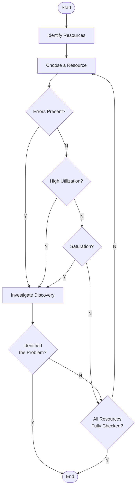
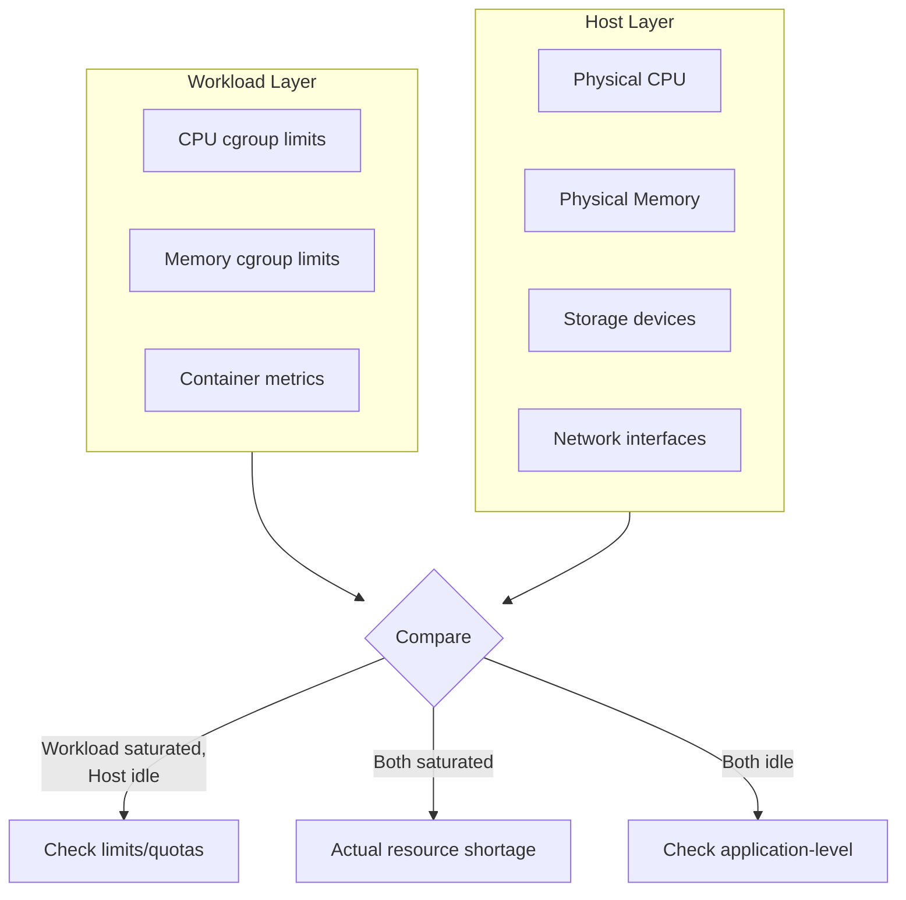
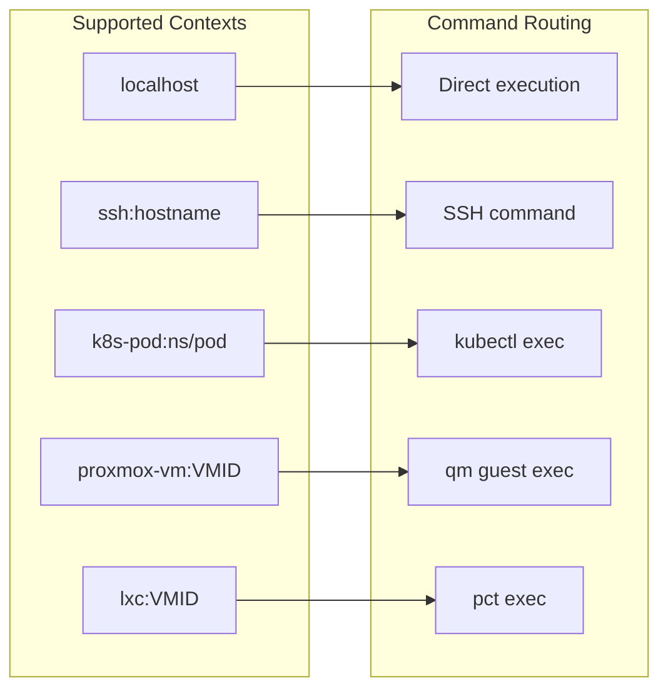
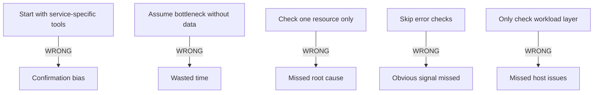
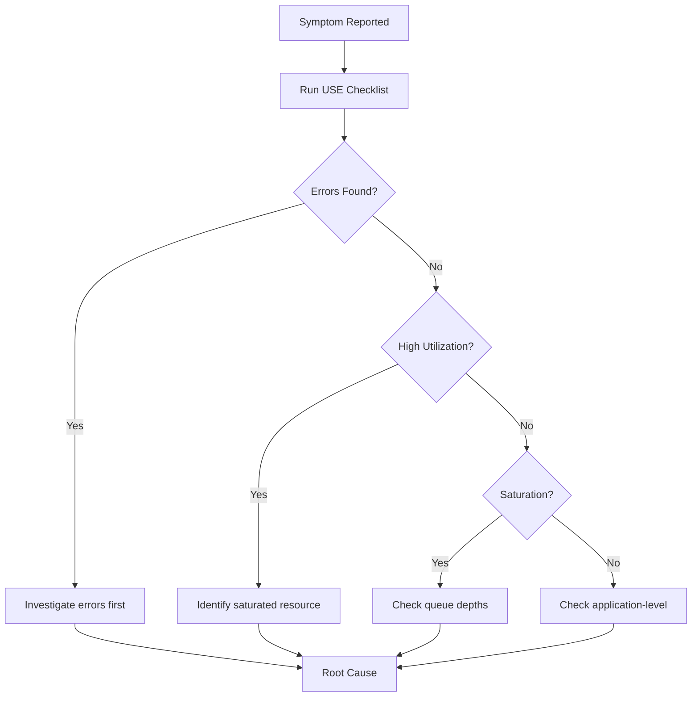

# USE Method Performance Diagnosis - Architecture & Design

## Flowchart (Brendan Gregg's USE Method)



## Key Principles

### 1. Check Order: E → U → S

**Always check in this order for each resource:**

1. **Errors FIRST** - Quickest signal, often points directly to root cause
2. **Utilization** - Is the resource busy? (>70% warrants investigation)
3. **Saturation** - Is work queueing? (any non-zero value is concerning)

### 2. Iterate Through ALL Resources

Do NOT stop at the first anomaly. Complete the checklist for ALL resources:
- CPU
- Memory
- Disk I/O
- Network
- GPU (if present)
- Software resources (file descriptors, mutexes, etc.)

### 3. Layered Analysis

For virtualized/containerized environments, check BOTH layers:



## Resource Checklist

### Physical Resources

| Resource | Utilization | Saturation | Errors |
|----------|-------------|------------|--------|
| **CPU** | % busy time | run queue length | MCE, hardware errors |
| **Memory** | % used, available | swap in/out, page scanning | OOM kills, alloc failures |
| **Disk I/O** | % util (iostat) | queue depth, await time | I/O errors, SMART |
| **Network** | throughput vs capacity | drops, retransmits | interface errors |
| **GPU** | compute %, VRAM % | SM occupancy | XID errors, ECC |

### Software Resources

| Resource | Utilization | Saturation | Errors |
|----------|-------------|------------|--------|
| **File Descriptors** | current vs ulimit | N/A | EMFILE errors |
| **Threads** | active vs max | thread pool queue | fork failures |
| **Connections** | active vs max | connection queue | refused/timeout |

## Execution Contexts



## Anti-Patterns

### What NOT To Do



### Correct Flow



## File Structure

```
scripts/perf/
├── use-checklist.sh        # Main USE method sweep (follows flowchart)
├── quick-triage.sh         # 60-second subset
├── install-crisis-tools.sh # Pre-install diagnostic packages
├── cpu-deep-dive.sh        # Detailed CPU analysis
├── memory-deep-dive.sh     # Detailed memory analysis
├── disk-deep-dive.sh       # Detailed disk I/O analysis
├── network-deep-dive.sh    # Detailed network analysis
├── gpu-deep-dive.sh        # Detailed GPU analysis
├── flame-graph.sh          # Generate CPU/off-CPU flame graphs
├── compare-reports.sh      # Compare JSON reports
├── reports/                # Timestamped JSON outputs
└── flames/                 # Generated flame graph SVGs
```

## References

- [The USE Method](https://www.brendangregg.com/usemethod.html) - Brendan Gregg
- [USE Method Linux Checklist](https://www.brendangregg.com/USEmethod/use-linux.html)
- [Linux Crisis Tools](https://www.brendangregg.com/blog/2024-03-24/linux-crisis-tools.html)
- [60-Second Linux Performance Analysis](https://netflixtechblog.com/linux-performance-analysis-in-60-000-milliseconds-accc10403c55)
