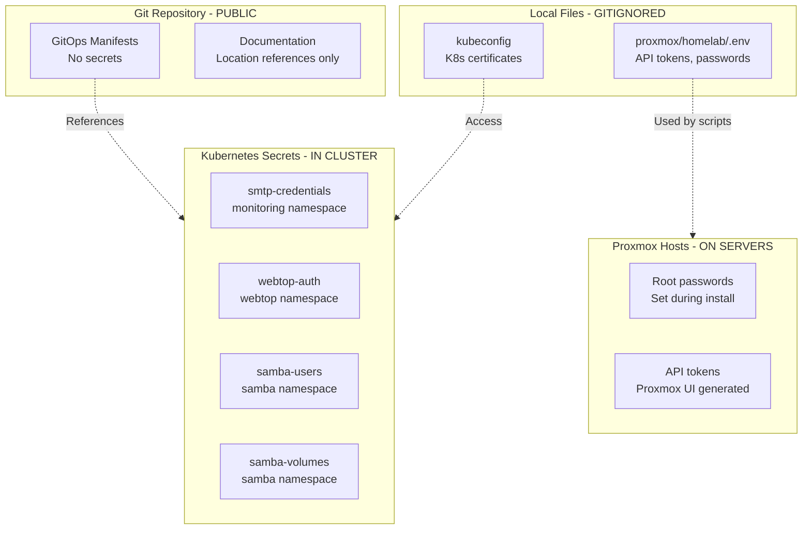

# Credentials and Secrets Location Reference

**Last Updated**: October 21, 2025
**Purpose**: Document WHERE credentials are stored (NOT the actual credentials)

**SECURITY NOTE**: This file is safe to commit to git - it only documents locations, not actual secrets.

## Security Architecture



## Gitignored Files (Local Machine Only)

### proxmox/homelab/.env

**Location**: `/Users/10381054/code/home/proxmox/homelab/.env`
**Gitignored**: ✅ Yes (via `.gitignore`)
**Purpose**: API tokens and credentials for Proxmox automation scripts

**Contents** (keys only, no values):
```bash
# Proxmox API Authentication
API_TOKEN=user!token=<secret>

# Home Assistant API
HA_TOKEN=<long-lived-access-token>

# MAAS Configuration
NODE_1=pve
STORAGE_1=local-zfs
# ... additional node/storage mappings

# SSH Keys
SSH_PUBKEY_PATH=/path/to/id_rsa.pub
```

**How to recreate** (if lost):
1. Proxmox API Token:
   - Login to Proxmox web UI (https://pve.maas:8006)
   - Datacenter → Permissions → API Tokens
   - Create new token for `root@pam`
   - Copy `user!token=<secret>` format

2. Home Assistant Token:
   - Login to Home Assistant
   - Profile → Long-Lived Access Tokens
   - Create new token
   - Copy token value

### ~/kubeconfig

**Location**: `/Users/10381054/kubeconfig` (user home directory)
**Gitignored**: Not in repo (outside repo directory)
**Purpose**: K3s cluster authentication and certificates

**How to retrieve**:
```bash
# From any K3s master node
ssh ubuntu@192.168.4.238 "sudo cat /etc/rancher/k3s/k3s.yaml" > ~/kubeconfig

# Edit server URL to match your setup
# Change: server: https://127.0.0.1:6443
# To:     server: https://192.168.4.238:6443 (or any master node IP)

# Set permissions
chmod 600 ~/kubeconfig

# Test access
export KUBECONFIG=~/kubeconfig
kubectl get nodes
```

**SECURITY NOTE**: This file contains cluster admin certificates - protect it like a password!

## Kubernetes Secrets (In-Cluster Storage)

### monitoring/smtp-credentials

**Purpose**: Email credentials for Grafana alerting
**Keys**: `user`, `pass`
**Used by**: Grafana SMTP configuration

**How to view** (NOT the values, just that it exists):
```bash
KUBECONFIG=~/kubeconfig kubectl get secret smtp-credentials -n monitoring
```

**How to recreate** (if lost):
```bash
# Replace with your actual SMTP credentials
KUBECONFIG=~/kubeconfig kubectl create secret generic smtp-credentials \
  --from-literal=user='<your-email>' \
  --from-literal=pass='<your-password>' \
  -n monitoring
```

**Configuration reference**: `gitops/clusters/homelab/infrastructure/monitoring/monitoring-values.yaml:73-96`

### webtop/webtop-auth

**Purpose**: Webtop user password
**Keys**: `password`
**Used by**: Webtop container environment variable

**How to recreate**:
```bash
# Replace with desired password
KUBECONFIG=~/kubeconfig kubectl create secret generic webtop-auth \
  --from-literal=password='<your-password>' \
  -n webtop
```

**Configuration reference**: `gitops/clusters/homelab/apps/webtop/deployment.yaml:55-59`

### samba/samba-users

**Purpose**: Samba user accounts and passwords
**Keys**: Environment variables for Samba container
**Used by**: Samba container configuration

**How to view keys**:
```bash
KUBECONFIG=~/kubeconfig kubectl get secret samba-users -n samba -o jsonpath='{.data}' | jq 'keys'
```

**Example structure**:
```bash
# Create Samba users secret (example format)
KUBECONFIG=~/kubeconfig kubectl create secret generic samba-users \
  --from-literal=ACCOUNT_user1=<username> \
  --from-literal=UID_user1=1000 \
  --from-literal=GID_user1=1000 \
  -n samba
```

**Configuration reference**: `gitops/clusters/homelab/apps/samba/deployment.yaml:45-46`

### samba/samba-volumes (ConfigMap, not secret)

**Purpose**: Samba share definitions
**Type**: ConfigMap (not sensitive, but configuration)
**Used by**: Samba container configuration

**How to view**:
```bash
KUBECONFIG=~/kubeconfig kubectl get configmap samba-volumes -n samba -o yaml
```

**Configuration reference**: `gitops/clusters/homelab/apps/samba/deployment.yaml:47-48`

## Proxmox Credentials (On Servers)

### Root Passwords

**Location**: Set during Proxmox VE installation
**Storage**: `/etc/shadow` on each Proxmox host (hashed)
**Hosts**:
- pve.maas (192.168.4.122)
- chief-horse.maas (192.168.4.19)
- pumped-piglet.maas (192.168.4.175)
- fun-bedbug.maas (192.168.4.172)

**If forgotten**: Use Proxmox recovery console or reinstall

### Proxmox API Tokens

**Location**: Datacenter → Permissions → API Tokens (Proxmox web UI)
**Format**: `user!token=<secret>`
**Purpose**: API access for automation scripts

**How to create**:
1. Login to Proxmox web UI: https://<host>.maas:8006
2. Navigate: Datacenter → Permissions → API Tokens
3. Click "Add" button
4. User: `root@pam`
5. Token ID: `automation` (or any descriptive name)
6. Privilege Separation: Unchecked (use user permissions)
7. Copy token in format: `root@pam!automation=xxxxxxxx-xxxx-xxxx-xxxx-xxxxxxxxxxxx`

**Storage**: Copy to `proxmox/homelab/.env` as `API_TOKEN=<value>`

## Cloud-Init Passwords

### K3s VM User Passwords

**User**: `ubuntu` (on all K3s VMs)
**Location**: Set via cloud-init `cipassword` parameter
**Visible in**: `qm config <vmid>` shows as `**********`

**How it was set** (example for VM 107):
```bash
# During VM creation
qm set 107 --cipassword '<password>'
```

**Security note**: Password authentication may be disabled in favor of SSH keys.

**SSH key authentication**: All VMs have SSH keys injected via cloud-init `sshkeys` parameter.

## Service Default Credentials

### Grafana

**URL**: http://grafana.app.homelab
**Default Username**: `admin`
**Default Password**: `admin`
**Location in config**: `gitops/clusters/homelab/infrastructure/monitoring/monitoring-values.yaml:5`

**IMPORTANT**: Change password on first login!

**How to reset** (if forgotten):
```bash
# Get Grafana pod name
KUBECONFIG=~/kubeconfig kubectl get pods -n monitoring | grep grafana

# Reset admin password inside pod
KUBECONFIG=~/kubeconfig kubectl exec -n monitoring <grafana-pod-name> -c grafana -- grafana-cli admin reset-admin-password <new-password>
```

### Ollama

**Authentication**: None (no password required)
**Access**: Internal network only (192.168.4.0/24)
**API**: No authentication required

### Stable Diffusion WebUI

**Authentication**: None (no password required)
**Access**: Internal network only

### Webtop

**Username**: `gshiva` (configured in deployment)
**Password**: Stored in Kubernetes Secret `webtop-auth`
**SSH Access**: Via SSH keys (not password)
**RDP Access**: Uses same password as HTTP login

**Configuration reference**: `gitops/clusters/homelab/apps/webtop/deployment.yaml:53-60`

### Samba

**Users**: Defined in Kubernetes Secret `samba-users`
**Access**: SMB protocol (port 445, 139)
**No anonymous access**: Authentication required

## SSH Keys

### Proxmox Host Keys

**Location**: Injected into all K3s VMs via cloud-init
**Format**: Multiple `sshkeys` in cloud-init configuration
**Purpose**: Password-less SSH from Proxmox hosts to VMs

**Example hosts that can SSH to VMs**:
- root@pve
- root@chief-horse
- root@pumped-piglet
- root@fun-bedbug
- User workstation (10381054@CA235-M-9XQQL9V)
- Windows machine (gshiv@DESKTOP-78OT656)
- Claude Code automation (claude-code@windows)

**View authorized keys in VM**:
```bash
ssh ubuntu@192.168.4.210 "cat ~/.ssh/authorized_keys"
```

### Workstation SSH Keys

**Location**: `~/.ssh/` on local machine
**Key files**:
- `id_rsa` / `id_rsa.pub` (RSA key)
- `id_ed25519` / `id_ed25519.pub` (Ed25519 key)
- `id_ed25519_pve` / `id_ed25519_pve.pub` (Proxmox-specific)
- `id_ed25519_windows` / `id_ed25519_windows.pub` (Windows-specific)

**SSH Config**: `~/.ssh/config` has `*.maas` wildcard for automatic key selection

**Configuration reference**: `CLAUDE.md` documents SSH patterns

## Home Assistant

**URL**: http://<haos-ip>:8123 (check DHCP for VM 116 IP)
**Initial Setup**: First-time web wizard creates admin account
**API Token**: Generated via Home Assistant UI → Profile → Long-Lived Access Tokens

**API Token Storage**: `proxmox/homelab/.env` as `HA_TOKEN=<value>`

**If forgotten**: Login to web UI and generate new token

## OPNsense Firewall

**URL**: https://192.168.4.1
**Default Username**: `root` (check OPNsense documentation)
**Default Password**: Set during initial setup

**Not stored in this repository**: Managed separately

## Credential Backup Strategy

### What to backup manually (NOT in git):

1. **proxmox/homelab/.env** - Copy to secure password manager
2. **~/kubeconfig** - Copy to secure location (or regenerate from K3s)
3. **Kubernetes secrets** - Export and encrypt:
   ```bash
   # Export all secrets to encrypted backup
   KUBECONFIG=~/kubeconfig kubectl get secrets --all-namespaces -o yaml > k8s-secrets-backup.yaml
   # Encrypt this file and store securely (NOT in git)
   ```

4. **Proxmox root passwords** - Store in password manager
5. **Grafana admin password** - Store in password manager after changing from default
6. **Home Assistant credentials** - Store in password manager

### What auto-recovers from git:

1. **All Kubernetes manifests** - Flux auto-applies from GitHub
2. **All configuration files** - Stored in GitOps repo
3. **VM configurations** - Documented in `proxmox-vm-configurations.md`

## Credential Rotation

### Regular rotation recommended (every 90 days):

- [ ] Proxmox API tokens
- [ ] Home Assistant API token
- [ ] Grafana admin password
- [ ] SMTP credentials (if using personal account)

### No rotation needed:

- SSH keys (unless compromised)
- Kubernetes certificates (auto-rotated by K3s)

## Emergency Access

**If all credentials are lost**:

1. **K3s cluster**: SSH to any master node, retrieve kubeconfig
   ```bash
   ssh ubuntu@192.168.4.238 "sudo cat /etc/rancher/k3s/k3s.yaml"
   ```

2. **Proxmox**: Use host console (physical/IPMI access), reset root password
   ```bash
   # From Proxmox recovery console
   passwd root
   ```

3. **Grafana**: Reset admin password via kubectl exec (see above)

4. **Kubernetes secrets**: View base64-encoded values:
   ```bash
   KUBECONFIG=~/kubeconfig kubectl get secret <secret-name> -n <namespace> -o jsonpath='{.data.<key>}' | base64 -d
   ```

## Related Documentation

- [Homelab Service Inventory](homelab-service-inventory.md) - Service URLs and access methods
- [Proxmox VM Configurations](proxmox-vm-configurations.md) - VM configuration backups
- [K3s Node Addition Blueprint](../runbooks/k3s-node-addition-blueprint.md) - K3s token retrieval

## Tags

credentials, secrets, security, kubernetes-secrets, ssh-keys, api-tokens, passwords, authentication, disaster-recovery, security-architecture, credential-management

## Version History

- **v1.0** (Oct 21, 2025): Initial credential location documentation
