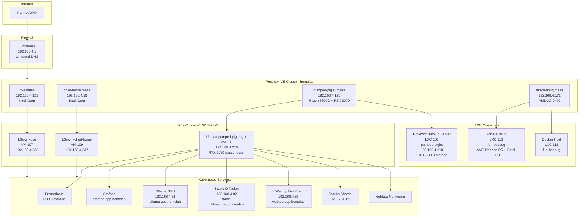

# Homelab Service Inventory

**Last Updated**: October 23, 2025
**Cluster Status**: 3-node K3s cluster + PBS operational (after still-fawn.maas failure)

## Network Architecture Overview

```
┌─────────────────────────────────────────────────────────────────────────────────┐
│                            Home Network (192.168.4.0/24)                        │
│                                                                                 │
│  ┌─────────────┐         ┌──────────────────────────────────────────────┐     │
│  │  OPNsense   │────────▶│            MetalLB Address Pool              │     │
│  │   Firewall  │         │         192.168.4.50 - 192.168.4.130         │     │
│  │ 192.168.4.1 │         └──────────────────────────────────────────────┘     │
│  │             │                                                               │
│  │ Unbound DNS │──▶ homelab domain resolution                                 │
│  └─────────────┘                                                               │
│                                                                                 │
│  ┌─────────────────────────────────────────────────────────────────────────┐  │
│  │                      Traefik Ingress Controller                         │  │
│  │                         192.168.4.80 (HTTP/HTTPS)                       │  │
│  │  ┌──────────────────────────────────────────────────────────────────┐  │  │
│  │  │ *.app.homelab → routes to K8s services via Ingress             │  │  │
│  │  └──────────────────────────────────────────────────────────────────┘  │  │
│  └─────────────────────────────────────────────────────────────────────────┘  │
│                                                                                 │
└─────────────────────────────────────────────────────────────────────────────────┘
```

## Infrastructure Diagram



## Service Access URLs

### Web Interfaces (via Traefik Ingress - 192.168.4.80)

| Service | URL | Access Method | Notes |
|---------|-----|---------------|-------|
| **Grafana** | http://grafana.app.homelab | Browser | Monitoring dashboards, alerting |
| **Ollama** | http://ollama.app.homelab | Browser/API | LLM inference API |
| **Stable Diffusion** | http://stable-diffusion.app.homelab | Browser | AI image generation WebUI |
| **Webtop** | http://webtop.app.homelab | Browser | Ubuntu Xfce desktop in browser |
| **Netdata** | http://netdata.k8s.local | Browser | Real-time metrics (local access) |

### Direct LoadBalancer Access (MetalLB IPs)

| Service | IP Address | Ports | Protocol | Notes |
|---------|------------|-------|----------|-------|
| **Traefik** | 192.168.4.80 | 80, 443 | HTTP/HTTPS | Main ingress controller |
| **Ollama** | 192.168.4.81 | 80 | HTTP | Direct API access |
| **Stable Diffusion** | 192.168.4.82 | 80 | HTTP | Direct WebUI access |
| **Webtop** | 192.168.4.83 | 3000, 3001, 22, 3389 | HTTP/HTTPS/SSH/RDP | Multi-protocol access |
| **Samba** | 192.168.4.120 | 445, 139 | SMB | Network file shares |

### NodePort Services

| Service | Node IP | NodePort | Internal Port | Notes |
|---------|---------|----------|---------------|-------|
| **Grafana** | Any node | 32080 | 80 | Fallback access |
| **Invoke AI** | Any node | 30090 | 9090 | AI image generation (scaled down) |

### SSH Access

```bash
# Proxmox Hosts
ssh root@pve.maas                    # 192.168.4.122
ssh root@chief-horse.maas            # 192.168.4.19
ssh root@pumped-piglet.maas          # 192.168.4.175
ssh root@fun-bedbug.maas             # 192.168.4.172

# K3s VMs (ubuntu user)
ssh ubuntu@192.168.4.238             # k3s-vm-pve
ssh ubuntu@192.168.4.237             # k3s-vm-chief-horse
ssh ubuntu@192.168.4.210             # k3s-vm-pumped-piglet-gpu

# Webtop (via LoadBalancer)
ssh gshiva@192.168.4.83              # Webtop development environment

# LXC Containers
ssh root@192.168.4.<frigate-ip>      # Frigate NVR (LXC 113)
ssh root@192.168.4.<docker-ip>       # Docker host (LXC 112)
```

### RDP Access

```bash
# Webtop RDP
xfreerdp /v:192.168.4.83:3389 /u:gshiva
```

### Samba Shares

```bash
# Mount Samba share
smbclient -L //192.168.4.120

# macOS Finder
smb://192.168.4.120
```

## Default Credentials

**SECURITY NOTE**: This section documents WHERE credentials are stored, NOT the actual credentials.

### Grafana
- **URL**: http://grafana.app.homelab
- **Default Username**: `admin`
- **Default Password**: `admin` (CHANGE ON FIRST LOGIN)
- **Location**: `gitops/clusters/homelab/infrastructure/monitoring/monitoring-values.yaml:5`
- **SMTP Credentials**: Kubernetes Secret `smtp-credentials` in `monitoring` namespace

### Webtop
- **URL**: http://webtop.app.homelab
- **Username**: `gshiva`
- **Password**: Kubernetes Secret `webtop-auth` in `webtop` namespace
- **SSH Key**: ConfigMap `webtop-init-scripts` (placeholder for your public key)

### Ollama
- **Authentication**: None (internal network only)
- **API Access**: No authentication required

### Stable Diffusion WebUI
- **Authentication**: None (internal network only)

### Samba
- **Users**: Kubernetes Secret `samba-users` in `samba` namespace
- **Shares**: ConfigMap `samba-volumes` in `samba` namespace

### Proxmox VE
- **Web UI**: https://pve.maas:8006, https://chief-horse.maas:8006, etc.
- **Root Password**: Set during installation (NOT stored in git)
- **API Tokens**: Stored in `proxmox/homelab/.env` (gitignored)

### K3s Cluster
- **Kubeconfig**: `~/kubeconfig` (contains cluster certificates)
- **K3s Token**: Stored on first master node (`/var/lib/rancher/k3s/server/token`)

### Home Assistant
- **Web UI**: Configured on chief-horse (VM 116 - haos16.0)
- **API Token**: Stored in `proxmox/homelab/.env` as `HA_TOKEN` (gitignored)

## Service-Specific Configuration

### Ollama GPU

**Pod**: `ollama-gpu-696df7df9d-gc7j9` (ollama namespace)
**Node**: k3s-vm-pumped-piglet-gpu
**GPU**: NVIDIA RTX 3070 (passthrough from Proxmox)

**API Examples**:
```bash
# Test inference
curl -X POST http://192.168.4.81/api/generate \
  -d '{"model":"llama2","prompt":"Hello, world!"}'

# List models
curl http://192.168.4.81/api/tags

# Via ingress
curl -X POST http://ollama.app.homelab/api/generate \
  -d '{"model":"llama2","prompt":"Hello, world!"}'
```

**Storage**: PVC `ollama-models` (50Gi) on k3s-vm-pumped-piglet-gpu

### Stable Diffusion WebUI

**Pod**: `stable-diffusion-webui-869dd9f845-4d5r2` (stable-diffusion namespace)
**Node**: k3s-vm-pumped-piglet-gpu
**GPU**: NVIDIA RTX 3070 (1 GPU resource)

**Storage**:
- Models: PVC `sd-models` (20Gi)
- Outputs: PVC `sd-outputs` (10Gi)
- Extensions: PVC `sd-extensions` (5Gi)
- Localizations: PVC `sd-localizations` (1Gi)

**Access**: http://stable-diffusion.app.homelab or http://192.168.4.82

### Prometheus & Grafana

**Prometheus Pod**: `prometheus-kube-prometheus-stack-prometheus-0` (monitoring namespace)
**Grafana Pod**: `kube-prometheus-stack-grafana-75bd975c45-zxpjn` (monitoring namespace)
**Node**: k3s-vm-pumped-piglet-gpu

**Storage**:
- Prometheus: 500Gi PVC on `/mnt/smb_data/prometheus` (20TB ZFS pool)
- Grafana: 10Gi PVC (local-path storage)

**Retention**: 30 days of raw metrics

**External Targets**:
- Proxmox node-exporters: pve, chief-horse, fun-bedbug (port 9100)
- Proxmox PVE exporter: pve (port 9221)

**Alerting**:
- Email alerts via SMTP (smtp.mail.yahoo.com:587)
- Credentials in Kubernetes Secret `smtp-credentials`

### Webtop Development Environment

**Pod**: `webtop-6c7cdff88-275z7` (webtop namespace)
**Node**: k3s-vm-pumped-piglet-gpu
**GPU**: NVIDIA RTX 3070 (1 GPU resource)

**Features**:
- Ubuntu Xfce desktop in browser
- Docker-in-Docker (dind sidecar)
- SSH server (port 22)
- xRDP server (port 3389)
- Code Server with Python, Poetry, Node.js

**Storage**: PVC `webtop-config` (50Gi)

**Access Methods**:
- HTTP: http://webtop.app.homelab or http://192.168.4.83:3000
- HTTPS: https://webtop.app.homelab or https://192.168.4.83:3001
- SSH: `ssh gshiva@192.168.4.83`
- RDP: `192.168.4.83:3389`

### Samba File Server

**Pod**: `samba-7b59768d64-66q5f` (samba namespace)
**Node**: k3s-vm-pumped-piglet-gpu

**Storage**: HostPath `/mnt/smb_data` (symlink to 18TB disk at `/mnt/samba-storage`)

**Access**:
- SMB: `smb://192.168.4.120`
- Ports: 445 (SMB), 139 (NetBIOS)

**Configuration**:
- Users: Kubernetes Secret `samba-users`
- Volumes: ConfigMap `samba-volumes`

### Frigate NVR

**Type**: LXC Container 113 on fun-bedbug.maas
**Hardware**: AMD Radeon R5 (renderD128), Google Coral TPU (USB)
**Storage**: 500G mount at `/media` (local-3TB-backup)

**Access**: http://<frigate-ip>:5000 (check fun-bedbug DHCP lease)

**Features**:
- Object detection with Coral TPU
- AMD GPU hardware acceleration
- Face recognition (requires Frigate 0.16.0+, waiting for PVE Helper Scripts update)

### Netdata Monitoring

**Pods**:
- `netdata-parent-6f677c9b8d-h7jxp` (parent dashboard)
- `netdata-k8s-state-d55cf59bd-6s467` (k8s state collector)
- `netdata-child-*` (DaemonSet on each node)

**Node**: All running on k3s-vm-pumped-piglet-gpu (parent)

**Access**: http://netdata.k8s.local (local network only)

## Storage Configuration

### Proxmox Storage Pools

```
┌─────────────────────────────────────────────────────────────────┐
│                    Proxmox Storage Pools                        │
├─────────────────────────────────────────────────────────────────┤
│                                                                 │
│  pve.maas (192.168.4.122)                                      │
│  ├─ local-zfs         : 1TB ZFS pool (VM disks)               │
│  └─ local             : Local directory (snippets, ISOs)       │
│                                                                 │
│  chief-horse.maas (192.168.4.19)                               │
│  ├─ local-256-gb-zfs  : 256GB ZFS pool (VM disks)             │
│  └─ local             : Local directory                        │
│                                                                 │
│  pumped-piglet.maas (192.168.4.175)                            │
│  ├─ local-2TB-zfs     : 2TB ZFS pool (VM disks)               │
│  ├─ local-20TB-zfs    : 20TB ZFS pool (large storage)         │
│  │   └─ VM 105 scsi1  : 18TB disk for Samba/Prometheus       │
│  └─ local             : Local directory                        │
│                                                                 │
│  fun-bedbug.maas (192.168.4.172)                               │
│  ├─ local             : 1TB local directory (LXC containers)   │
│  └─ local-3TB-backup  : 3TB ZFS pool (Frigate recordings)     │
│                                                                 │
└─────────────────────────────────────────────────────────────────┘
```

### K3s Storage Classes

| Storage Class | Provisioner | Use Case | Nodes |
|---------------|-------------|----------|-------|
| `local-path` | rancher.io/local-path | Default dynamic storage | All nodes |
| `prometheus-2tb-storage` | rancher.io/local-path | Prometheus long-term storage | k3s-vm-pumped-piglet-gpu only |

### VM 105 Storage Layout (k3s-vm-pumped-piglet-gpu)

```
VM 105 Disks:
├─ scsi0: 1800G (local-2TB-zfs)      → Root filesystem
└─ scsi1: 18000G (local-20TB-zfs)    → /mnt/samba-storage (ext4)
    └─ /mnt/smb_data (symlink)       → Samba shares + Prometheus data
        ├─ prometheus/               → Prometheus TSDB (500Gi PVC)
        └─ (other Samba shares)
```

## GitOps Configuration

**Repository**: https://github.com/homeiac/home
**Branch**: `master` (auto-deployed via Flux)
**Flux Version**: Latest
**Reconciliation Interval**: 1m

### Key GitOps Paths

```
gitops/clusters/homelab/
├── apps/
│   ├── ollama/              → Ollama GPU deployment
│   ├── stable-diffusion/    → Stable Diffusion WebUI
│   ├── webtop/              → Webtop dev environment
│   ├── samba/               → Samba file server
│   └── netdata/             → Netdata monitoring
├── infrastructure/
│   ├── monitoring/          → Prometheus + Grafana (kube-prometheus-stack)
│   │   ├── monitoring-values.yaml
│   │   └── prometheus-storage-class.yaml
│   └── metallb/             → MetalLB LoadBalancer
└── kustomization.yaml       → Main apps/infrastructure manifest
```

## Hardware Specifications

### Proxmox Hosts

**pve.maas (192.168.4.122)**
- CPU: Intel Xeon (details via `lshw`)
- RAM: Unknown (check via `lshw`)
- Storage: 1TB ZFS
- Network: 2.5GbE vmbr25gbe + 1GbE vmbr0

**chief-horse.maas (192.168.4.19)**
- CPU: Intel Xeon (details via `lshw`)
- RAM: Unknown (check via `lshw`)
- Storage: 256GB ZFS
- Network: 2.5GbE vmbr0 (USB adapter enx803f5df8d628)

**pumped-piglet.maas (192.168.4.175)**
- CPU: AMD Ryzen 5 5600G
- GPU: NVIDIA RTX 3070 (passthrough to VM 105)
- RAM: Unknown (check via `lshw`)
- Storage: 2TB ZFS + 20TB ZFS
- Network: 2.5GbE vmbr0 (USB adapter enx803f5df8d628)

**fun-bedbug.maas (192.168.4.172)**
- CPU: AMD A9-9400 (low-power)
- GPU: AMD Radeon R5 (integrated, used by Frigate)
- TPU: Google Coral USB (passed to Frigate LXC 113)
- RAM: Unknown (check via `lshw`)
- Storage: 1TB local + 3TB ZFS
- Network: 2.5GbE vmbr0 (USB adapter)

### K3s VMs

**VM 107 (k3s-vm-pve)**
- Proxmox Host: pve.maas
- CPU: 2 cores (host CPU type)
- RAM: 4000 MB
- Disk: 200GB (local-zfs)
- Network: vmbr25gbe + vmbr0 (dual NIC)

**VM 109 (k3s-vm-chief-horse)**
- Proxmox Host: chief-horse.maas
- CPU: 2 cores (host CPU type)
- RAM: 4000 MB
- Disk: 200GB (local-256-gb-zfs)
- Network: vmbr0

**VM 105 (k3s-vm-pumped-piglet-gpu)**
- Proxmox Host: pumped-piglet.maas
- CPU: 10 cores (host CPU type)
- RAM: 49152 MB (48 GB)
- Disk 1: 1800GB (local-2TB-zfs, scsi0)
- Disk 2: 18000GB (local-20TB-zfs, scsi1)
- GPU: RTX 3070 (PCI passthrough 0000:b3:00.0)
- Machine: Q35 with UEFI
- Network: vmbr0

## Monitoring and Alerting

### Prometheus Targets

**Kubernetes Internal**:
- K3s nodes (via node-exporter DaemonSet)
- Kubernetes API server
- Kube-state-metrics
- All pods with Prometheus annotations

**External Targets** (static_configs):
- `192.168.4.122:9100` - pve node-exporter
- `192.168.4.17:9100` - still-fawn node-exporter (OFFLINE)
- `192.168.4.19:9100` - chief-horse node-exporter
- `192.168.4.172:9100` - fun-bedbug node-exporter
- `192.168.4.122:9221` - pve Proxmox PVE exporter

### Grafana Dashboards

**Default Dashboards** (from kube-prometheus-stack):
- Kubernetes Cluster Monitoring
- Node Exporter Full
- Prometheus Stats
- Alertmanager Overview

**Email Alerting**:
- SMTP: smtp.mail.yahoo.com:587
- From: g_skumar@yahoo.com
- Credentials: Kubernetes Secret `smtp-credentials` (user/pass keys)

### Alert Rules

**Infrastructure Alerts**:
- Node down
- High CPU/memory usage
- Disk space warnings
- Pod crash loops
- PVC capacity alerts

## Backup and Recovery

**GitOps Backups**:
- All Kubernetes manifests in GitHub: https://github.com/homeiac/home
- Flux auto-applies from `master` branch

**Prometheus Data**:
- 30-day retention on 500Gi PVC
- Location: `/mnt/smb_data/prometheus` on VM 105
- Manual backups: `ssh ubuntu@192.168.4.210 "sudo tar -czf /tmp/prometheus-backup.tar.gz -C /mnt/smb_data prometheus"`

**Grafana Dashboards**:
- Stored in GitOps manifests (auto-restored)
- Manual export: Settings → JSON Model in Grafana UI

**VM Backups**:
- **Proxmox Backup Server (PBS)**: ✅ Operational
  - Location: LXC 103 on pumped-piglet.maas
  - Web UI: https://proxmox-backup-server.maas:8007 (192.168.4.218)
  - Storage: homelab-backup datastore (1.3TB used / 21TB total)
  - Existing backups: 5 containers + 6 VMs
  - Integration: Active in Proxmox VE storage config
- Manual snapshots: `qm snapshot <vmid> <snapshot-name>`
- Automated backups: Configure via Datacenter → Backup in Proxmox

**LXC Backups**:
- PBS datastore: homelab-backup (primary backup target)
- Frigate: Recordings on local-3TB-backup ZFS pool
- Docker containers: Managed via docker-compose files (not in this repo)

## Troubleshooting Quick Reference

### Common Commands

```bash
# K3s cluster status
KUBECONFIG=~/kubeconfig kubectl get nodes -o wide
KUBECONFIG=~/kubeconfig kubectl get pods -A

# Flux reconciliation
KUBECONFIG=~/kubeconfig flux get kustomizations
KUBECONFIG=~/kubeconfig flux reconcile kustomization flux-system --with-source

# Check pod logs
KUBECONFIG=~/kubeconfig kubectl logs -n <namespace> <pod-name>

# Check service endpoints
KUBECONFIG=~/kubeconfig kubectl get svc -A
KUBECONFIG=~/kubeconfig kubectl get ingress -A

# Proxmox VM management
ssh root@<host>.maas "qm list"
ssh root@<host>.maas "qm status <vmid>"
ssh root@<host>.maas "qm start <vmid>"

# Check Proxmox cluster status
ssh root@pve.maas "pvecm status"

# GPU passthrough verification
ssh ubuntu@192.168.4.210 "nvidia-smi"
KUBECONFIG=~/kubeconfig kubectl describe node k3s-vm-pumped-piglet-gpu | grep nvidia.com/gpu
```

### Service-Specific Troubleshooting

**Grafana not accessible**:
1. Check pod status: `kubectl get pods -n monitoring`
2. Check NodePort: `kubectl get svc -n monitoring kube-prometheus-stack-grafana`
3. Verify DNS: `nslookup grafana.app.homelab`
4. Check Traefik ingress: `kubectl get ingress -n monitoring grafana-ingress`

**Ollama inference failures**:
1. Check GPU allocation: `kubectl describe pod -n ollama <pod-name> | grep nvidia.com/gpu`
2. Verify GPU on node: `ssh ubuntu@192.168.4.210 "nvidia-smi"`
3. Check pod logs: `kubectl logs -n ollama <pod-name>`
4. Test API: `curl http://192.168.4.81/api/tags`

**Samba shares not accessible**:
1. Check pod status: `kubectl get pods -n samba`
2. Verify LoadBalancer IP: `kubectl get svc -n samba samba-lb`
3. Check HostPath mount: `ssh ubuntu@192.168.4.210 "ls -la /mnt/smb_data"`
4. Test connection: `smbclient -L //192.168.4.120`

**Prometheus not scraping**:
1. Check StatefulSet: `kubectl get statefulset -n monitoring`
2. Verify PVC: `kubectl get pvc -n monitoring`
3. Check targets: Access Grafana → Prometheus → Status → Targets
4. Verify external exporters: `curl http://192.168.4.122:9100/metrics`

## Related Documentation

- [K3s Workload Migration Runbook](../runbooks/k3s-workload-migration-after-still-fawn-loss.md)
- [GPU Passthrough Runbook](../runbooks/proxmox-gpu-passthrough-k3s-node.md)
- [Monitoring Setup Guide](../md/monitoring-alerting-guide.md)
- [K3s Node Addition Blueprint](../runbooks/k3s-node-addition-blueprint.md)
- [Proxmox 2.5GbE USB Adapter Configuration](../runbooks/proxmox-usb-2.5gbe-adapter-configuration.md)

## Tags

kubernetes, k8s, kubernettes, proxmox, k3s, flux, fluxcd, gitops, monitoring, prometheus, promethius, grafana, grafanna, ollama, stable-diffusion, gpu, nvidia, rtx-3070, metallb, traefik, samba, webtop, frigate, nvr, homelab, infrastructure, service-inventory, network-diagram, architecture

## Version History

- **v1.0** (Oct 21, 2025): Initial comprehensive inventory after still-fawn.maas failure and 3-node migration
