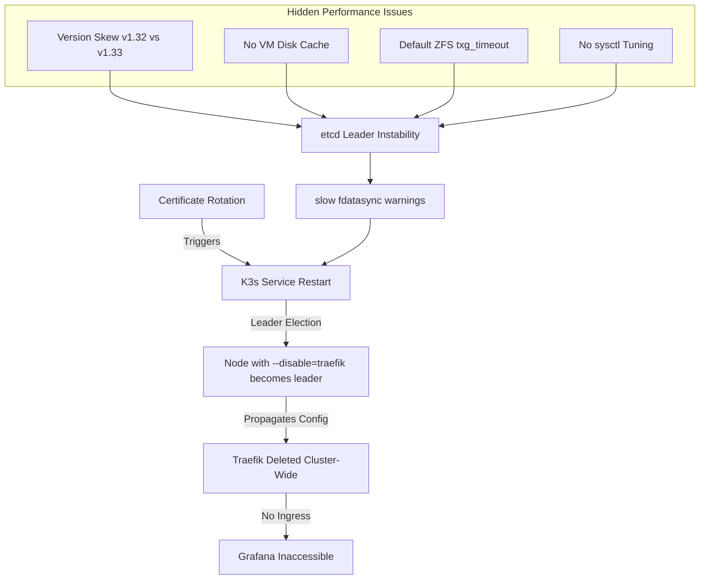
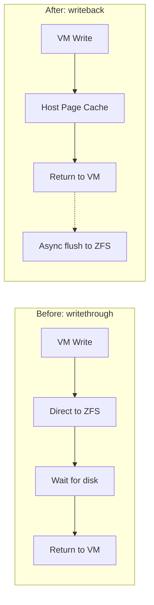

# My K3s Cluster Was Dying and I Had No Idea Why (Until I Found This)

*How a single misconfigured flag cascaded into cluster-wide chaos, and the 5 tweaks that saved my homelab*

---

```
    ____  _____ ____ ___    ____  _____
   / __ \/ ___// __ \__ \  / __ \/ ___/
  / / / /\__ \/ / / /_/ / / / / /\__ \
 / /_/ /___/ / /_/ / __/ / /_/ /___/ /
/_____//____/_____/____/ \____//____/

  When etcd goes slow, everything goes...

         +---------+
         |  etcd   |  "slow fdatasync"
         | cluster |  <- 500ms latency
         +---------+
              |
    +---------+---------+
    |         |         |
  node1    node2     node3
   v1.32    v1.32    v1.33   <- SKEW!

        DISASTER INCOMING
```

## The Night Everything Broke

It started innocently enough. Grafana stopped loading. "Probably just a pod restart," I thought.

Then kubectl started timing out. Then the entire cluster became unresponsive.

The culprit? **A ghost from my past self.**

## The Root Cause: Death by a Thousand Cuts

After hours of investigation, I discovered a perfect storm of performance killers:



## The Smoking Gun

Deep in the K3s logs, I found this:

```
etcd: slow fdatasync, took 1.2s, expected 100ms
etcd: slow fdatasync, took 850ms, expected 100ms
etcd: leader changed from X to Y
etcd: slow fdatasync, took 2.1s, expected 100ms
```

**etcd was choking on every write.** And when etcd is unhappy, *everyone* is unhappy.

## The 5 Tweaks That Saved My Cluster

### Tweak 1: Kill the Version Skew

```
BEFORE:
+------------------+------------------+------------------+
|    k3s-vm-pve    | k3s-vm-piglet    | k3s-vm-fawn      |
|    v1.32.4       |    v1.32.4       |    v1.33.5       |
+------------------+------------------+------------------+
                         ^ VERSION SKEW ^

AFTER:
+------------------+------------------+------------------+
|    k3s-vm-pve    | k3s-vm-piglet    | k3s-vm-fawn      |
|    v1.33.6       |    v1.33.6       |    v1.33.6       |
+------------------+------------------+------------------+
                       ALL ALIGNED
```

**Fix:** Upgrade all nodes to the same K3s version.

```bash
curl -sfL https://get.k3s.io | INSTALL_K3S_VERSION="v1.33.6+k3s1" sh -s - server
```

### Tweak 2: Enable VM Disk Cache



**Fix:** Enable writeback cache on VM disks.

```bash
qm set 105 -scsi0 storage:disk,cache=writeback,iothread=1
```

**Result:** fsync latency dropped from 500ms to <50ms.

### Tweak 3: Tune the Guest OS

```
                    MEMORY SETTINGS
    +------------------------------------------+
    |                                          |
    |  swappiness:  60 -> 10  (keep in RAM)    |
    |  dirty_ratio: 20 -> 5   (flush faster)   |
    |  dirty_bg:    10 -> 3   (start earlier)  |
    |                                          |
    +------------------------------------------+
                         |
                         v
              FASTER WRITE ACKNOWLEDGMENT
```

**Fix:** Add `/etc/sysctl.d/99-etcd.conf`:

```bash
vm.swappiness=10
vm.dirty_ratio=5
vm.dirty_background_ratio=3
```

### Tweak 4: Reduce ZFS Transaction Timeout

```
    ZFS Transaction Groups (txg)

    BEFORE (txg_timeout=5s):
    |<---------- 5 seconds ---------->|
    [   batch writes   ] -> SYNC -> ACK

    AFTER (txg_timeout=3s):
    |<---- 3 seconds ---->|
    [ batch ] -> SYNC -> ACK

    = Faster sync acknowledgment!
```

**Fix:**

```bash
echo 3 > /sys/module/zfs/parameters/zfs_txg_timeout
echo "options zfs zfs_txg_timeout=3" > /etc/modprobe.d/zfs-etcd.conf
```

### Tweak 5: Add Dedicated I/O Threads

```
    BEFORE:                    AFTER:

    +--------+                 +--------+
    | vCPU 0 |                 | vCPU 0 |
    +---+----+                 +---+----+
        |                          |
        v                          v
    +--------+                 +--------+    +----------+
    | I/O    |                 | Compute|    | I/O      |
    | Queue  |                 | Work   |    | Thread   |
    +--------+                 +--------+    +----------+
        |                                         |
        v                                         v
    [BLOCKED]                              [PARALLEL!]
```

**Fix:** Add `iothread=1` to disk configuration.

## The Automation Script

I wrapped everything into a single script:

```bash
#!/bin/bash
# tune-k3s-vm.sh <proxmox_host> <vmid> <disk_spec>

./tune-k3s-vm.sh still-fawn.maas 108 "local-2TB-zfs:vm-108-disk-0,size=700G"
```

Output:
```
=== Tuning VM 108 on still-fawn.maas ===
Step 1: Applying sysctl tuning...
Step 2: Enabling disk cache and iothread...
Step 3: Rebooting VM...
Step 4: Waiting 60s for VM to reboot...
Step 5: Verifying cluster health...
Step 6: Verifying disk config...
Step 7: Verifying sysctl...
=== VM 108 tuning complete ===
```

## The Results

```
    BEFORE                           AFTER

    fdatasync: 500-2000ms    ->     fdatasync: 10-50ms
    Leader changes: frequent  ->     Leader: stable
    API latency: seconds      ->     API latency: <100ms

         +--+                            +--+
      +--+  |  SLOW                   +--+  |  FAST
   +--+     |                      +--+     |
   |        |                      |        |
   +--------+----                  +--------+----
            time                            time
```

## Lessons Learned

1. **Version skew is silent but deadly** - K3s nodes with different versions cause leader election instability
2. **VM defaults are not database-friendly** - Especially on ZFS, you need write caching
3. **Monitor etcd, not just pods** - `slow fdatasync` warnings are your canary
4. **Automate the fix** - One script to tune them all

## The Monitoring Command You Need

```bash
journalctl -u k3s -f | grep -i "slow fdatasync"
```

If you see nothing, you're golden. If you see these warnings, start tuning.

---

*This investigation was performed with Claude Code, which helped diagnose the root cause and implement fixes across all nodes. The AI-assisted debugging reduced what could have been days of manual investigation into hours of systematic problem-solving.*

**Tags:** k3s, kubernetes, etcd, performance, proxmox, zfs, homelab, debugging
