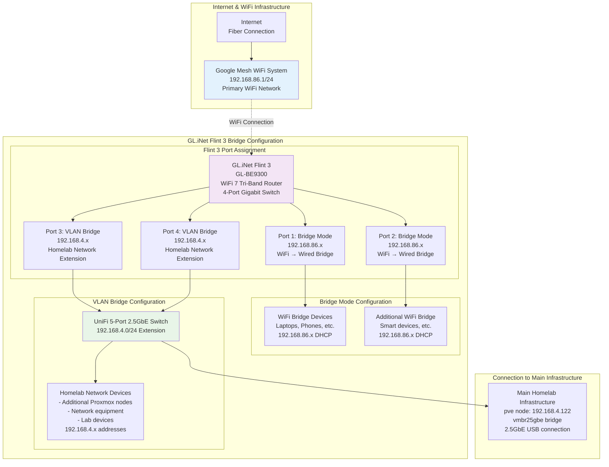
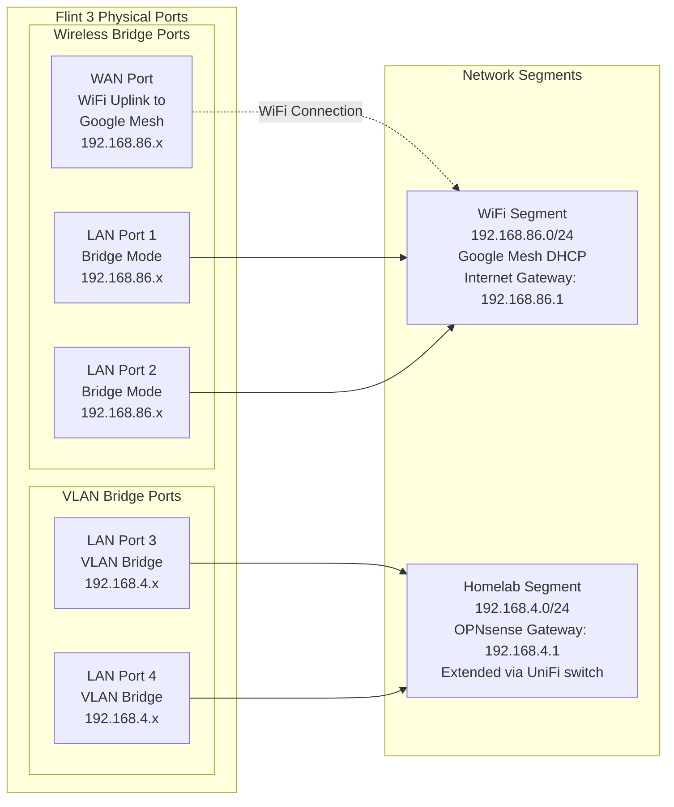
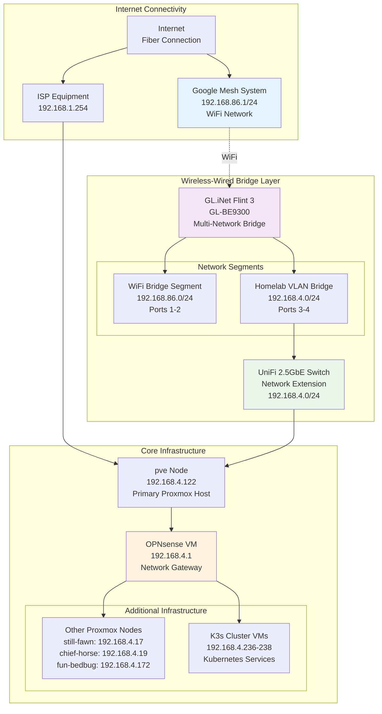

# GL.iNet Flint 3 Network Bridge Configuration Guide

## Overview

The GL.iNet Flint 3 (GL-BE9300) serves as a critical wireless-wired bridge in the homelab network, extending both the Google Mesh WiFi network (192.168.86.x) and the internal lab network (192.168.4.x) through VLAN configuration.

## Network Architecture



## Detailed Port Configuration

### GL.iNet Flint 3 Port Mapping



## Configuration Details

### Flint 3 Network Configuration

#### Basic Settings
```yaml
Device: GL.iNet Flint 3 (GL-BE9300)
Firmware: Latest OpenWrt-based GL.iNet firmware
WiFi Standards: WiFi 7 (802.11be), WiFi 6E, WiFi 6
Radio Configuration:
  - 2.4GHz: Connected to Google Mesh
  - 5GHz Low: Connected to Google Mesh  
  - 5GHz High: Connected to Google Mesh
  - 6GHz: Connected to Google Mesh (if available)
```

#### Interface Configuration
```bash
# WAN Interface (WiFi to Google Mesh)
config interface 'wan'
    option ifname 'wlan0'
    option proto 'dhcp'
    option hostname 'flint3-bridge'
    # Connects to Google Mesh at 192.168.86.1

# Bridge Interface for WiFi Extension (Ports 1-2)
config interface 'lan_bridge'
    option type 'bridge'
    option ifname 'eth0 eth1'  # Ports 1-2
    option proto 'none'        # Transparent bridge
    option bridge_empty '1'

# VLAN Interface for Homelab Extension (Ports 3-4)  
config interface 'homelab'
    option type 'bridge'
    option ifname 'eth2 eth3'  # Ports 3-4
    option proto 'none'        # Transparent bridge
    option bridge_empty '1'
```

#### VLAN Configuration
```bash
# VLAN setup for homelab network extension
config switch_vlan
    option device 'switch0'
    option vlan '1'
    option ports '0 1 6t'  # Ports 1-2 + CPU for WiFi bridge

config switch_vlan  
    option device 'switch0'
    option vlan '4'
    option ports '2 3 6t'  # Ports 3-4 + CPU for homelab VLAN
```

### UniFi Switch Integration

#### Switch Configuration
```yaml
Device: UniFi 5-Port 2.5GbE Switch
Purpose: Extend 192.168.4.0/24 network with high-speed connectivity
Connection: Ports 3-4 from Flint 3 via VLAN bridge

Port Configuration:
  Port 1: Uplink from Flint 3 (2.5GbE)
  Port 2: Uplink from Flint 3 (2.5GbE, redundant)
  Port 3: Connection to pve node (2.5GbE USB adapter)
  Port 4: Available for additional homelab devices
  Port 5: Available for additional homelab devices

Network Settings:
  VLAN: Native VLAN 4 (192.168.4.0/24)
  STP: Enabled for loop prevention
  Management: Via UniFi Network Controller
```

## Network Topology Integration

### Complete Network Flow



## Device Access and Management

### Flint 3 Management
```bash
# Web Interface Access
# When connected to WiFi bridge network:
http://192.168.86.x/  # Dynamic IP from Google Mesh

# When connected to homelab network:
# Access via dedicated management interface (if configured)

# SSH Access (if enabled)
ssh root@<flint3-ip>

# Configuration backup
scp root@<flint3-ip>:/etc/config/* ./flint3-backup/
```

### Network Testing and Validation

#### Connectivity Testing
```bash
# Test WiFi bridge functionality
# From device on 192.168.86.x network:
ping 192.168.86.1        # Google Mesh gateway
ping 8.8.8.8             # Internet connectivity

# Test VLAN bridge functionality  
# From device on 192.168.4.x network:
ping 192.168.4.1         # OPNsense gateway
ping 192.168.4.122       # pve node

# Test cross-network communication
# From 192.168.86.x to 192.168.4.x (should be blocked/routed)
ping 192.168.4.122       # Should fail or route through internet
```

#### Performance Testing
```bash
# Test bridge throughput
# Between devices on same bridge segment:
iperf3 -s  # On target device
iperf3 -c <target-ip> -t 30  # From source device

# Test VLAN bridge performance
# Between UniFi switch ports:
iperf3 -c <device2-ip> -P 4 -t 60  # Multi-stream test

# Wireless bridge performance
# WiFi to wired bridge performance:
iperf3 -c <wired-device> -t 60  # From WiFi client
```

## Troubleshooting Guide

### Common Issues

#### WiFi Bridge Not Working
```bash
# Check WiFi connection to Google Mesh
iwconfig wlan0
ping 192.168.86.1

# Verify bridge configuration
brctl show
bridge link show

# Check interface status
ip link show
ifconfig
```

#### VLAN Bridge Issues
```bash
# Verify VLAN configuration
cat /proc/net/vlan/config
vconfig

# Check switch port configuration
swconfig dev switch0 show

# Test UniFi switch connectivity
ping <unifi-switch-ip>
```

#### Performance Problems
```bash
# Check interface statistics
cat /proc/net/dev
ethtool eth0  # Check each interface

# Monitor traffic
tcpdump -i br-lan  # Bridge traffic
iftop -i eth0      # Interface bandwidth

# Check for errors
dmesg | grep -i error
logread | grep -i network
```

### Configuration Backup and Recovery

#### Backup Configuration
```bash
# Full system backup
tar -czf flint3-backup-$(date +%Y%m%d).tar.gz /etc/config/

# Network configuration only
cp /etc/config/network network.backup
cp /etc/config/wireless wireless.backup
cp /etc/config/system system.backup
```

#### Recovery Procedures
```bash
# Restore from backup
scp backup-files root@<flint3-ip>:/etc/config/
reboot

# Factory reset (if needed)
# Hold reset button for 10 seconds while powered
# Reconfigure from scratch using this guide
```

## Integration with Homelab Monitoring

### SNMP Monitoring (if enabled)
```bash
# Enable SNMP on Flint 3
opkg update
opkg install snmpd

# Configure SNMP community
echo "rocommunity homelab" >> /etc/snmp/snmpd.conf

# Test SNMP access
snmpwalk -v2c -c homelab <flint3-ip> 1.3.6.1.2.1.2.2
```

### Network Monitoring Integration
```bash
# Add to network monitoring system
# Monitor interfaces: WiFi, Bridge ports, VLAN interfaces
# Alert on: Link down, high error rates, bandwidth saturation
# Metrics: Throughput, packet loss, latency across bridges
```

This configuration provides seamless extension of both the WiFi network and the homelab network, allowing devices to connect to either segment while maintaining network separation and performance.