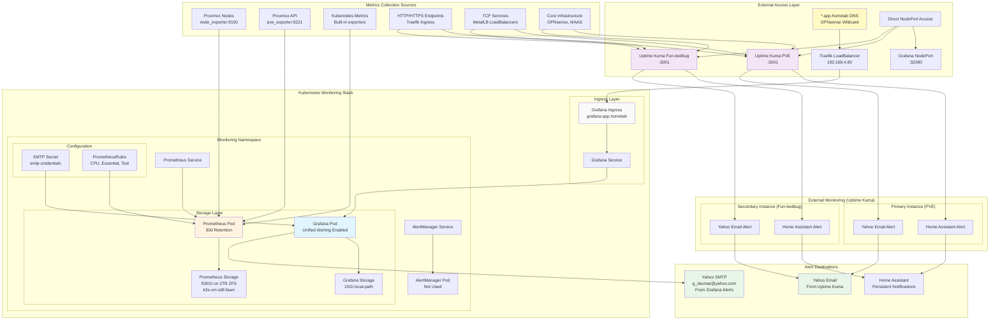

# Homelab Monitoring Architecture Overview

## Overview

The homelab uses a multi-layered monitoring approach combining Kubernetes-native monitoring (Prometheus/Grafana) with external HTTP/TCP monitoring (Uptime Kuma). This provides comprehensive coverage from infrastructure metrics to service availability.

## Complete Monitoring Architecture

## Monitoring Strategy by Layer

### **Kubernetes-Native Monitoring (Prometheus/Grafana)**
- **Purpose**: Deep metrics collection and time-series analysis
- **Scope**: Infrastructure metrics, resource usage, performance trends
- **Alerting**: Grafana Unified Alerting with Yahoo SMTP
- **Storage**: Long-term metrics retention (30 days) on high-capacity storage
- **Access**: `grafana.app.homelab` via Traefik Ingress

### **External Service Monitoring (Uptime Kuma)**  
- **Purpose**: Service availability and HTTP/TCP endpoint monitoring
- **Scope**: Application uptime, external connectivity, infrastructure health
- **Redundancy**: Dual instances (PVE + Fun-bedbug) for reliability
- **Alerting**: Multiple channels (Yahoo Email + Home Assistant notifications)
- **Access**: Direct NodePort access per instance

## Key Architectural Decisions

### **Dual Alerting Strategy**
- **Grafana**: Complex metric-based alerts with statistical analysis
- **Uptime Kuma**: Simple up/down service monitoring with immediate notifications
- **Redundancy**: Both systems can alert independently via different paths

### **Storage Strategy**
- **Prometheus**: High-capacity 2TB ZFS storage for long-term metrics
- **Grafana**: Local-path storage for dashboard/config persistence
- **Node Affinity**: Both run on `k3s-vm-still-fawn` (GPU node) for performance

### **Access Patterns**
- **Production Access**: `grafana.app.homelab` via Traefik (preferred)
- **Direct Access**: NodePort fallback for troubleshooting
- **DNS Strategy**: Leverages `*.app.homelab` wildcard for seamless routing

### **Alert Philosophy**
- **Grafana**: Threshold-based alerts for resource exhaustion, performance degradation  
- **Uptime Kuma**: Availability-focused alerts for service outages
- **Consolidation**: Single email destination with different alert contexts

## Service Coverage Matrix

| Service Type | Prometheus/Grafana | Uptime Kuma | Alert Method |
|---|---|---|---|
| **K8s Resource Usage** | ✅ Detailed metrics | ❌ | Grafana → Email |
| **Node Performance** | ✅ Historical trends | ❌ | Grafana → Email |
| **Service Availability** | ⚠️ Limited | ✅ Primary | Uptime Kuma → Email/HA |
| **HTTP Endpoints** | ❌ | ✅ Primary | Uptime Kuma → Email/HA |
| **Infrastructure Health** | ⚠️ Metrics only | ✅ Primary | Uptime Kuma → Email/HA |
| **External Connectivity** | ❌ | ✅ Primary | Uptime Kuma → Email/HA |

## Implementation References

- **Grafana Configuration**: `gitops/clusters/homelab/infrastructure/monitoring/`
- **Uptime Kuma Setup**: [Complete Uptime Kuma Monitoring Setup Guide](uptime-kuma-monitoring-complete-guide.md)
- **Email Alerting**: [Monitoring and Alerting Guide](monitoring-alerting-guide.md)
- **Prometheus Storage**: [Prometheus 2TB Storage Migration Guide](prometheus-2tb-migration-guide.md)

This architecture provides comprehensive monitoring coverage while maintaining simplicity and redundancy across the homelab infrastructure.