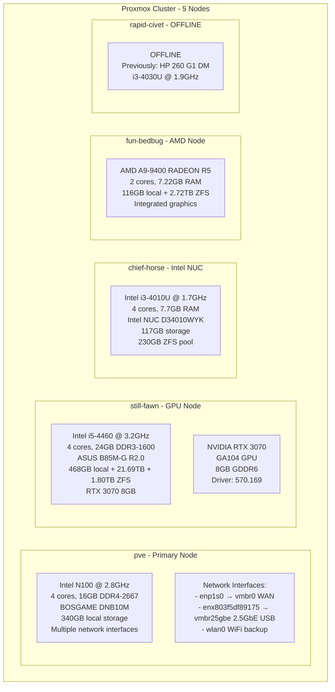
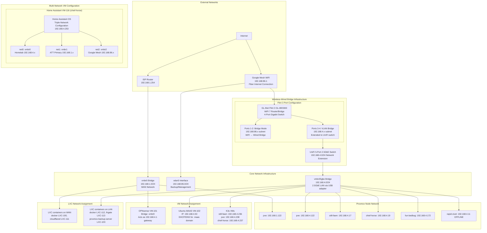
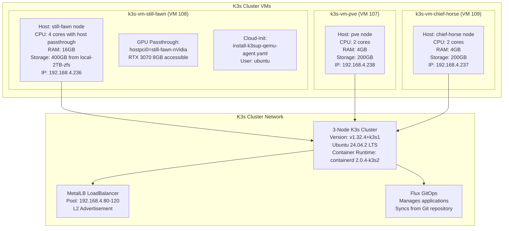
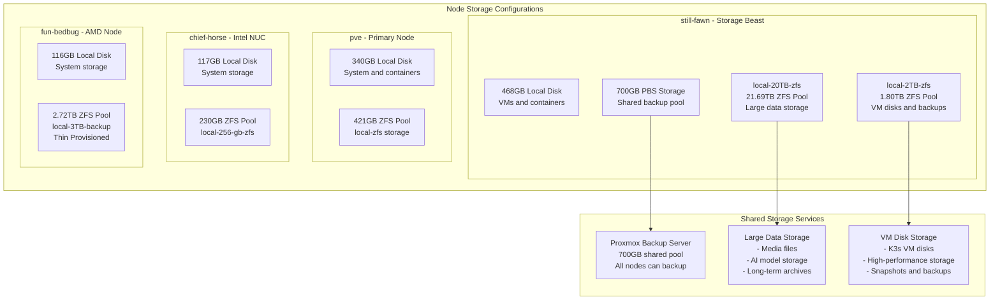
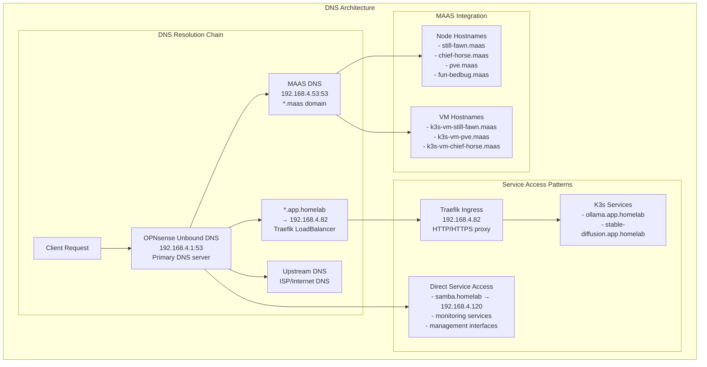

# Proxmox Infrastructure Guide

## Overview

This document provides comprehensive details about the Proxmox VE cluster infrastructure, including hardware specifications, network topology, VM/LXC configurations, and management workflows.

## Cluster Architecture

### Physical Hardware Specifications



### Network Topology



## Virtual Machine Configurations

### Core Infrastructure VMs

#### OPNsense Firewall (VM 101)
```yaml
Location: pve node
Resources:
  - CPU: 4 cores
  - RAM: 4GB
  - Storage: 32GB
Network:
  - net0: virtio, bridge=vmbr0, MAC=BC:24:11:C2:5E:3B
  - firewall: enabled
Purpose: Network gateway and firewall for 192.168.4.0/24 network
Management: Web interface at 192.168.4.1
```

#### Ubuntu MAAS (VM 102)
```yaml
Location: pve node
Resources:
  - CPU: 2 cores
  - RAM: 8GB
  - Storage: 100GB
Network:
  - net1: virtio, bridge=vmbr25gbe, MAC=BC:24:11:E5:85:5E
  - IP: 192.168.4.53
Purpose: Metal-as-a-Service for bare metal provisioning
Management: Web interface at http://192.168.4.53:5240/MAAS/
Features:
  - DHCP server for .maas domain hostnames
  - DNS integration with OPNsense
  - Provides hostnames like still-fawn.maas, chief-horse.maas
```

### K3s Cluster VMs



#### K3s VM Specifications

**k3s-vm-still-fawn (VM 108) - GPU Node**
- **Host**: still-fawn.maas
- **Resources**: 4 cores, 16GB RAM, 400GB disk
- **GPU**: RTX 3070 passthrough (hostpci0=still-fawn-nVidia)
- **Network**: bridge=vmbr0, IP=192.168.4.236
- **Special**: Primary node for GPU workloads (Ollama, Stable Diffusion)

**k3s-vm-pve (VM 107) - Control Plane**
- **Host**: pve
- **Resources**: 2 cores, 4GB RAM, 200GB disk  
- **Network**: bridge=vmbr25gbe, IP=192.168.4.238
- **Role**: Control plane node

**k3s-vm-chief-horse (VM 109) - Worker**
- **Host**: chief-horse.maas
- **Resources**: 2 cores, 4GB RAM, 200GB disk
- **Network**: bridge=vmbr25gbe, IP=192.168.4.237
- **Role**: Worker node

### Home Assistant VM

#### Home Assistant OS (VM 116)
```yaml
Location: chief-horse.maas
Purpose: Home automation and smart home management
Resources:
  - CPU: 2 cores (host passthrough)
  - RAM: 2GB
  - Storage: 40GB
Network Configuration (Triple-Homed):
  - net0: virtio, bridge=vmbr0, MAC=02:86:5F:DF:2B:0B
    Purpose: Homelab network access (192.168.4.x)
    IP: 192.168.4.253
  - net1: virtio, bridge=vmbr1, MAC=BC:24:11:21:F4:AB
    Purpose: ATT primary network access (192.168.1.x)
    IP: Dynamic DHCP from ATT router
  - net2: virtio, bridge=vmbr2, MAC=BC:24:11:BD:9A:ED
    Purpose: Google Mesh WiFi network access (192.168.86.x)
    IP: Dynamic DHCP via Flint 3 bridge
Features:
  - Multi-network access for device discovery across subnets
  - Integration with Frigate NVR (192.168.4.240)
  - MQTT broker for IoT device communication
  - Web interface at http://192.168.4.253:8123
Management: Home Assistant OS with HACS community store
```

#### chief-horse Network Bridge Configuration

The chief-horse node hosts the Home Assistant VM with a unique triple-network configuration requiring three dedicated bridge interfaces:

```bash
# vmbr0 - Homelab Network Bridge (192.168.4.0/24)
auto vmbr0
iface vmbr0 inet static
    address 192.168.4.19/24
    gateway 192.168.4.1
    bridge-ports enx803f5df88f6b  # USB-C 2.5GbE adapter
    bridge-stp off
    bridge-fd 0

# vmbr1 - ATT Primary Network Bridge (192.168.1.0/24)  
auto vmbr1
iface vmbr1 inet manual
    bridge-ports eno1              # Onboard Ethernet
    bridge-stp off
    bridge-fd 0
    # Provides access to ATT router and primary network devices

# vmbr2 - Google Mesh WiFi Network Bridge (192.168.86.0/24)
auto vmbr2
iface vmbr2 inet manual
    bridge-ports enx008b20105b82   # USB Ethernet adapter
    bridge-stp off  
    bridge-fd 0
    # Connected to Flint 3 VLAN 1 for Google Mesh access
```

This configuration enables Home Assistant to discover and manage smart devices across three separate network segments while maintaining network isolation and security.

## LXC Container Configurations

### Docker Containers

#### Docker LXC (100) - pve node
```yaml
Purpose: Docker host for lightweight services
Resources:
  - CPU: 2 cores
  - RAM: 2GB
  - Storage: 24GB ZFS (local-zfs:subvol-100-disk-0)
Network:
  - eth0: vmbr0, DHCP, MAC=BC:24:11:E6:50:41
  - eth1: vmbr25gbe, DHCP, MAC=BC:24:11:B3:D0:40
Features:
  - Unprivileged container
  - Nested virtualization enabled
  - Keyctl enabled for systemd
Tags: community-script, docker
```

#### Docker LXC (112) - fun-bedbug node  
```yaml
Purpose: Secondary Docker host
Resources:
  - CPU: 2 cores
  - RAM: 2GB
  - Storage: 24GB ZFS
Network:
  - eth0: vmbr25gbe, DHCP
Features: Similar to LXC 100
```

### Specialized Service Containers

#### Cloudflare Tunnel (LXC 111)
```yaml
Location: pve node
Purpose: Cloudflare tunnel for external access
Resources:
  - CPU: 1 core
  - RAM: 512MB
  - Storage: 2GB ZFS (local-zfs:subvol-111-disk-0)
Network:
  - eth0: vmbr0, DHCP, MAC=BC:24:11:DD:72:5F
Features:
  - Unprivileged container
  - Minimal resource footprint
Tags: cloudflare, community-script, network
```

#### Frigate NVR (LXC 113)
```yaml
Location: fun-bedbug node
Purpose: Network Video Recorder with AI detection
Resources:
  - CPU: 4 cores
  - RAM: 4GB
  - Storage: 500GB from local-3TB-backup ZFS pool
Network:
  - eth0: vmbr25gbe, DHCP
Features:
  - High CPU usage for video processing
  - AI-powered object detection
  - Storage migrated from Samsung T5 USB to 3TB HDD SATA
  - 16x storage capacity increase (from 928GB to 2.72TB pool)
Tags: community-script, nvr
```

#### Proxmox Backup Server (LXC 103)
```yaml
Location: still-fawn node
Purpose: Centralized backup solution
Resources:
  - CPU: 4 cores
  - RAM: 4GB
  - Storage: 700GB shared across cluster
Network:
  - eth0: vmbr25gbe, DHCP
Features:
  - Deduplication and compression
  - Incremental backups
  - Web management interface
Tags: backup, community-script
```

## Storage Architecture



### Storage Classes and Usage

| Node | Storage Pool | Size | Usage | ZFS Features |
|------|-------------|------|-------|--------------|
| still-fawn | local-20TB-zfs | 21.69TB | Large data, media, AI models | Compression, snapshots |
| still-fawn | local-2TB-zfs | 1.80TB | VM disks, high-performance | Compression, snapshots |  
| still-fawn | local | 468GB | System, containers | Standard filesystem |
| pve | local-zfs | 421GB | VMs, containers | Compression, snapshots |
| pve | local | 340GB | System storage | Standard filesystem |
| chief-horse | local-256-gb-zfs | 230GB | VMs, containers | Compression, snapshots |
| fun-bedbug | local-3TB-backup | 2.72TB | Frigate NVR, backup storage | Compression, thin provisioning, **POSIX ACLs** |

**Note**: The `local-3TB-backup` dataset requires POSIX ACL support (`acltype=posixacl`) for Proxmox backup compatibility. Other datasets may use `acltype=off` for CPU performance optimization.

## Backup Infrastructure

### Proxmox Backup Server (PBS) Architecture

The homelab uses a centralized Proxmox Backup Server for comprehensive backup coverage with proper retention policies and deduplication.

```mermaid
graph TB
    subgraph "Backup Infrastructure"
        subgraph "PBS Container (still-fawn)"
            pbs[proxmox-backup-server<br/>Container 103<br/>4GB RAM, 4 cores]
            pbs_old[Old Storage<br/>local-2TB-zfs<br/>489GB available]
            pbs_new[homelab-backup<br/>local-20TB-zfs<br/>20TB available]
        end
        
        subgraph "Backup Sources"
            critical[Critical Infrastructure<br/>101 OPNsense<br/>102 MAAS<br/>113 Frigate<br/>116 Home Assistant]
            
            k8s[Kubernetes Cluster<br/>107 k3s-pve<br/>108 k3s-still-fawn<br/>109 k3s-chief-horse]
            
            services[Support Services<br/>100 docker-pve<br/>111 cloudflared<br/>112 docker-fun-bedbug]
        end
        
        subgraph "Backup Job"
            single_job[backup-ff3d789f-f52b<br/>All VMs/LXCs<br/>Every 2 days @ 22:30<br/>Exclude: PBS (103)]
        end
    end
    
    critical --> single_job
    k8s --> single_job
    services --> single_job
    single_job --> pbs_new
    
    subgraph "Storage Optimization"
        tmpdir[fun-bedbug tmpdir<br/>500GB ZFS dataset<br/>No compression<br/>POSIX ACLs enabled<br/>CPU efficiency]
        k3s_storage[K3s VM Expansion<br/>400GB → 700GB<br/>+300GB for LLM models]
    end
```

### Backup Configuration

#### Single Job Approach ("One Job to Rule Them All")

**Job ID**: `backup-ff3d789f-f52b`

```json
{
  "all": 1,
  "enabled": 1,
  "exclude": "103",
  "mode": "snapshot",
  "schedule": "2,22:30",
  "storage": "homelab-backup",
  "prune-backups": {
    "keep-daily": 3,
    "keep-weekly": 2
  },
  "notes-template": "{{guestname}}"
}
```

#### Coverage Details

**Automatically Backed Up**:
- **101** - OPNsense (Firewall/Router)
- **102** - Ubuntu MAAS (Infrastructure provisioning)
- **107** - k3s-vm-pve (Kubernetes control plane)
- **108** - k3s-vm-still-fawn (Kubernetes GPU worker)
- **109** - k3s-vm-chief-horse (Kubernetes worker)
- **116** - Home Assistant OS (Home automation)
- **100** - docker-pve (Docker services)
- **111** - cloudflared (Tunnel service)
- **112** - docker-fun-bedbug (Docker services)
- **113** - frigate (NVR/Security cameras)

**Excluded**:
- **103** - proxmox-backup-server (Prevents recursive backups)

#### Storage Specifications

| Component | Size | Usage | Details |
|-----------|------|-------|---------|
| **homelab-backup datastore** | 20TB | 0.01% | PBS storage on local-20TB-zfs |
| **Backup tmpdir** | 500GB | Variable | Dedicated ZFS dataset on fun-bedbug |
| **Previous storage** | 489GB | N/A | Migrated from proxmox-backup-server |

#### Retention Policy

- **Daily backups**: 3 retained
- **Weekly backups**: 2 retained  
- **Schedule**: Every 2 days at 22:30 (off-peak)
- **Compression**: zstd with pigz for efficiency

### Storage Optimizations

#### SMB Storage Fix
- **Problem**: VM 108 had 19.8TB thick provisioned (actual usage: 1.8TB)
- **Solution**: Converted to thin provisioning, freed 18TB space
- **Command**: `zfs set refreservation=none local-20TB-zfs/vm-108-disk-0`

#### K3s VM Expansion  
- **Previous**: 400GB total, ~380GB available
- **Current**: 700GB total, 437GB available (+300GB for LLM models)
- **Process**: VM resize → partition resize → filesystem expansion

#### Tmpdir Configuration
- **Location**: `/local-3TB-backup/backup-tmpdir`
- **Size**: 500GB quota
- **Features**: No compression (CPU efficiency for Frigate node)
- **Purpose**: Avoid /tmp space limitations during large backups
- **Configuration**: Added `tmpdir: /local-3TB-backup/backup-tmpdir` to `/etc/vzdump.conf` on fun-bedbug

#### ZFS ACL Configuration for Backup Compatibility

**CRITICAL**: ZFS datasets optimized for CPU performance (with `acltype=off`) can cause Proxmox backup failures. When rsync attempts to preserve ACLs during backup operations, it fails with "Operation not supported" errors.

**Required Configuration**:
```bash
# Enable POSIX ACL support on backup storage datasets
zfs set acltype=posixacl local-3TB-backup
zfs set acltype=posixacl local-3TB-backup/backup-tmpdir
```

**Performance Trade-offs**:
- **CPU Performance**: `acltype=off` provides maximum CPU efficiency
- **Backup Compatibility**: `acltype=posixacl` required for Proxmox backup operations
- **Recommendation**: Enable ACLs on backup storage, optimize CPU performance on other datasets

**Verification**:
```bash
# Check current ACL configuration
zfs get acltype <dataset-name>

# Should return: acltype=posix for backup datasets
```

### Backup Management

#### Migration Script
Use `/scripts/migrate_backup_storage.sh` to migrate between storage backends:

```bash
# Migrate all jobs from old to new storage
./migrate_backup_storage.sh --from proxmox-backup-server --to homelab-backup --all

# Dry run to preview changes
./migrate_backup_storage.sh --from old-storage --to new-storage --all --dry-run
```

#### Monitoring Commands

```bash
# Check backup job status
pvesh get /cluster/backup

# Monitor PBS storage usage
pvesm status | grep homelab-backup

# View backup logs
journalctl -u pveproxy | grep backup

# Check individual job
pvesh get /cluster/backup/backup-ff3d789f-f52b
```

#### Troubleshooting

**Common Issues**:

1. **Insufficient tmpdir space**
   - Solution: Increase `/local-3TB-backup/backup-tmpdir` quota
   - Monitor: `df -h /local-3TB-backup/backup-tmpdir`

2. **PBS storage full**
   - Check: `pvesm status | grep homelab-backup`
   - Solution: Adjust retention or expand storage

3. **Backup job failures**
   - Logs: `journalctl -u pveproxy | grep vzdump`
   - Check: VM/LXC status during backup window

4. **ACL-related backup failures**
   - **Symptoms**: rsync errors with "Operation not supported" for ACL operations
   - **Root Cause**: ZFS dataset has `acltype=off` (CPU performance optimization)
   - **Solution**: Enable POSIX ACL support on backup storage datasets
   ```bash
   # Fix ACL support on backup datasets
   zfs set acltype=posixacl local-3TB-backup
   zfs set acltype=posixacl local-3TB-backup/backup-tmpdir
   
   # Verify configuration
   zfs get acltype local-3TB-backup local-3TB-backup/backup-tmpdir
   ```
   - **Prevention**: Include ACL considerations when optimizing ZFS for CPU performance

**Performance Notes**:
- Backups run during off-peak hours (22:30)
- zstd compression with pigz for CPU efficiency
- Snapshots minimize downtime
- Deduplication reduces storage usage

## Network Configuration Details

### Bridge Configurations

#### vmbr0 - WAN Bridge (192.168.1.0/24)
```bash
# Interface: vmbr0
# Purpose: WAN/Internet access
# Physical: enp1s0 (1Gb Ethernet)
# Gateway: 192.168.1.254 (ISP router)
# Connected VMs/LXCs:
#   - OPNsense (101) - Firewall/Gateway
#   - docker (100) - Docker host
#   - cloudflared (111) - Tunnel service
```

#### vmbr25gbe - LAN Bridge (192.168.4.0/24)  
```bash
# Interface: vmbr25gbe
# Purpose: High-speed LAN
# Physical: enx803f5df89175 (2.5Gb USB Ethernet)
# Gateway: 192.168.4.1 (OPNsense VM)
# Connected Infrastructure:
#   - All Proxmox nodes (192.168.4.17, 192.168.4.19, 192.168.4.122, 192.168.4.172)
#   - Ubuntu MAAS (192.168.4.53)
#   - All K3s VMs (192.168.4.236, 192.168.4.237, 192.168.4.238)
#   - LXC containers on LAN network
```

#### chief-horse Multi-Network Bridge Configuration

The chief-horse node requires additional bridge configurations to support the Home Assistant VM's multi-network access:

#### vmbr0 - Homelab Bridge (192.168.4.0/24) on chief-horse
```bash
# Interface: vmbr0 (chief-horse specific configuration)
# Purpose: Primary homelab network access
# Physical: enx803f5df88f6b (USB-C 2.5GbE adapter)
# Gateway: 192.168.4.1 (OPNsense VM)
# Host IP: 192.168.4.19
# Connected VMs:
#   - Home Assistant VM-116 (net0: 192.168.4.253)
```

#### vmbr1 - ATT Primary Network Bridge (192.168.1.0/24)
```bash
# Interface: vmbr1
# Purpose: ATT primary wired/wireless network access
# Physical: eno1 (onboard Ethernet)
# Gateway: ATT router (dynamic)
# Connected VMs:
#   - Home Assistant VM-116 (net1: dynamic DHCP)
# Note: Provides access to ATT router and primary network devices
```

#### vmbr2 - Google Mesh WiFi Bridge (192.168.86.0/24)
```bash
# Interface: vmbr2
# Purpose: Google Mesh WiFi network access
# Physical: enx008b20105b82 (USB Ethernet adapter)
# Connection: Connected to Flint 3 VLAN 1 for Google Mesh access
# Connected VMs:
#   - Home Assistant VM-116 (net2: dynamic DHCP via Flint 3 bridge)
# Note: Enables Home Assistant to discover WiFi-connected smart devices
```

### DNS and Service Discovery



## Management Workflows

### SSH Access Patterns

```bash
# Proxmox Hosts (root access)
ssh root@pve                    # Primary node
ssh root@still-fawn.maas        # GPU node  
ssh root@chief-horse.maas       # Intel NUC
ssh root@fun-bedbug.maas        # AMD node

# K3s VMs (ubuntu user)
ssh ubuntu@k3s-vm-still-fawn    # GPU VM
ssh ubuntu@k3s-vm-pve           # Control plane VM  
ssh ubuntu@k3s-vm-chief-horse   # Worker VM

# Kubernetes Cluster Access
export KUBECONFIG=~/kubeconfig   # On Mac or pve host
kubectl get nodes                # Cluster management
```

### Common Management Tasks

#### VM/LXC Management
```bash
# List all VMs and containers
pvesh get /cluster/resources --type vm

# Start/stop VMs
qm start 108    # Start k3s-vm-still-fawn
qm stop 108     # Stop k3s-vm-still-fawn  

# LXC container management
pct start 100   # Start docker container
pct stop 100    # Stop docker container

# Get VM/LXC configuration
pvesh get /nodes/pve/qemu/101/config        # VM config
pvesh get /nodes/pve/lxc/100/config         # LXC config
```

#### Network Troubleshooting
```bash
# Check bridge status
ip link show vmbr0
ip link show vmbr25gbe

# Verify VM network connectivity  
qm monitor 108
info network

# Test DNS resolution
dig @192.168.4.1 ollama.app.homelab
nslookup still-fawn.maas 192.168.4.53
```

#### Storage Management
```bash
# Check ZFS pool status
zpool status
zfs list

# Storage usage by node
pvesh get /cluster/resources --type storage

# Backup operations
vzdump 108 --storage proxmox-backup-server  # Backup VM 108
```

### GPU Passthrough Verification

```bash
# On still-fawn host - verify GPU hardware
lspci | grep -i nvidia

# On k3s-vm-still-fawn - verify GPU in VM
nvidia-smi
nvidia-smi --query-gpu=name,memory.total,driver_version --format=csv
```

## Troubleshooting Guide

### Common Issues and Solutions

#### VM/LXC Won't Start
1. Check resource allocation: `pvesh get /cluster/resources`
2. Verify storage availability: `pvesh get /cluster/resources --type storage`
3. Check host load: `top`, `iostat`
4. Review logs: `journalctl -u pveproxy`, `journalctl -u pvedaemon`

#### Network Connectivity Issues
1. Verify bridge configuration: `ip link show`
2. Check firewall rules: VM firewall settings in Proxmox
3. Test DNS resolution: `dig @192.168.4.1 <hostname>`
4. Verify MAAS DHCP: Check MAAS web interface

#### Storage Issues
1. Check ZFS pool health: `zpool status`
2. Verify disk space: `df -h`, `zfs list`
3. Check for failed disks: `smartctl -a /dev/sdX`
4. Review backup job status: Proxmox Backup Server interface

#### GPU Passthrough Issues
1. Verify IOMMU groups: `find /sys/kernel/iommu_groups -name "devices"`
2. Check GPU binding: `lspci -v | grep -A 10 nvidia`
3. Verify VM GPU access: `nvidia-smi` in VM
4. Check driver compatibility: Ensure VM has proper NVIDIA drivers

## Maintenance Schedules

### Weekly Tasks
- Check cluster health: `pvecm status`
- Review backup job results
- Monitor storage usage across nodes
- Verify critical VM/LXC status

### Monthly Tasks  
- Update Proxmox VE packages: `apt update && apt upgrade`
- Review and rotate logs
- Check hardware health (temperatures, disk SMART status)
- Update documentation with any configuration changes

### Quarterly Tasks
- Full cluster backup verification
- Review and optimize resource allocation
- Hardware maintenance (dust cleaning, cable management)
- Security updates and patching

This comprehensive guide provides the foundation for managing the Proxmox infrastructure, with specific focus on the network topology, VM/LXC configurations, and operational procedures critical for maintaining the homelab environment.
