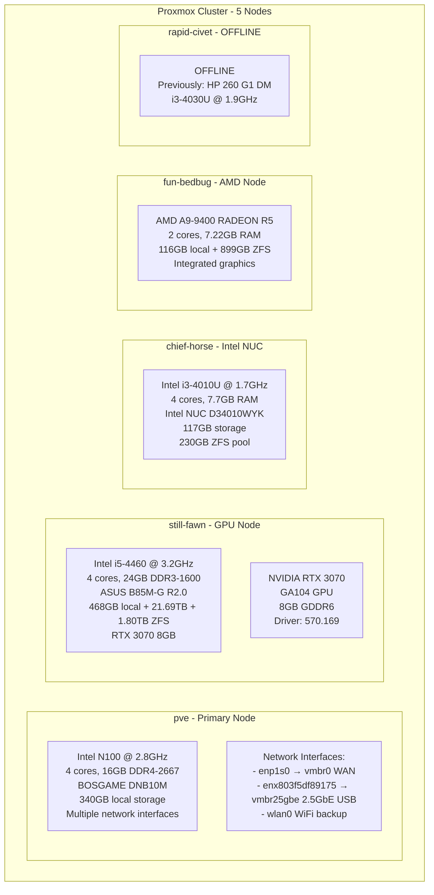
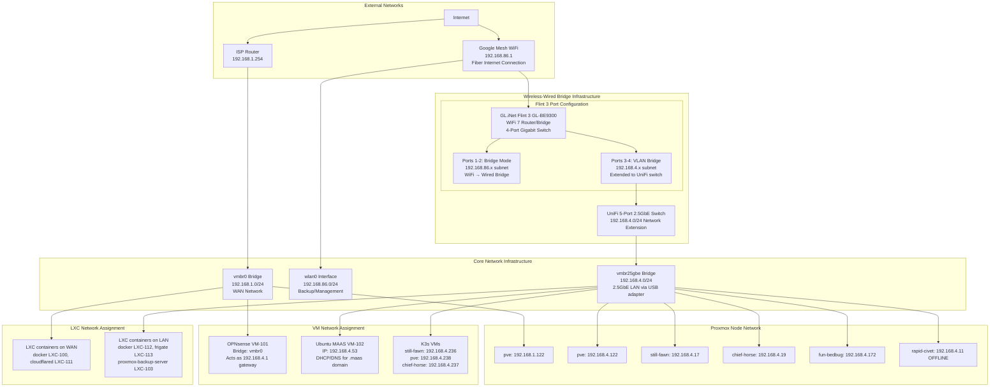
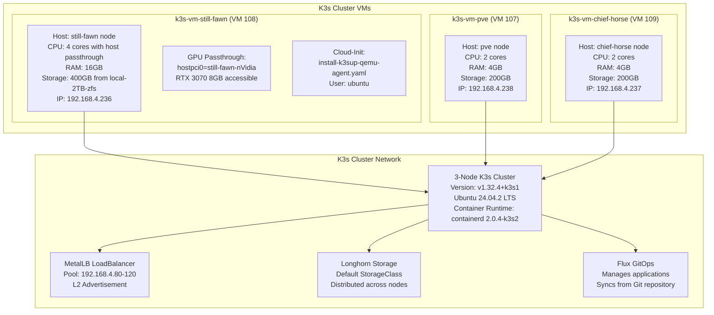
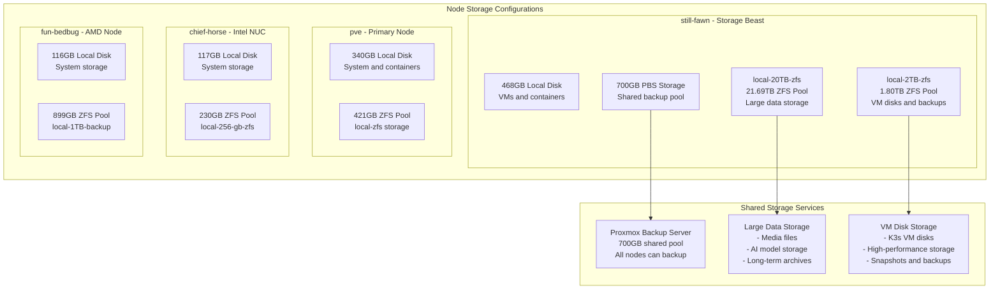

# Proxmox Infrastructure Guide

## Overview

This document provides comprehensive details about the Proxmox VE cluster infrastructure, including hardware specifications, network topology, VM/LXC configurations, and management workflows.

## Cluster Architecture

### Physical Hardware Specifications



### Network Topology



## Virtual Machine Configurations

### Core Infrastructure VMs

#### OPNsense Firewall (VM 101)
```yaml
Location: pve node
Resources:
  - CPU: 4 cores
  - RAM: 4GB
  - Storage: 32GB
Network:
  - net0: virtio, bridge=vmbr0, MAC=BC:24:11:C2:5E:3B
  - firewall: enabled
Purpose: Network gateway and firewall for 192.168.4.0/24 network
Management: Web interface at 192.168.4.1
```

#### Ubuntu MAAS (VM 102)
```yaml
Location: pve node
Resources:
  - CPU: 2 cores
  - RAM: 8GB
  - Storage: 100GB
Network:
  - net1: virtio, bridge=vmbr25gbe, MAC=BC:24:11:E5:85:5E
  - IP: 192.168.4.53
Purpose: Metal-as-a-Service for bare metal provisioning
Management: Web interface at http://192.168.4.53:5240/MAAS/
Features:
  - DHCP server for .maas domain hostnames
  - DNS integration with OPNsense
  - Provides hostnames like still-fawn.maas, chief-horse.maas
```

### K3s Cluster VMs



#### K3s VM Specifications

**k3s-vm-still-fawn (VM 108) - GPU Node**
- **Host**: still-fawn.maas
- **Resources**: 4 cores, 16GB RAM, 400GB disk
- **GPU**: RTX 3070 passthrough (hostpci0=still-fawn-nVidia)
- **Network**: bridge=vmbr0, IP=192.168.4.236
- **Special**: Primary node for GPU workloads (Ollama, Stable Diffusion)

**k3s-vm-pve (VM 107) - Control Plane**
- **Host**: pve
- **Resources**: 2 cores, 4GB RAM, 200GB disk  
- **Network**: bridge=vmbr25gbe, IP=192.168.4.238
- **Role**: Control plane node

**k3s-vm-chief-horse (VM 109) - Worker**
- **Host**: chief-horse.maas
- **Resources**: 2 cores, 4GB RAM, 200GB disk
- **Network**: bridge=vmbr25gbe, IP=192.168.4.237
- **Role**: Worker node

## LXC Container Configurations

### Docker Containers

#### Docker LXC (100) - pve node
```yaml
Purpose: Docker host for lightweight services
Resources:
  - CPU: 2 cores
  - RAM: 2GB
  - Storage: 24GB ZFS (local-zfs:subvol-100-disk-0)
Network:
  - eth0: vmbr0, DHCP, MAC=BC:24:11:E6:50:41
  - eth1: vmbr25gbe, DHCP, MAC=BC:24:11:B3:D0:40
Features:
  - Unprivileged container
  - Nested virtualization enabled
  - Keyctl enabled for systemd
Tags: community-script, docker
```

#### Docker LXC (112) - fun-bedbug node  
```yaml
Purpose: Secondary Docker host
Resources:
  - CPU: 2 cores
  - RAM: 2GB
  - Storage: 24GB ZFS
Network:
  - eth0: vmbr25gbe, DHCP
Features: Similar to LXC 100
```

### Specialized Service Containers

#### Cloudflare Tunnel (LXC 111)
```yaml
Location: pve node
Purpose: Cloudflare tunnel for external access
Resources:
  - CPU: 1 core
  - RAM: 512MB
  - Storage: 2GB ZFS (local-zfs:subvol-111-disk-0)
Network:
  - eth0: vmbr0, DHCP, MAC=BC:24:11:DD:72:5F
Features:
  - Unprivileged container
  - Minimal resource footprint
Tags: cloudflare, community-script, network
```

#### Frigate NVR (LXC 113)
```yaml
Location: fun-bedbug node
Purpose: Network Video Recorder with AI detection
Resources:
  - CPU: 4 cores
  - RAM: 4GB
  - Storage: 20GB ZFS
Network:
  - eth0: vmbr25gbe, DHCP
Features:
  - High CPU usage for video processing
  - AI-powered object detection
Tags: community-script, nvr
```

#### Proxmox Backup Server (LXC 103)
```yaml
Location: still-fawn node
Purpose: Centralized backup solution
Resources:
  - CPU: 4 cores
  - RAM: 4GB
  - Storage: 700GB shared across cluster
Network:
  - eth0: vmbr25gbe, DHCP
Features:
  - Deduplication and compression
  - Incremental backups
  - Web management interface
Tags: backup, community-script
```

## Storage Architecture



### Storage Classes and Usage

| Node | Storage Pool | Size | Usage | ZFS Features |
|------|-------------|------|-------|--------------|
| still-fawn | local-20TB-zfs | 21.69TB | Large data, media, AI models | Compression, snapshots |
| still-fawn | local-2TB-zfs | 1.80TB | VM disks, high-performance | Compression, snapshots |  
| still-fawn | local | 468GB | System, containers | Standard filesystem |
| pve | local-zfs | 421GB | VMs, containers | Compression, snapshots |
| pve | local | 340GB | System storage | Standard filesystem |
| chief-horse | local-256-gb-zfs | 230GB | VMs, containers | Compression, snapshots |
| fun-bedbug | local-1TB-backup | 899GB | Backup storage | Compression, dedup |

## Network Configuration Details

### Bridge Configurations

#### vmbr0 - WAN Bridge (192.168.1.0/24)
```bash
# Interface: vmbr0
# Purpose: WAN/Internet access
# Physical: enp1s0 (1Gb Ethernet)
# Gateway: 192.168.1.254 (ISP router)
# Connected VMs/LXCs:
#   - OPNsense (101) - Firewall/Gateway
#   - docker (100) - Docker host
#   - cloudflared (111) - Tunnel service
```

#### vmbr25gbe - LAN Bridge (192.168.4.0/24)  
```bash
# Interface: vmbr25gbe
# Purpose: High-speed LAN
# Physical: enx803f5df89175 (2.5Gb USB Ethernet)
# Gateway: 192.168.4.1 (OPNsense VM)
# Connected Infrastructure:
#   - All Proxmox nodes (192.168.4.17, 192.168.4.19, 192.168.4.122, 192.168.4.172)
#   - Ubuntu MAAS (192.168.4.53)
#   - All K3s VMs (192.168.4.236, 192.168.4.237, 192.168.4.238)
#   - LXC containers on LAN network
```

### DNS and Service Discovery


## Management Workflows

### SSH Access Patterns

```bash
# Proxmox Hosts (root access)
ssh root@pve                    # Primary node
ssh root@still-fawn.maas        # GPU node  
ssh root@chief-horse.maas       # Intel NUC
ssh root@fun-bedbug.maas        # AMD node

# K3s VMs (ubuntu user)
ssh ubuntu@k3s-vm-still-fawn    # GPU VM
ssh ubuntu@k3s-vm-pve           # Control plane VM  
ssh ubuntu@k3s-vm-chief-horse   # Worker VM

# Kubernetes Cluster Access
export KUBECONFIG=~/kubeconfig   # On Mac or pve host
kubectl get nodes                # Cluster management
```

### Common Management Tasks

#### VM/LXC Management
```bash
# List all VMs and containers
pvesh get /cluster/resources --type vm

# Start/stop VMs
qm start 108    # Start k3s-vm-still-fawn
qm stop 108     # Stop k3s-vm-still-fawn  

# LXC container management
pct start 100   # Start docker container
pct stop 100    # Stop docker container

# Get VM/LXC configuration
pvesh get /nodes/pve/qemu/101/config        # VM config
pvesh get /nodes/pve/lxc/100/config         # LXC config
```

#### Network Troubleshooting
```bash
# Check bridge status
ip link show vmbr0
ip link show vmbr25gbe

# Verify VM network connectivity  
qm monitor 108
info network

# Test DNS resolution
dig @192.168.4.1 ollama.app.homelab
nslookup still-fawn.maas 192.168.4.53
```

#### Storage Management
```bash
# Check ZFS pool status
zpool status
zfs list

# Storage usage by node
pvesh get /cluster/resources --type storage

# Backup operations
vzdump 108 --storage proxmox-backup-server  # Backup VM 108
```

### GPU Passthrough Verification

```bash
# On still-fawn host - verify GPU hardware
lspci | grep -i nvidia

# On k3s-vm-still-fawn - verify GPU in VM
nvidia-smi
nvidia-smi --query-gpu=name,memory.total,driver_version --format=csv
```

## Troubleshooting Guide

### Common Issues and Solutions

#### VM/LXC Won't Start
1. Check resource allocation: `pvesh get /cluster/resources`
2. Verify storage availability: `pvesh get /cluster/resources --type storage`
3. Check host load: `top`, `iostat`
4. Review logs: `journalctl -u pveproxy`, `journalctl -u pvedaemon`

#### Network Connectivity Issues
1. Verify bridge configuration: `ip link show`
2. Check firewall rules: VM firewall settings in Proxmox
3. Test DNS resolution: `dig @192.168.4.1 <hostname>`
4. Verify MAAS DHCP: Check MAAS web interface

#### Storage Issues
1. Check ZFS pool health: `zpool status`
2. Verify disk space: `df -h`, `zfs list`
3. Check for failed disks: `smartctl -a /dev/sdX`
4. Review backup job status: Proxmox Backup Server interface

#### GPU Passthrough Issues
1. Verify IOMMU groups: `find /sys/kernel/iommu_groups -name "devices"`
2. Check GPU binding: `lspci -v | grep -A 10 nvidia`
3. Verify VM GPU access: `nvidia-smi` in VM
4. Check driver compatibility: Ensure VM has proper NVIDIA drivers

## Maintenance Schedules

### Weekly Tasks
- Check cluster health: `pvecm status`
- Review backup job results
- Monitor storage usage across nodes
- Verify critical VM/LXC status

### Monthly Tasks  
- Update Proxmox VE packages: `apt update && apt upgrade`
- Review and rotate logs
- Check hardware health (temperatures, disk SMART status)
- Update documentation with any configuration changes

### Quarterly Tasks
- Full cluster backup verification
- Review and optimize resource allocation
- Hardware maintenance (dust cleaning, cable management)
- Security updates and patching

This comprehensive guide provides the foundation for managing the Proxmox infrastructure, with specific focus on the network topology, VM/LXC configurations, and operational procedures critical for maintaining the homelab environment.