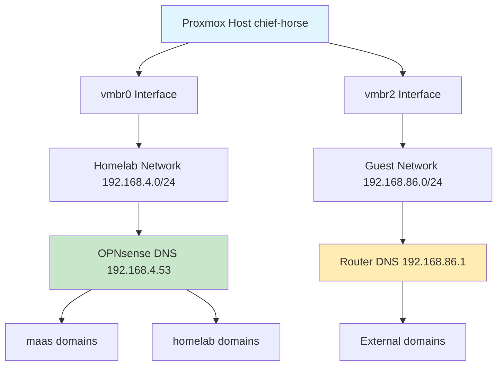
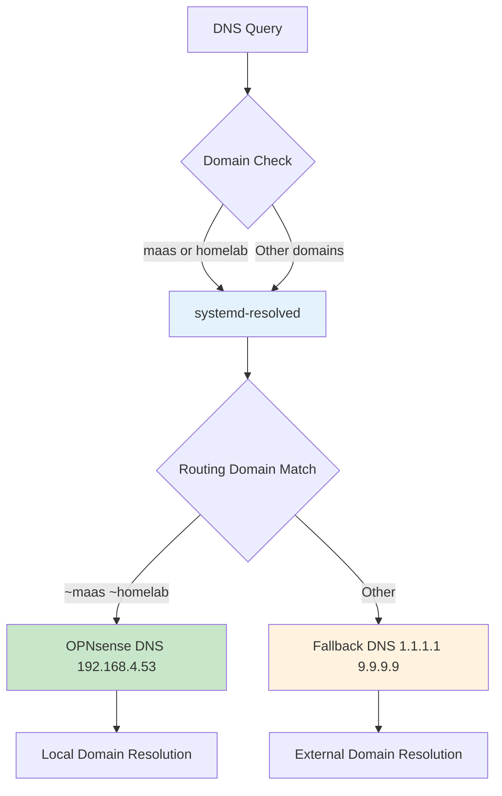
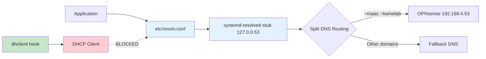

# Proxmox Multi-Network DNS Split Configuration Runbook

## Overview

This runbook documents the permanent solution for DNS resolution issues in Proxmox hosts with multiple network interfaces where DHCP clients override DNS configuration. The solution implements systemd-resolved split DNS with DHCP protection to ensure persistent DNS routing.

## Problem Statement

### Symptoms
- DNS resolution failures for `.maas` and `.homelab` domains from multi-homed Proxmox hosts
- DHCP clients overwriting `/etc/resolv.conf` with incorrect DNS servers
- Backup jobs failing with "Temporary failure in name resolution"
- Manual DNS fixes not surviving DHCP renewals or reboots

### Root Cause
DHCP clients on secondary network interfaces override system DNS configuration, preventing resolution of local domains that require specific DNS servers.

## Network Architecture



## DNS Resolution Flow



## Solution Architecture



## Implementation Steps

### Prerequisites

**Environment Requirements:**
- Proxmox VE 8.x with systemd-resolved
- Multi-homed host with DHCP on multiple interfaces
- Root access to Proxmox host

**Pre-Implementation Checks:**
```bash
# Verify systemd version
systemd --version | head -n1

# Check target interfaces exist
ip -br addr show | grep -E "(vmbr0|vmbr2)"

# Verify systemd-resolved is available
systemctl status systemd-resolved
```

### Step 1: Create Configuration Backups

```bash
# Create timestamped backup of current resolv.conf
cp /etc/resolv.conf /etc/resolv.conf.backup.$(date +%Y%m%d_%H%M%S)

# Verify backup creation
ls -la /etc/resolv.conf*
```

### Step 2: Configure systemd-resolved

**Enable systemd-resolved:**
```bash
systemctl enable --now systemd-resolved
systemctl status systemd-resolved --no-pager
```

**Create configuration directory:**
```bash
mkdir -p /etc/systemd/resolved.conf.d
```

**Configure DNS stub listener:**
```bash
cat > /etc/systemd/resolved.conf.d/10-stub-and-fallback.conf << 'EOF'
[Resolve]
DNSStubListener=yes
FallbackDNS=1.1.1.1 9.9.9.9
EOF
```

**Configure routing domains:**
```bash
cat > /etc/systemd/resolved.conf.d/20-homelab-routing.conf << 'EOF'
[Resolve]
# Route .maas and .homelab domains through homelab DNS
Domains=~maas ~homelab
DNS=192.168.4.53
EOF
```

**Verify configuration files:**
```bash
ls -la /etc/systemd/resolved.conf.d/
cat /etc/systemd/resolved.conf.d/*.conf
```

### Step 3: Create DHCP Protection

**Create dhclient hook directory:**
```bash
mkdir -p /etc/dhcp/dhclient-enter-hooks.d
```

**Create DNS override protection hook:**
```bash
cat > /etc/dhcp/dhclient-enter-hooks.d/nodnsupdate << 'EOF'
#!/bin/sh
# Stop dhclient from touching /etc/resolv.conf; DNS is managed by systemd-resolved
make_resolv_conf() { :; }
EOF
```

**Make hook executable:**
```bash
chmod +x /etc/dhcp/dhclient-enter-hooks.d/nodnsupdate
```

**Verify hook creation:**
```bash
ls -la /etc/dhcp/dhclient-enter-hooks.d/
```

### Step 4: Configure resolv.conf

**Remove existing resolv.conf:**
```bash
rm -f /etc/resolv.conf
```

**Link to systemd-resolved stub:**
```bash
ln -s /run/systemd/resolve/stub-resolv.conf /etc/resolv.conf
```

**Verify symlink:**
```bash
ls -la /etc/resolv.conf
```

### Step 5: Apply Configuration

**Restart systemd-resolved:**
```bash
systemctl restart systemd-resolved
```

**Verify resolv.conf content:**
```bash
cat /etc/resolv.conf
```

Expected output:
```
nameserver 127.0.0.53
options edns0 trust-ad
search maas
```

## Verification Procedures

### Configuration Verification

**Check systemd-resolved status:**
```bash
resolvectl status
```

**Expected key indicators:**
- `resolv.conf mode: stub`
- `DNS Domain ~homelab ~maas`
- `Current DNS Server: 192.168.4.53`

### DNS Resolution Testing

**Test .maas domain resolution:**
```bash
resolvectl query proxmox-backup-server.maas
```

Expected output format:
```
proxmox-backup-server.maas: 192.168.4.218                   -- link: vmbr0
-- Information acquired via protocol DNS in 7.0ms.
-- Data from: cache
```

**Test traditional DNS tools:**
```bash
host proxmox-backup-server.maas
nslookup proxmox-backup-server.maas
```

**Test backup storage connectivity:**
```bash
pvesm status -storage homelab-backup
```

### Persistence Testing

**DHCP renewal test:**
```bash
# Test DHCP renewal on guest network
dhclient -r vmbr2
dhclient vmbr2

# Wait for renewal
sleep 2

# Verify DNS still works
resolvectl query proxmox-backup-server.maas
```

**Reboot persistence test:**
```bash
# Reboot system
reboot

# After reboot, verify configuration
resolvectl status
host proxmox-backup-server.maas
```

## Configuration Files Reference

### systemd-resolved Configuration

**File:** `/etc/systemd/resolved.conf.d/10-stub-and-fallback.conf`
```ini
[Resolve]
DNSStubListener=yes
FallbackDNS=1.1.1.1 9.9.9.9
```

**File:** `/etc/systemd/resolved.conf.d/20-homelab-routing.conf`
```ini
[Resolve]
# Route .maas and .homelab domains through homelab DNS
Domains=~maas ~homelab
DNS=192.168.4.53
```

### DHCP Protection Hook

**File:** `/etc/dhcp/dhclient-enter-hooks.d/nodnsupdate`
```bash
#!/bin/sh
# Stop dhclient from touching /etc/resolv.conf; DNS is managed by systemd-resolved
make_resolv_conf() { :; }
```

**Permissions:** `755 (executable)`

### System Links

**File:** `/etc/resolv.conf`
```
# Symlink to: /run/systemd/resolve/stub-resolv.conf
nameserver 127.0.0.53
options edns0 trust-ad
search maas
```

## Troubleshooting

### Common Issues

#### DNS Resolution Fails After Implementation

**Symptoms:**
- `host` command fails with SERVFAIL
- systemd-resolved shows correct configuration

**Investigation:**
```bash
# Check systemd-resolved logs
journalctl -u systemd-resolved --since "10 minutes ago"

# Test direct DNS query
dig @192.168.4.53 proxmox-backup-server.maas

# Check network connectivity to DNS server
ping -c 3 192.168.4.53
```

**Solutions:**
```bash
# Restart systemd-resolved
systemctl restart systemd-resolved

# Flush DNS cache
resolvectl flush-caches

# Check for conflicting DNS configuration
resolvectl status | grep -E "(DNS|Domain)"
```

#### DHCP Still Overriding DNS

**Symptoms:**
- `/etc/resolv.conf` contains DHCP-provided DNS servers
- dhclient hook not preventing updates

**Investigation:**
```bash
# Check if hook is executable
ls -la /etc/dhcp/dhclient-enter-hooks.d/nodnsupdate

# Check if hook is being called
grep -r "make_resolv_conf" /etc/dhcp/

# Check for other DHCP clients
ps aux | grep -i dhcp
```

**Solutions:**
```bash
# Ensure hook is executable
chmod +x /etc/dhcp/dhclient-enter-hooks.d/nodnsupdate

# Test hook manually
dhclient -r vmbr2 && dhclient vmbr2

# Check for NetworkManager interference
systemctl status NetworkManager
```

#### systemd-resolved Not Using Routing Domains

**Symptoms:**
- All queries go to fallback DNS
- Routing domains not shown in status

**Investigation:**
```bash
# Check configuration syntax
systemd-analyze verify /etc/systemd/resolved.conf.d/*.conf

# Check for configuration conflicts
grep -r "DNS" /etc/systemd/resolved.conf*
```

**Solutions:**
```bash
# Verify configuration file syntax
cat /etc/systemd/resolved.conf.d/20-homelab-routing.conf

# Restart systemd-resolved
systemctl restart systemd-resolved

# Check for override files
find /etc -name "*resolved*" -type f
```

### Emergency Procedures

#### Quick DNS Fix (Temporary)

```bash
# Manual DNS configuration (survives until next DHCP renewal)
echo 'nameserver 192.168.4.53' > /etc/resolv.conf
echo 'search maas' >> /etc/resolv.conf
```

#### Complete Rollback

```bash
# Remove systemd-resolved configuration
rm -f /etc/systemd/resolved.conf.d/10-stub-and-fallback.conf
rm -f /etc/systemd/resolved.conf.d/20-homelab-routing.conf

# Remove dhclient hook
rm -f /etc/dhcp/dhclient-enter-hooks.d/nodnsupdate

# Restore original resolv.conf
rm -f /etc/resolv.conf
cp /etc/resolv.conf.backup.* /etc/resolv.conf

# Restart services
systemctl restart systemd-resolved
```

### Health Check Script

```bash
#!/bin/bash
# dns-health-check.sh
# Quick verification of DNS configuration

echo "=== DNS Configuration Health Check ==="

# Check 1: resolv.conf points to stub
if grep -q "127.0.0.53" /etc/resolv.conf; then
    echo "PASS: resolv.conf uses systemd-resolved stub"
else
    echo "FAIL: resolv.conf not using stub resolver"
fi

# Check 2: systemd-resolved has routing domains
if resolvectl status | grep -q "~maas\|~homelab"; then
    echo "PASS: Routing domains configured"
else
    echo "FAIL: Routing domains missing"
fi

# Check 3: DNS resolution works
if host proxmox-backup-server.maas >/dev/null 2>&1; then
    echo "PASS: DNS resolution functional"
else
    echo "FAIL: DNS resolution broken"
fi

# Check 4: Backup storage accessible
if pvesm status -storage homelab-backup >/dev/null 2>&1; then
    echo "PASS: Backup storage accessible"
else
    echo "FAIL: Backup storage inaccessible"
fi

echo "=== Health Check Complete ==="
```

## Monitoring and Maintenance

### Regular Monitoring

**Daily checks:**
```bash
# Verify DNS resolution
host proxmox-backup-server.maas

# Check backup storage status
pvesm status | grep homelab-backup

# Monitor systemd-resolved health
systemctl status systemd-resolved
```

**Weekly checks:**
```bash
# Test DHCP renewal persistence
dhclient -r vmbr2 && dhclient vmbr2 && sleep 2 && host proxmox-backup-server.maas

# Check configuration file integrity
ls -la /etc/systemd/resolved.conf.d/
ls -la /etc/dhcp/dhclient-enter-hooks.d/
```

### Log Monitoring

**Key log locations:**
```bash
# systemd-resolved logs
journalctl -u systemd-resolved

# DHCP client logs
journalctl | grep dhclient

# DNS query logs (if enabled)
journalctl | grep "DNS query"
```

## Performance Considerations

### DNS Query Performance

The systemd-resolved stub resolver provides:
- **Local caching** for improved response times
- **Parallel queries** for faster resolution
- **DNSSEC validation** when supported

### Network Impact

- **Minimal overhead** from routing domain evaluation
- **No additional network traffic** from split DNS
- **Fallback protection** for network resilience

## Security Considerations

### DNS Security

- **DNSSEC support** when available from upstream resolvers
- **Local domain isolation** prevents external queries for internal domains
- **Fallback DNS encryption** available via DNS-over-TLS

### Access Control

- **Local stub resolver** (127.0.0.53) not accessible externally
- **Configuration files** protected by root permissions
- **DHCP hook protection** prevents unauthorized DNS changes

## Best Practices

### Configuration Management

1. **Always backup** configuration files before changes
2. **Test changes** in non-production environment first
3. **Document modifications** with timestamps and reasoning
4. **Monitor DNS performance** after configuration changes

### Deployment Guidelines

1. **Stage deployments** across multiple hosts
2. **Verify persistence** through DHCP renewals and reboots
3. **Establish monitoring** before considering deployment complete
4. **Maintain rollback procedures** for rapid recovery

### Documentation Standards

1. **Update runbooks** when configuration changes
2. **Document custom domains** and their DNS servers
3. **Maintain network topology** diagrams
4. **Record performance baselines** for comparison

## Related Documentation

- [Homelab Network Architecture Reference](./homelab-network-architecture.md)
- [Home Assistant OS Network Priority Fix](./homeassistant-os-network-priority-fix.md)
- [Backup Storage Migration Runbook](./backup-storage-migration-runbook.md)
- [Proxmox Infrastructure Guide](./proxmox-infrastructure-guide.md)

## Support Information

### External References
- [systemd-resolved Manual](https://www.freedesktop.org/software/systemd/man/systemd-resolved.service.html)
- [Proxmox VE Network Configuration](https://pve.proxmox.com/wiki/Network_Configuration)
- [Debian DNS Configuration](https://wiki.debian.org/resolv.conf)

### Change History

| Date | Author | Changes |
|------|--------|---------|
| 2025-08-16 | Claude Code Agent | Initial implementation and documentation |