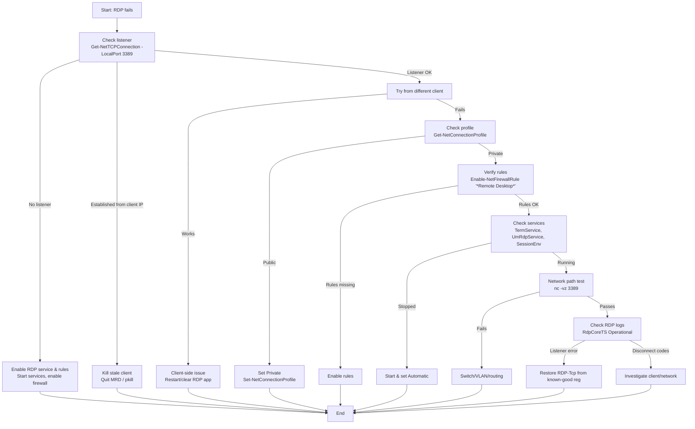

# 🖥️ Homelab RDP Troubleshooting Runbook (Windows host, macOS client)

## Quick checklist (60-second triage)

1. **On Windows host (Admin PowerShell)**

   ```powershell
   Get-NetTCPConnection -LocalPort 3389
   ```

   * Expect `Listen` on `0.0.0.0:3389` (and/or `::3389`)
   * If you see `Established` from your client IP when you're **not** connected, it's a stuck client. Kill the client app.

2. **On macOS client**

   ```bash
   pkill -f "Microsoft Remote Desktop"  # fully quit MRD
   nc -vz <server-ip> 3389              # connectivity check
   ```

   * If `nc` fails → network/firewall.
   * If `nc` passes but MRD hangs → client cache/session → quit the app or reboot Mac.

3. **Windows network profile**

   ```powershell
   Get-NetConnectionProfile
   # If Ethernet is Public:
   Set-NetConnectionProfile -InterfaceAlias "Ethernet" -NetworkCategory Private
   ```

4. **Windows RDP firewall rules**

   ```powershell
   Get-NetFirewallRule | Where-Object DisplayName -like '*Remote Desktop*' | Enable-NetFirewallRule
   ```

5. **Windows services**

   ```powershell
   Get-Service TermService, UmRdpService, SessionEnv | Select Name, Status, StartType
   # If stopped: Start-Service <name>
   ```

6. **If still stuck, check logs**

   ```powershell
   Get-WinEvent -LogName 'Microsoft-Windows-RemoteDesktopServices-RdpCoreTS/Operational' -MaxEvents 20 |
     Select TimeCreated, Id, LevelDisplayName, Message
   ```

---

## Mermaid flow



---

## macOS client commands (Microsoft Remote Desktop)

```bash
# Kill any stuck MRD processes
pkill -f "Microsoft Remote Desktop"

# Connectivity sanity check
nc -vz <server-ip> 3389

# (Optional) watch client logs while connecting
log stream --style compact --predicate 'process == "Microsoft Remote Desktop"' --info
```

**Tip:** Always try the **raw IP** (e.g., `192.168.4.225`) and username `.\yourusername` for local accounts (or your full Microsoft account email).

---

## Windows host commands (copy/paste snippets)

### Show/enable RDP firewall rules

```powershell
Get-NetFirewallRule | Where-Object DisplayName -like '*Remote Desktop*' |
  Format-Table DisplayName, Enabled, Profile
Get-NetFirewallRule | Where-Object DisplayName -like '*Remote Desktop*' | Enable-NetFirewallRule
```

### Ensure network is Private (not Public)

```powershell
Get-NetConnectionProfile
Set-NetConnectionProfile -InterfaceAlias "Ethernet" -NetworkCategory Private
```

### Verify services

```powershell
Get-Service TermService, UmRdpService, SessionEnv | Select Name, Status, StartType
Start-Service TermService, UmRdpService, SessionEnv
```

### Check recent RDP events

```powershell
Get-WinEvent -LogName 'Microsoft-Windows-RemoteDesktopServices-RdpCoreTS/Operational' -MaxEvents 20 |
  Select TimeCreated, Id, LevelDisplayName, Message
```

---

## One-command health check (server-side)

Save as **`Test-RDPServer.ps1`** and run in **Admin PowerShell** on the Windows host:

```powershell
# Usage: .\Test-RDPServer.ps1
# Runs core checks and prints PASS/FAIL with next-step hints.

$e = @{ ForegroundColor = 'Yellow' }; $ok = @{ ForegroundColor = 'Green' }; $bad = @{ ForegroundColor = 'Red' }

Write-Host "== RDP Server Health ==" @e

# 1) Listener
$tcp = Get-NetTCPConnection -LocalPort 3389 -ErrorAction SilentlyContinue
if ($tcp) {
  $listens = $tcp | Where-Object { $_.State -eq 'Listen' }
  $stuck   = $tcp | Where-Object { $_.State -eq 'Established' -and $_.RemoteAddress -ne '0.0.0.0' -and $_.RemoteAddress -ne '::' }
  if ($listens) { Write-Host "[PASS] Listener on 3389" @ok } else { Write-Host "[FAIL] No LISTEN on 3389" @bad }
  if ($stuck) { Write-Host "[WARN] Established from $($stuck.RemoteAddress | Select -First 1) — client may be stuck" @e }
} else {
  Write-Host "[FAIL] No TCP entries for 3389" @bad
}

# 2) Services
$s = Get-Service TermService, UmRdpService, SessionEnv | Select Name, Status, StartType
$allRunning = @('Running','Running','Running') -eq $s.Status
if ($allRunning) { Write-Host "[PASS] Services running (TermService/UmRdpService/SessionEnv)" @ok }
else {
  Write-Host "[FAIL] One or more services not running:" @bad
  $s | Format-Table | Out-String | Write-Host
}

# 3) Profile
$profiles = Get-NetConnectionProfile
$active = $profiles | Where-Object { $_.IPv4Connectivity -ne 'Disconnected' -or $_.IPv6Connectivity -ne 'Disconnected' }
$public = $active | Where-Object NetworkCategory -eq 'Public'
if ($public) {
  Write-Host "[WARN] Active adapter is Public — RDP often blocked; set to Private" @e
} else {
  Write-Host "[PASS] Network profile not Public" @ok
}

# 4) Firewall rules
$rules = Get-NetFirewallRule | Where-Object DisplayName -like '*Remote Desktop*'
if ($rules -and ($rules.Enabled -contains 'True')) {
  Write-Host "[PASS] RDP firewall rules enabled" @ok
} else {
  Write-Host "[FAIL] RDP firewall rules disabled or missing" @bad
}

# 5) Recent RDP core errors
$errs = Get-WinEvent -FilterHashtable @{
  LogName='Microsoft-Windows-RemoteDesktopServices-RdpCoreTS/Operational'
  Level=2
  StartTime=(Get-Date).AddMinutes(-15)
} -ErrorAction SilentlyContinue
if ($errs) {
  Write-Host "[WARN] Recent RDP core errors:" @e
  $errs | Select TimeCreated, Id, Message | Format-Table -AutoSize | Out-String | Write-Host
} else {
  Write-Host "[PASS] No recent RDP core errors" @ok
}

Write-Host "`nNext:" @e
if (-not $listens) { Write-Host " - Start services; enable firewall rules; ensure profile is Private." }
elseif ($stuck)     { Write-Host " - Kill/quit the client app on $($stuck.RemoteAddress | Select -First 1) (macOS: pkill MRD)." }
elseif ($public)    { Write-Host " - Set-NetConnectionProfile -InterfaceAlias 'Ethernet' -NetworkCategory Private" }
elseif (-not ($rules.Enabled -contains 'True')) { Write-Host " - Enable RDP firewall rules." }
else { Write-Host " - Check switch/VLAN/routing or inspect RDP logs for disconnect codes." }
```

### Optional: quick fixer (use with care)

```powershell
# Flip to Private, enable rules, start services
Set-NetConnectionProfile -InterfaceAlias "Ethernet" -NetworkCategory Private
Get-NetFirewallRule | Where-Object DisplayName -like '*Remote Desktop*' | Enable-NetFirewallRule
Start-Service TermService, UmRdpService, SessionEnv
```

---

## Known "gotchas" (and quick remedies)

* **Mac client hangs at "Configuring remote PC…"**
  Quit MRD (`pkill -f "Microsoft Remote Desktop"`) or reboot the Mac; stale client sockets can block new sessions.

* **After network reset, Windows flips to Public**
  Set profile back to **Private** and re-enable RDP firewall rules.

* **Wrong username format**
  Use `.\yourusername` for local accounts; use full email for Microsoft accounts.

* **Listener errors like "Can't find listener registry key in WinStations"**
  Restore a known-good `RDP-Tcp` registry key and restart `TermService`.

---

If you want, I can also wrap **Test-RDPServer.ps1** into a tiny script that writes a one-page HTML health report you can keep in your homelab wiki.