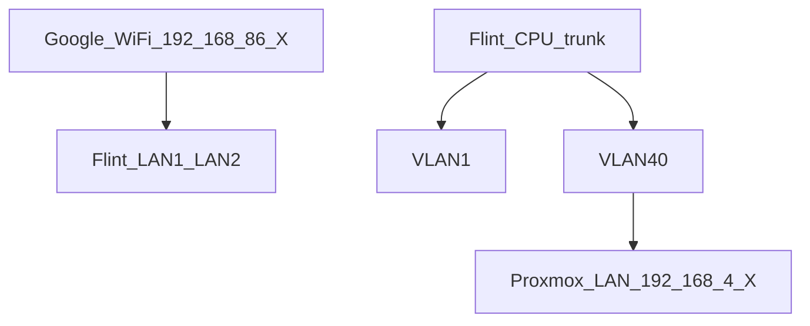
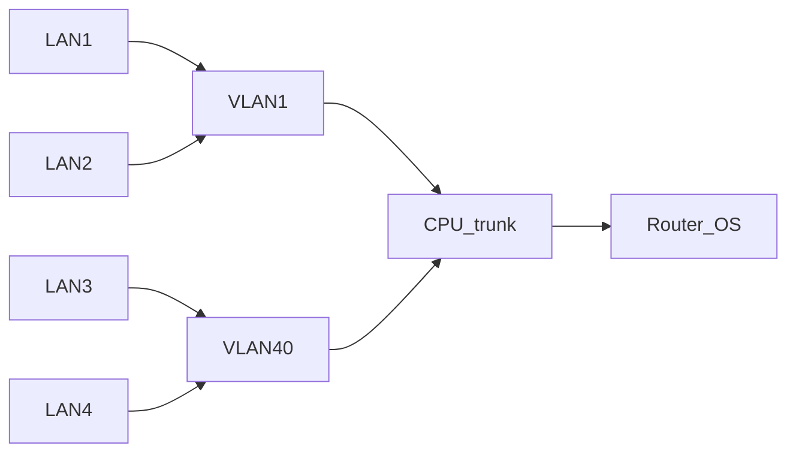

# Flint 3 VLAN40 Split Guide

<!-- markdownlint-disable MD013 -->

This runbook explains how to split VLANs on the GL.iNet Flint 3 router so that
LAN1 and LAN2 remain bridged to the Google Mesh Wi-Fi network while LAN3 and
LAN4 form a dedicated 192.168.4.x switch.

## CRITICAL WARNINGS

> **Warning**: GL-iNet firmware often shows **reversed port numbers** in LuCI.
> Physical **LAN1** appears as **LAN4**, and **LAN4** appears as **LAN1**.
> Confirm the mapping **before** applying any configuration. Multiple forum
> posts report this bug.

### Pre-Configuration Checklist

- [ ] Physical port mapping confirmed with a cable test
- [ ] Backup files created and verified
- [ ] Recovery procedures understood
- [ ] Alternative Internet access available during changes

## Context / Why

The goal is to let Home Assistant running in a Proxmox VM access devices on the
wireless 192.168.86.x network. Proxmox cannot bridge Wi-Fi adapters, so a Flint
3 router bridges Wi-Fi to wired. The default LAN is 192.168.8.0/24. Ports LAN1 and LAN2 must keep access to Wi-Fi while LAN3
and LAN4 join a Proxmox/OPNsense subnet at 192.168.4.0/24.

### Homelab topology



### Hardware Architecture Requirements

GL-BE9300 exposes all four Ethernet jacks through a single
`eth1` interface. Individual `lan1`–`lan4` devices do **not** exist.
Instead the router relies on VLAN tags such as `eth1.1` and `eth1.40`.
Bridge devices per port do not work because there is no discrete
switch chip. Separation must happen via switch VLANs.

### Research-Based Architecture Explanation

OpenWrt on the Flint uses **DSA** (Distributed Switch Architecture) rather than
legacy `swconfig`. Port numbering mismatches stem from how the vendor applied
DSA on top of an integrated switch. VLAN filtering happens in software, so the
LuCI interface may not mirror actual hardware behavior. Use `swconfig` or
`ip link` to verify tagging.

## High-level Plan

1. Backup router configs
2. SSH in and map ports
3. Create VLAN40 and edit VLAN1
4. Verify with ping tests
5. Take final backups

## What NOT to Do

- Avoid creating multiple bridge devices like `br-lan4` or `br-lan8`.
  The Flint's switch is integrated so individual port interfaces do not exist.
- Assigning ports directly to new bridges can lock you out and break DHCP.
- Rely on switch VLAN configuration instead of bridge devices.

## Step-by-step Procedure

### Step 1: Backup

- GUI: **System → Backup/Restore → Download backup**
- LuCI: **System → Backup/Flash Firmware → Generate archive**
- CLI:

  ```sh
  sysupgrade -b /tmp/flint-backup-$(date +%F).tar.gz
  cp /etc/config/network /tmp/network.before_vlan.$(date +%s)
  ```

**Success criteria:** backup files saved locally and connection intact.

### Step 2: SSH in

```sh
ssh root@<flint-ip>
```

Expect a `root@GL-BE9300:~#` prompt.

**Success criteria:** shell access to router.

### Step 3: Map ports

Move one cable across LAN1–4 and run:

```sh
bridge vlan show
bridge link
uci show network | grep -E 'device|ports|ifname|bridge'
swconfig dev switch1 show
for p in 4 5 6 7; do
  echo -n "Port $p -> "
  swconfig dev switch1 port $p get link
done
```

Another option is to run a loop so each port is tested deliberately:

```bash
for physical_port in 1 2 3 4; do
    echo "Testing physical LAN$physical_port"
    echo "Plug cable into LAN$physical_port and check which logical port shows link"
    swconfig dev switch1 show | grep -A 1 "Port [4-7]" | grep link
    read -p "Press enter when ready for next port..."
done
```

Record mapping:

| Port | Switch id |
|------|-----------|
| LAN1 | 7 |
| LAN2 | 6 |
| LAN3 | 5 |
| LAN4 | 4 |
| CPU  | 3t |

**Success criteria:** mapping confirmed without losing access.

### Step 4: Create VLAN40 & adjust VLAN1

> **STOP**: Verify backups and port mapping before applying these changes.

```sh
uci set network.vlan40='switch_vlan'
uci set network.vlan40.device='switch1'
uci set network.vlan40.vlan='40'
uci set network.vlan40.ports='4 5 3t'

uci set network.vlan_lan.ports='6 7 3t'

uci commit network
/etc/init.d/network reload 2>/dev/null || service network reload
```

Check:

```sh
swconfig dev switch1 show | sed -n '/VLAN 1/,+3p;/VLAN 40/,+3p'
```

Expected output:

```text
VLAN 1 : ports: 3t 6 7
VLAN 40: ports: 3t 4 5
```

LuCI "Switch" view may display wrong membership; trust `swconfig` output.

**Success criteria:** VLANs configured as above and connection remains.

### Step 5: Test LAN3/4 and LAN1/2

1. Plug Mac into LAN3 or LAN4 and disable Wi-Fi.
2. Run:

   ```bash
   ifconfig | grep "inet "
   ping -c 3 192.168.4.1
   ping -c 3 192.168.86.1
   ```

   Ping to 192.168.86.1 should fail.
3. Move the Mac to LAN1 or LAN2, unplug/replug if DHCP fails.

   ```bash
   ping -c 3 192.168.86.1
   ```

If 86.1 remains unreachable, reboot Flint to flush ARP and routes.

**Success criteria:** LAN3/4 only see 192.168.4.x; LAN1/2 still reach 192.168.86.1.

### Step 6: Final backups & LuCI interface

```sh
cp /etc/config/network /tmp/network.after_vlan.$(date +%s)
sysupgrade -b /tmp/flint-post-vlan-$(date +%F).tar.gz
```

Optionally create an unmanaged interface for VLAN40 in LuCI so it appears in the
UI. No IP address or DHCP should be assigned.

**Success criteria:** backup files stored and configuration visible.

## Verification Checklist

- `swconfig dev switch1 show` shows ports as expected
- Ping tests from LAN3/4 fail to 192.168.86.1
- Ping tests from LAN1/2 succeed to 192.168.86.1
- Mac `ifconfig` shows 192.168.4.x only when on LAN3/4

## Rollback Procedure

Restore the snapshot:

```sh
cp /tmp/network.before_vlan.* /etc/config/network
/etc/init.d/network reload
```

Reboot if ports still show incorrect behavior.

## Recovery Procedures

If configuration mistakes block management access:

1. Hold the reset button for **4 seconds** until the LEDs flash. Settings are
   preserved but network services restart.
2. If the router is bricked, power on while holding the reset button for
   **10 seconds** to enter U-Boot recovery.
3. Connect to the recovery IP (usually 192.168.1.1) and re-upload the backup
   created earlier.

Automatic rollback sometimes fails; manual restoration via these steps saved the
router during testing.

## Troubleshooting

- LuCI may show outdated VLAN boxes; rely on `swconfig`
- If ping to 192.168.86.1 succeeds from LAN3, Wi-Fi may still be active
- Clearing ARP caches or rebooting the router restored LAN1/2 routes during tests
- `bridge vlan show` output may be empty under this firmware—use `swconfig`

## Common Mistakes

- Assuming physical and logical port numbers match without verification
- Attempting to split ports with new bridge devices
- Using "Apply unchecked" without backups

### Final topology



## Lessons Learned

- Port labels in LuCI do not match physical jacks.
- Splitting ports via new bridges bricked the router; VLANs are required.
- A 4-second reset can recover without losing configs.

## Appendices

- Terminal transcripts of each step
- Glossary for VLAN, tagged/untagged, CPU trunk, DSA
- Links to IaC modules
- Scripts in `../scripts` snapshot and verify configs

<!-- markdownlint-enable MD013 -->
