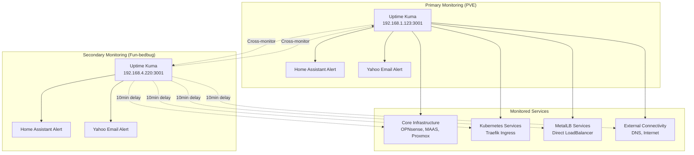

# Complete Uptime Kuma Monitoring Setup Guide

> **🔄 Disaster Recovery Ready**: This guide contains all information needed to completely rebuild the Uptime Kuma monitoring system from scratch, including discovering endpoints, configuring notifications, and setting up redundant alerting.

## Table of Contents

1. [Overview](#overview)
2. [Prerequisites](#prerequisites)
3. [Infrastructure Discovery](#infrastructure-discovery)
4. [Uptime Kuma Installation & Configuration](#uptime-kuma-installation--configuration)
5. [Notification Setup](#notification-setup)
6. [Monitor Configuration via Code](#monitor-configuration-via-code)
7. [Redundant Alerting Strategy](#redundant-alerting-strategy)
8. [Maintenance & Troubleshooting](#maintenance--troubleshooting)
9. [Complete Recovery Procedures](#complete-recovery-procedures)

## Overview

The homelab monitoring system uses **dual Uptime Kuma instances** with programmatically configured monitors covering:

- **Core Infrastructure**: OPNsense, MAAS, Proxmox nodes
- **Kubernetes Services**: Traefik ingress endpoints (Ollama, Stable Diffusion)
- **MetalLB LoadBalancers**: Direct service access (Samba file server)
- **Network Connectivity**: Internet, DNS resolution, K3s VMs

### Architecture



## Prerequisites

### Network Access Requirements

1. **Homelab Network Connection**: Your machine must be connected to the 192.168.4.x network
2. **SSH Access**: Verify connectivity to Proxmox nodes
3. **Python Environment**: Poetry-managed Python environment

### Verification Commands

```bash
# Test network connectivity
ping 192.168.4.1          # OPNsense gateway
ping pve.maas             # Proxmox pve
ping fun-bedbug.maas      # Proxmox fun-bedbug

# Test SSH access  
ssh root@pve.maas "hostname"
ssh root@fun-bedbug.maas "hostname"

# Verify homelab network
ifconfig | grep "192.168.4"
```

## Infrastructure Discovery

### Finding Uptime Kuma Instances

Use the MonitoringManager to discover running instances:

```bash
cd proxmox/homelab
poetry run python -c "
from src.homelab.monitoring_manager import get_monitoring_status_all_nodes
statuses = get_monitoring_status_all_nodes()
for status in statuses:
    if status.get('uptime_kuma', {}).get('url'):
        print(f'{status[\"node\"]}: {status[\"uptime_kuma\"][\"url\"]}')
"
```

**Expected Output:**
```
pve: http://192.168.1.123:3001
fun-bedbug: http://192.168.4.220:3001
```

### Discovering Service Endpoints

#### Traefik Ingress Services

Find Traefik-routed services in the GitOps configuration:

```bash
# Find all Traefik ingress configurations
find gitops/clusters/homelab/apps -name "ingress.yaml" -exec grep -l "traefik" {} \;

# Extract service hostnames
grep -r "host:" gitops/clusters/homelab/apps/*/ingress.yaml
```

**Example services found:**
- `ollama.app.homelab` (Traefik → MetalLB LoadBalancer)
- `stable-diffusion.app.homelab` (Traefik → MetalLB LoadBalancer)

#### MetalLB LoadBalancer Services

Find MetalLB LoadBalancer services and their assigned IPs:

```bash
# Find LoadBalancer service configurations
find gitops/clusters/homelab/apps -name "service.yaml" -exec grep -l "LoadBalancer" {} \;

# Check MetalLB IP pool configuration
cat gitops/clusters/homelab/infrastructure-config/metallb-config/address-pool.yaml
```

**Example MetalLB pool:**
```yaml
spec:
  addresses:
    - 192.168.4.80-192.168.4.120
```

**Example fixed IP service:**
```yaml
# Samba service with fixed IP
metadata:
  annotations:
    metallb.universe.tf/loadBalancerIPs: 192.168.4.120
spec:
  type: LoadBalancer
  ports:
  - port: 445
```

#### Network Infrastructure Discovery

```bash
# Find network infrastructure IPs
cat proxmox/homelab/.env | grep "_IP"

# Test core services
curl -s http://192.168.4.53:5240/MAAS/  # MAAS server
ping 192.168.4.1                        # OPNsense gateway
```

## Uptime Kuma Installation & Configuration

### Deployment via MonitoringManager

Deploy Uptime Kuma containers to both Proxmox nodes:

```bash
cd proxmox/homelab
poetry run python src/homelab/monitoring_manager.py
```

This creates:
- **PVE**: Docker LXC 100 → Uptime Kuma at `http://192.168.1.123:3001`
- **Fun-bedbug**: Docker LXC 112 → Uptime Kuma at `http://192.168.4.220:3001`

### Initial Admin Setup

1. **Access each instance** via web browser
2. **Create admin account**: 
   - Username: `gshiva`
   - Password: `REDACTED_MQTT_PASSWORD` 
   - *(Store credentials in `.env` file)*
3. **Skip** initial monitor setup (will be done programmatically)

## Notification Setup

> **⚠️ CRITICAL**: Notifications must be configured manually via the web interface before running the automated monitor setup.

### Home Assistant Integration

**For each Uptime Kuma instance:**

1. Navigate to **Settings → Notifications**
2. Click **Add New Notification**
3. Configure Home Assistant notification:

```yaml
Name: My Home Assistant Alert
Type: Home Assistant
Default: Yes (checked)
Home Assistant URL: http://homeassistant.maas:8123/
Long-Lived Access Token: [Get from Home Assistant]
```

#### Getting Home Assistant Access Token

1. Access Home Assistant at `http://homeassistant.maas:8123/`
2. Go to **Profile → Security → Long-lived access tokens**
3. Click **Create Token**
4. Name: `Uptime Kuma Integration`
5. Copy the generated token
6. **Test the notification** before saving

### Yahoo Email Alerts

**For each Uptime Kuma instance:**

1. Navigate to **Settings → Notifications** 
2. Click **Add New Notification**
3. Configure SMTP notification:

```yaml
Name: Yahoo email alert
Type: SMTP
Default: Yes (checked)
SMTP Host: smtp.mail.yahoo.com
SMTP Port: 587
Security: STARTTLS
SMTP Username: g_skumar@yahoo.com
SMTP Password: [App-specific password]
From: g_skumar@yahoo.com
To: g_skumar@yahoo.com
```

#### Getting Yahoo App Password

1. Log into Yahoo Mail
2. Go to **Account Security**
3. Enable **2-step verification** (required)
4. Generate **App Password** for "Mail app"
5. Use this password in SMTP configuration

### Notification Testing

**Test each notification:**
1. Click **Test** button in notification configuration  
2. Verify alerts arrive in Home Assistant and email
3. **Save** only after successful testing

## Monitor Configuration via Code

### Environment Configuration

Create/update the `.env` file in `proxmox/homelab/`:

```bash
# Uptime Kuma Configuration
UPTIME_KUMA_USERNAME=gshiva
UPTIME_KUMA_PASSWORD=REDACTED_MQTT_PASSWORD

# Uptime Kuma Instance URLs
UPTIME_KUMA_PVE_URL=http://192.168.1.123:3001
UPTIME_KUMA_FUNBEDBUG_URL=http://192.168.4.220:3001
```

> **🔒 Security**: Never commit `.env` files to version control. Add to `.gitignore`.

### Install Dependencies

```bash
cd proxmox/homelab
poetry install
poetry add uptime-kuma-api  # If not already installed
```

### Run Automated Monitor Configuration

Execute the comprehensive monitoring setup:

```bash
cd proxmox/homelab
poetry run python src/homelab/uptime_kuma_client.py
```

**Expected Output:**
```
=== Uptime Kuma Monitor Configuration ===
Using official uptime-kuma-api library
✅ Using credentials: gshiva / *************

=== Configuring all instances ===

PVE:
  ✅ OPNsense Gateway: created
  ✅ MAAS Server: created
  ✅ Proxmox pve Node: created
  ✅ Proxmox still-fawn Node: created
  ✅ Proxmox fun-bedbug Node: created
  ✅ Ollama GPU Server: created
  ✅ Stable Diffusion WebUI: created
  ✅ Samba File Server: created
  ✅ K3s VM - still-fawn: created
  ✅ Internet - Google DNS: created
  ✅ Internet - Cloudflare DNS: created
  ✅ DNS Resolution Test: created

FUN-BEDBUG:
  ✅ OPNsense Gateway (Secondary): created
  ✅ MAAS Server (Secondary): created
  [... all monitors with (Secondary) suffix ...]

🎉 Monitor configuration complete!
📊 Summary: 24 created, 0 existing, 0 failed
```

### Monitors Created

#### Core Infrastructure
- **OPNsense Gateway**: `192.168.4.1` (PING, 60s interval)
- **MAAS Server**: `http://192.168.4.53:5240/MAAS/` (HTTP, 300s interval)

#### Proxmox Nodes  
- **Proxmox pve**: `pve.maas` (PING, 120s interval)
- **Proxmox still-fawn**: `still-fawn.maas` (PING, 120s interval)
- **Proxmox fun-bedbug**: `fun-bedbug.maas` (PING, 120s interval)

#### Kubernetes Services (via Traefik)
- **Ollama GPU Server**: `http://ollama.app.homelab` (HTTP, 300s interval)
- **Stable Diffusion WebUI**: `http://stable-diffusion.app.homelab` (HTTP, 300s interval)

#### MetalLB LoadBalancer Services
- **Samba File Server**: `192.168.4.120:445` (PORT, 300s interval)

#### Network Health
- **K3s VM**: `k3s-vm-still-fawn` (PING, 120s interval)
- **Internet - Google DNS**: `8.8.8.8` (PING, 120s interval)  
- **Internet - Cloudflare DNS**: `1.1.1.1` (PING, 120s interval)
- **DNS Resolution Test**: `google.com` via `8.8.8.8` (DNS, 300s interval)

## Redundant Alerting Strategy

### Primary vs Secondary Instance Configuration

**Primary Instance (PVE)**:
- **Immediate alerts** on service failures
- **Standard intervals**: 60s-300s depending on service
- **Fast retry**: 60s retry intervals
- **Monitor names**: Standard names

**Secondary Instance (Fun-bedbug)**:
- **10-minute delayed alerts** for redundancy  
- **Extended intervals**: 2x primary intervals
- **Delayed retry**: 600s (10min) retry intervals
- **Monitor names**: Suffixed with " (Secondary)"

### Alert Storm Prevention

The secondary instance configuration prevents alert fatigue:

1. **Primary fails** → Immediate Home Assistant + Yahoo alerts
2. **Primary continues failing** → Secondary waits 10 minutes
3. **Service still down** → Secondary also alerts (redundant notification)
4. **Different failure modes** → Secondary catches what primary might miss

### Implementation Details

```python
# Primary instance (PVE)
{
    "name": "OPNsense Gateway",
    "interval": 60,
    "retryInterval": 60
}

# Secondary instance (Fun-bedbug) 
{
    "name": "OPNsense Gateway (Secondary)",
    "interval": 120,  # 2x primary
    "retryInterval": 600  # 10-minute delay
}
```

## Maintenance & Troubleshooting

### Verifying Monitor Status

Check monitor health in web interface:

1. **Access Uptime Kuma**: `http://192.168.1.123:3001`
2. **Dashboard view**: All monitors should show green (UP) status
3. **Individual monitor**: Click for detailed graphs and history

### Common Issues

#### Monitor Shows as DOWN

1. **Verify endpoint manually**:
   ```bash
   # Test HTTP endpoints
   curl -I http://ollama.app.homelab
   curl -I http://stable-diffusion.app.homelab
   curl -I http://192.168.4.53:5240/MAAS/
   
   # Test ping targets
   ping -c 3 192.168.4.1
   ping -c 3 pve.maas
   
   # Test port connectivity
   telnet 192.168.4.120 445
   ```

2. **Check DNS resolution**:
   ```bash
   nslookup ollama.app.homelab
   nslookup stable-diffusion.app.homelab
   ```

3. **Verify service status**:
   ```bash
   # Check Kubernetes pods
   kubectl get pods -A
   
   # Check MetalLB LoadBalancer assignments
   kubectl get svc -A --field-selector spec.type=LoadBalancer
   ```

#### Notification Not Working

1. **Test notification manually** in Uptime Kuma interface
2. **Verify Home Assistant** is accessible: `http://homeassistant.maas:8123/`
3. **Check email credentials** and app-specific password
4. **Review notification logs** in Uptime Kuma: Settings → Logs

#### Environment Variables Not Loading

```bash
# Test .env loading
cd proxmox/homelab
poetry run python -c "
import os
from dotenv import load_dotenv
load_dotenv()
print('Username:', os.getenv('UPTIME_KUMA_USERNAME'))
print('PVE URL:', os.getenv('UPTIME_KUMA_PVE_URL'))
"
```

### Adding New Services

To monitor additional services:

1. **Identify the endpoint** (HTTP URL, hostname, or IP:port)
2. **Determine the type**: HTTP, PING, PORT, or DNS
3. **Update the monitor configuration** in `uptime_kuma_client.py`:

```python
{
    "name": f"New Service{instance_suffix}",
    "type": MonitorType.HTTP,  # or PING, PORT, DNS
    "url": "http://new-service.app.homelab",
    "interval": 300 * base_interval_multiplier,
    "maxretries": 2,
    "retryInterval": base_retry_delay * 2,
    "description": "Description of the new service"
}
```

4. **Re-run the configuration script**:
   ```bash
   poetry run python src/homelab/uptime_kuma_client.py
   ```

## Complete Recovery Procedures

### Scenario 1: Lost Uptime Kuma Instances

If both Uptime Kuma containers are lost:

1. **Redeploy containers**:
   ```bash
   cd proxmox/homelab
   poetry run python src/homelab/monitoring_manager.py
   ```

2. **Access web interfaces** and create admin accounts
3. **Configure notifications manually** (see [Notification Setup](#notification-setup))
4. **Run monitor configuration**:
   ```bash
   poetry run python src/homelab/uptime_kuma_client.py
   ```

### Scenario 2: Lost Environment Configuration

If `.env` file is lost:

1. **Discover Uptime Kuma URLs**:
   ```bash
   # Check running Docker containers
   ssh root@pve.maas "docker ps | grep uptime-kuma"
   ssh root@fun-bedbug.maas "docker ps | grep uptime-kuma"
   
   # Get container IPs
   ssh root@pve.maas "docker inspect uptime-kuma | grep IPAddress"
   ssh root@fun-bedbug.maas "docker inspect uptime-kuma | grep IPAddress"
   ```

2. **Recreate `.env` file**:
   ```bash
   # Copy from this documentation and update URLs
   cp .env.example .env
   # Edit with discovered URLs and credentials
   ```

### Scenario 3: Complete Infrastructure Loss

If the entire homelab is rebuilt:

1. **Follow Infrastructure Discovery** section to find new endpoints
2. **Deploy Uptime Kuma** using MonitoringManager
3. **Update `.env`** with new URLs and credentials  
4. **Configure notifications** manually in web interface
5. **Update monitor configurations** if service endpoints changed
6. **Run automated setup**:
   ```bash
   poetry run python src/homelab/uptime_kuma_client.py
   ```

### Scenario 4: Lost Credentials

If admin credentials are forgotten:

1. **Reset via container**:
   ```bash
   # On the Proxmox node hosting Uptime Kuma
   ssh root@pve.maas
   docker exec -it uptime-kuma /bin/sh
   
   # Inside container - reset admin password
   cd /app
   npm run reset-password
   ```

2. **Use reset password** to access web interface
3. **Update `.env`** with new credentials

## Best Practices

### Security
- **Never commit** `.env` files to version control
- **Use app-specific passwords** for email providers
- **Regularly rotate** access tokens and passwords
- **Limit network access** to monitoring instances

### Reliability
- **Test notifications** before relying on them
- **Monitor the monitors** - set up cross-monitoring between instances
- **Document changes** when adding new services
- **Backup configurations** by exporting monitor JSON

### Performance
- **Tune intervals** based on service criticality
- **Use appropriate monitor types** (PING vs HTTP vs PORT)
- **Avoid over-monitoring** - balance coverage with resource usage
- **Review alerting logic** to prevent notification fatigue

## Conclusion

This monitoring setup provides comprehensive coverage of the homelab infrastructure with redundant alerting to prevent single points of failure. The automated configuration ensures consistency and enables rapid recovery from disasters.

**Key Benefits:**
- ✅ **Comprehensive Coverage**: All critical services monitored
- ✅ **Redundant Alerting**: Primary + secondary with delayed notifications  
- ✅ **Infrastructure as Code**: Monitors configured programmatically
- ✅ **Multi-channel Alerts**: Home Assistant + Email notifications
- ✅ **Disaster Recovery**: Complete rebuild procedures documented
- ✅ **Easy Maintenance**: Adding new services is straightforward

For questions or issues, refer to the troubleshooting section or the project's CLAUDE.md file for development guidance.