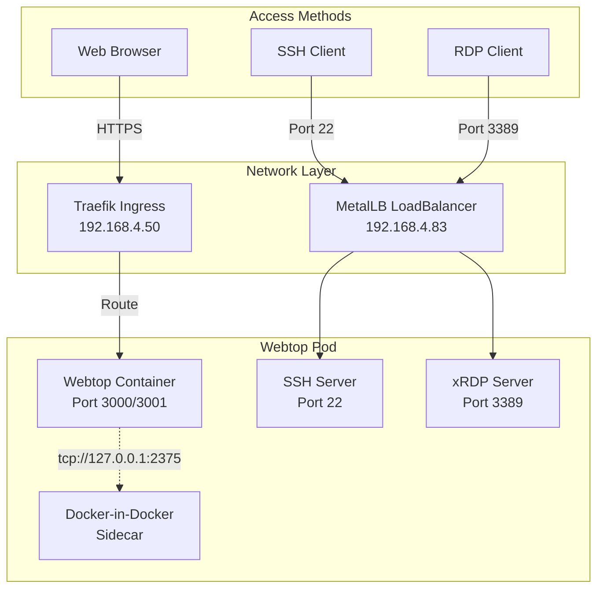

# Webtop Development Environment

## Overview

Webtop is a GPU-accelerated, browser-based Linux desktop environment deployed in the homelab Kubernetes cluster. It provides a persistent development environment with VS Code, Docker, Python, Node.js, and remote access capabilities via SSH and RDP.

## Architecture



## Features

### Development Tools
- **Python 3.12** with pip and venv
- **Node.js 22.x** with npm
- **Docker CLI** and docker-compose
- **Git** and GitHub CLI
- **kubectl** and Flux CLI
- **VS Code** (persistent via proot-apps)
- **Vim/Neovim** editors

### Access Methods
- **Web Interface**: Full desktop environment via browser
- **SSH Access**: Remote terminal access
- **RDP Access**: Remote desktop protocol support
- **GPU Acceleration**: NVIDIA GPU passthrough for AI/ML workloads

### Persistence
- Home directory (`/config`) persists across pod restarts
- VS Code installation via proot-apps persists
- User projects and settings maintained

## Deployment Configuration

### GitOps Structure
```
gitops/clusters/homelab/apps/webtop/
├── namespace.yaml       # Webtop namespace
├── pvc.yaml            # Persistent volume (50Gi)
├── configmap.yaml      # SSH/RDP init scripts
├── deployment.yaml     # Main deployment with GPU
├── service.yaml        # LoadBalancer service
├── ingress.yaml        # Traefik IngressRoute
└── kustomization.yaml  # Kustomize configuration
```

### Key Components

#### 1. Docker Mods
LinuxServer.io Docker Mods provide runtime modifications for development tools:
```yaml
DOCKER_MODS: "linuxserver/mods:universal-docker|linuxserver/mods:code-server-python3-poetry|linuxserver/mods:code-server-nodejs"
```

#### 2. Docker-in-Docker Sidecar
Secure Docker daemon configuration:
- Binds to `127.0.0.1:2375` (localhost only)
- Prevents network-wide root access
- Provides full Docker functionality

#### 3. Init Scripts
Custom initialization for SSH and RDP:
- Installs and configures OpenSSH server
- Sets up xRDP for remote desktop
- Configures SSH authorized_keys

## Access Configuration

### DNS Requirements

#### OPNsense Unbound DNS Configuration
Add the following host overrides in OPNsense:

1. **For HTTP/HTTPS access** (handled by Traefik):
   - Already configured: `*.app.homelab` → `192.168.4.50`

2. **For SSH/RDP access** (direct to LoadBalancer):
   ```
   Host: webtop
   Domain: homelab
   IP Address: 192.168.4.83
   Description: Webtop SSH/RDP access
   ```

### Access URLs
After DNS configuration:
- **Web Interface**: https://webtop.app.homelab
- **SSH Access**: `ssh gshiva@webtop.homelab`
- **RDP Access**: `webtop.homelab:3389`

Without DNS (using IP directly):
- **SSH**: `ssh gshiva@192.168.4.83`
- **RDP**: `192.168.4.83:3389`

## Security Configuration

### SSH Authentication
1. **Password Authentication**: Enabled for initial setup
2. **SSH Key Authentication**: Configure your public key in `/config/.ssh/authorized_keys`

Example SSH key setup:
```bash
# From your local machine
ssh-copy-id gshiva@webtop.homelab

# Or manually add to /config/.ssh/authorized_keys in Webtop
```

### Docker Security
- Docker daemon restricted to localhost (127.0.0.1:2375)
- No TLS required for localhost-only access
- Prevents network-wide root access vulnerability

## Usage Guide

### Installing Persistent Applications

#### Using proot-apps (Recommended for GUI apps)
```bash
# Install VS Code (persists across restarts)
proot-apps install vscode

# List available applications
proot-apps list

# Search for applications
proot-apps search <keyword>
```

#### Using Docker Mods
Development tools are automatically installed via Docker Mods at container startup:
- Docker CLI and docker-compose
- Python with Poetry
- Node.js with npm

### Development Workflows

#### Python Development
```bash
# Create virtual environment
python3 -m venv myproject
source myproject/bin/activate

# Install packages
pip install requests pandas numpy

# Use Poetry (if mod loads correctly)
poetry new myproject
poetry add requests
```

#### Node.js Development
```bash
# Create new project
npm init -y
npm install express

# Run development server
npm run dev
```

#### Docker Development
```bash
# Build and run containers
docker build -t myapp .
docker run -d -p 8080:80 myapp

# Use docker-compose
docker-compose up -d
```

#### Kubernetes Management
```bash
# Access cluster (kubeconfig should be mounted)
kubectl get pods -A
flux get sources git
```

## Troubleshooting

### Pod Not Starting
```bash
# Check pod status
kubectl describe pod -n webtop

# Check logs
kubectl logs -n webtop <pod-name> -c webtop
kubectl logs -n webtop <pod-name> -c dind
```

### SSH Connection Issues
```bash
# Verify SSH service is running
kubectl exec -n webtop <pod-name> -- ps aux | grep sshd

# Check SSH configuration
kubectl exec -n webtop <pod-name> -- cat /etc/ssh/sshd_config
```

### Docker Issues
```bash
# Verify Docker daemon is running
kubectl exec -n webtop <pod-name> -- docker version

# Check Docker logs
kubectl logs -n webtop <pod-name> -c dind
```

### Persistence Issues
- Ensure PVC is bound: `kubectl get pvc -n webtop`
- Check mount point: `/config` should persist
- VS Code via proot-apps: Check `/config/proot-apps/`

## Maintenance

### Updating Webtop
1. Update image version in `deployment.yaml`
2. Commit and push changes
3. Flux will automatically apply updates

### Backup
Important data to backup:
- `/config/` directory (entire home directory)
- SSH keys in `/config/.ssh/`
- Projects and configurations

### Resource Management
Current resource allocation:
- **CPU**: 2 cores (request) / 4 cores (limit)
- **Memory**: 4Gi (request) / 8Gi (limit)
- **GPU**: 1x NVIDIA GPU
- **Storage**: 50Gi persistent volume

## Health Checks

### Liveness Probe
- TCP check on port 3000
- Ensures web service is responsive
- Restarts container if unhealthy

### Readiness Probe
- Checks SSH and xRDP services are running
- Pod marked ready only when services are operational
- Prevents traffic until fully initialized

## Known Limitations

1. **Package Persistence**: System packages installed via `apt` don't persist across pod restarts
2. **Poetry Mod**: The poetry Docker mod may not always load correctly
3. **GPU Scheduling**: Only one Webtop instance can run due to GPU exclusivity
4. **DNS Split**: HTTP via Traefik, SSH/RDP need direct LoadBalancer access

## Future Enhancements

- [ ] Add TLS certificates for Docker daemon
- [ ] Implement backup automation for /config
- [ ] Add monitoring and alerting for service health
- [ ] Create custom Docker image with all tools pre-installed
- [ ] Add support for multiple user environments
- [ ] Integrate with external authentication (LDAP/OAuth)

## References

- [LinuxServer Webtop Documentation](https://docs.linuxserver.io/images/docker-webtop)
- [Docker Mods Documentation](https://github.com/linuxserver/docker-mods)
- [proot-apps Documentation](https://github.com/linuxserver/proot-apps)
- [Traefik IngressRoute](https://doc.traefik.io/traefik/routing/providers/kubernetes-crd/)