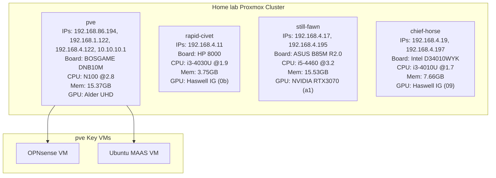
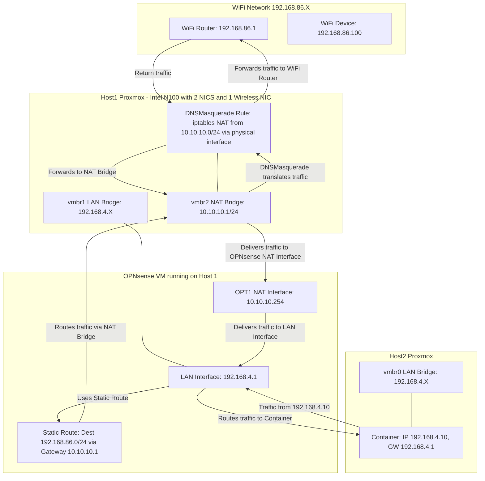

# Why

It happened sooner than I thought it would. My ["production"
mini-pc](https://www.aliexpress.com/i/3256806126703296.html?gatewayAdapt=4itemAdapt)
croaked within 6 months of "production" use. RIP.

I _thought_ I had documented the steps but apparently not.

So reinstalling my "production" homelab server from scratch. This document is to
help me recreate it in the event of the inevitable end of my current server. The
eventual goal is to have the ability to recreate it completely with code. For
now, documenting the manual steps.

## Hardware

[BOSGAME Linux Mini PC Dual LAN Intel Alder Lake N100 16 GB RAM 500 GB
SSD](https://a.co/d/cklfbpM) - I was impressed by the price/performance of Intel
N100 and hence went with the same model. Did not use more than 2 ports so picked
a model with 2 LAN ports. Picked one with a fan since I assumed that the G48S
mini-pc went kaput because there was only static cooling.

### Cluster Hardware

This are the nodes on the cluster:

| Node       | IPs                                     | Model         | CPU         | Mem  | GPU                 |
|------------|-----------------------------------------|---------------|-------------|------|---------------------|
| rapid-civet| 192.168.4.11                            | HP 260 G1 DM   | i3-4030U@1.9|3.75  | Haswell IG (0b)     |
| still-fawn | 192.168.4.17,192.168.4.195              | ASUS B85M-G R2.0     | i5-4460@3.2 |15.53 | NVIDIA RTX3070 (a1) |
| chief-horse| 192.168.4.19,192.168.4.197              | Intel NUC D34010WYK | i3-4010U@1.7|7.66  | Haswell IG (09)     |
| pve        | 192.168.86.194,192.168.1.122,192.168.4.122,10.10.10.1 | BOSGAME DNB10M | N100@2.8   |15.37 | Alder UHD |

## Install Proxmox server

1. Download proxmox iso from <https://www.proxmox.com/en/downloads>
1. Write to USB (I used [Balena Etcher](https://etcher.balena.io/))
1. Install Proxmox on the mini-pc
    1. I plugged in my "WAN" port connected to my home router only. This way I
       can access Proxmox via my laptop. Also there would be no confusion on
       proxmox which is the management interface.
1. Use [ProxmoxVE
   Helper-Scripts](https://github.com/community-scripts/ProxmoxVE) to run
   [Proxmox VE Post
   Install](https://community-scripts.github.io/ProxmoxVE/scripts?id=post-pve-install)
    1. RIP [Tteck](https://ko-fi.com/proxmoxhelperscripts) you were gone too
       soon. Your work lives on.

## Setup Opnsense VM

Following combined instructions from:

1. <https://homenetworkguy.com/how-to/virtualize-opnsense-on-proxmox-as-your-primary-router/>
1. <https://homenetworkguy.com/how-to/virtualize-opnsense-on-proxmox-as-your-primary-router/>
1. <https://kb.protectli.com/kb/opnsense-on-proxmox-ve/>

### Download and pre-setup

Mainly from <https://kb.protectli.com/kb/opnsense-on-proxmox-ve/> as it is
simpler so far:

1. Download [Opnsense installer](https://opnsense.org/download/) - I chose the
   DVD option.
1. Add comment 'WAN' for existing Linux bridge `vmbr0` with the network device
   (enp1s0)

  > Note: Any changes that you do are not applied till you hit `Apply
  > configuration`. Learnt it the hard way.

1. Add `LAN` Linux Bridge `vmbr1` with the network device (enp2s0)
1. Add `WIFI` Linux Bridge `vmbr2` with the network device (wlp0s20f3).

  > Note that this highly discouraged by almost all folks due to unreliability
  > of WIFI compared to LAN. I want to connect my home network devices (cameras,
  > plugs) to machines in Proxmox cluster so doing it anyway.

### Setup OPNsense

1. Expand the OPNsense-25.1-dvd-amd64.iso.bz2 file to get the ISO file. On my
   mac, the default archive expander didn't work. `Stuffit Expander` worked for
   the *.bz2 file.
1. Upload the ISO file by clicking on the `local(pve)-> ISO Images`.
1. Then click on `Create VM` on top.
    1. Type `OPNsense` for VM name
    1. Choose `Start at boot`
    1. In OS:
        1. For `ISO image` choose the ISO image you uploaded.
        1. In Guest OS switch to `Other` from Linux. OPNsense is BSD based OS
           not Linux
    1. Leave the defaults for `System`
    1. In `Disks` choose `VirtIO Block` (apparently for better performance). I
       left the `32 GB` as is.
    1. In `CPU` left the defaults as is
    1. In `Memory` choose `4096` [4GB RAM]
    1. In `Network` choose the default bridge `vmbr0` and change `Model` to
       `VirtIO`
    1. Click on `Finish`
1. Add the `LAN` device in `Hardware->Add->Network Device`. Choose `vmbr1` and
   `VirtIO`

### Start and Configure OPNSense

1. Start the VM
1. Remember to plug the `LAN` network cable into the server
1. Change the `LAN` network interface to `192.168.4.1/24` via command line
1. Connect your laptop to the `LAN` network switch via Ethernet and use static
   IP in `192.168.4.23`
1. Opnsense webgui should be available at `192.168.4.1`
1. Go through the wizard and set the time zone

## Setup Canonical/Ubuntu MAAS VM

[Canonical or Ubuntu MAAS](https://maas.io/) is great way to manage your home
lab server installs.

> Self-service, remote installation of Windows, CentOS, ESXi and Ubuntu on real
> servers turns your data centre into a bare metal cloud.

Install Ubuntu MAAS as a VM and make it the DHCP and TFTP server. Initial
attempt to set OPNSense as the external DHCP server, didn't work.

### Install Ubuntu server

1. Download Ubuntu server ISO - <https://ubuntu.com/download/server>
1. Create VM with `Linux OS`. The
   [requirements](https://maas.io/docs/reference-installation-requirements) are
   small. I used the following settings:
   1. Memory: 4096
   1. Storage: 100GB
1. Go through the install:
   1. Since the underlying storage is ZFS no need to set it up with ZFS as the
      boot fs.
   1. Enable `openssh-server`
   1. Choose `lxd` as a package to be installed.

### Install MAAS

1. Follow [instructions](https://maas.io/docs/how-to-manage-your-maas-workflow)
   for installing MAAS
1. Remember to use static IPs for MAAS and OPNSense

## Build the custom proxmox boot image

Need to build a custom image so that proxmox cluster is installed.

### Install the dependencies on the MAAS machine

1. `git clone https://github.com/canonical/packer-maas.git`
1. `packer` from
   <https://developer.hashicorp.com/packer/tutorials/docker-get-started/get-started-install-cli>

   1. `curl -fsSL https://apt.releases.hashicorp.com/gpg | apt-key add -`
   1. `apt install -y lsb-release software-properties-common`
   1. `apt-add-repository "deb [arch=amd64] https://apt.releases.hashicorp.com
      $(lsb_release -cs) main"`
   1. `apt-get update && apt-get install packer`

1. Other dependencies:
    1. `apt install -y qemu-utils libnbd-bin nbdkit fuse2fs qemu-system ovmf
       cloud-image-utils`
    1. It got upset with one or some of the above packages.
    1. Run `apt install -y libnbd-bin nbdkit fuse2fs  ovmf cloud-image-utils`

1. Since KVM is not installed on the Ubuntu MAAS, switching to building the
   image on the proxmox host itself
1. Build the image
   1. Create the [my-changes.sh](my-changes.sh) file in the `debian` directory
   1. it seemed that it ran out of disk space. Increased in deb*.pkr.hcl from
      4gb to 16GB
   1. You have to reboot (technically only restart maas service) in order for
      the new image to be picked up
1. Ran into "No MBR magic issue. "
   <https://discourse.maas.io/t/no-mbr-magic-treating-disk-as-raw/7675/5>
1. Ran into the no ga22*/debian image also. Had to reboot MAAS to get it
   working. <https://bugs.launchpad.net/maas/+bug/2046557>

## Adguard plugin setup within OPNSense along with Upbound DNS

1. Follow instructions in
   https://windgate.net/setup-adguard-home-opnsense-adblocker/

## Adding the wifi interface

Follow instructions plus turn on the interface [enable wifi
interface](enable_network_interface.jpg)

## Network diagram to enable WiFi device access on all Proxmox VMs and LXC

This network diagram shows how other Proxmox cluster hosts can access
the Wifi network.

## Guides

- [Frigate VA-API Acceleration](./guides/frigate-vaapi-acceleration.md)
- [MA90 packer-MAAS build](./guides/packer-maas-ma90.md)
