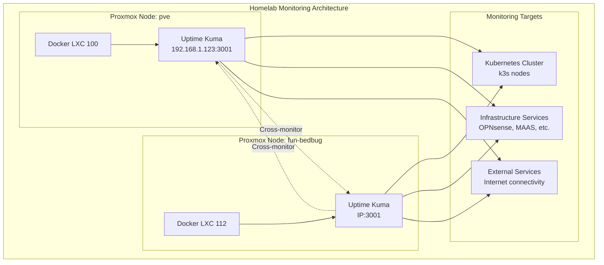
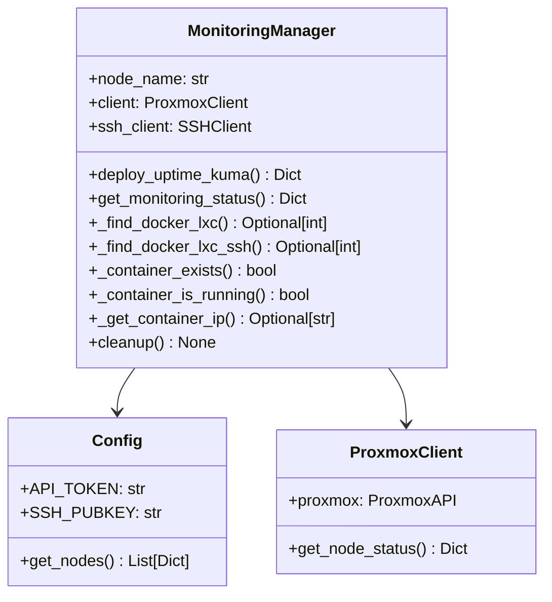
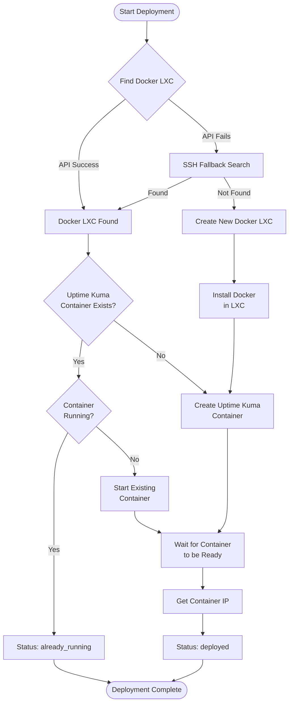

# Uptime Kuma Monitoring Infrastructure Guide

This guide documents the declarative deployment of Uptime Kuma monitoring infrastructure across the homelab using the MonitoringManager class.

## Overview

The homelab uses a redundant Uptime Kuma deployment across multiple Proxmox nodes to provide monitoring capabilities for the entire infrastructure. The deployment is fully automated and idempotent using Infrastructure as Code principles.

## Architecture



## MonitoringManager Class

The `MonitoringManager` class provides declarative, idempotent deployment of Uptime Kuma instances:



## Deployment Flow



## Prerequisites

### Network Connectivity Requirements

**IMPORTANT**: The MonitoringManager requires network connectivity to the homelab infrastructure:

1. **Network Connection**: Your machine must be connected to the homelab network (192.168.4.x subnet)
2. **Node Accessibility**: Must be able to reach Proxmox nodes via SSH:
   - `ssh root@pve.maas`
   - `ssh root@fun-bedbug.maas`
3. **DNS Resolution**: Nodes should resolve via `.maas` domain

### Verify Prerequisites

```bash
# Check network connectivity
ping pve.maas
ping fun-bedbug.maas

# Verify SSH access
ssh root@pve.maas "hostname"
ssh root@fun-bedbug.maas "hostname"

# Check your IP is in homelab range
ifconfig | grep "192.168.4"
```

### Alternative Deployment (No Network Access)

If you cannot connect to the homelab network directly, use the standalone deployment script:

```bash
# Copy script to each Proxmox node
scp proxmox/homelab/scripts/deploy_uptime_kuma.sh root@pve.maas:/tmp/
scp proxmox/homelab/scripts/deploy_uptime_kuma.sh root@fun-bedbug.maas:/tmp/

# Run on each node
ssh root@pve.maas "/tmp/deploy_uptime_kuma.sh 100"
ssh root@fun-bedbug.maas "/tmp/deploy_uptime_kuma.sh 112"
```

## Configuration

### Node Configuration (.env)

```bash
# Primary Monitoring Nodes
NODE_1=pve
STORAGE_1=local-zfs
IMG_STORAGE_1=local-zfs
CPU_RATIO_1=0.7
MEMORY_RATIO_1=0.7

NODE_2=fun-bedbug
STORAGE_2=local-zfs
IMG_STORAGE_2=local-zfs
CPU_RATIO_2=0.6
MEMORY_RATIO_2=0.6

# API Authentication
API_TOKEN=root@pam!provision-manage-vms=<token-secret>
```

### Uptime Kuma Container Configuration

```python
UPTIME_KUMA_CONFIG = {
    "image": "louislam/uptime-kuma:1",           # Latest stable version
    "name": "uptime-kuma",
    "port": 3001,
    "volume": "uptime-kuma-data",               # External storage for config
    "restart_policy": "unless-stopped",
    "healthcheck_path": "/",
    "memory_limit": "512m",
}
```

## Deployment Commands

### Deploy to Docker Nodes

```python
from homelab.monitoring_manager import deploy_monitoring_to_docker_nodes

# Deploy to both pve and fun-bedbug
results = deploy_monitoring_to_docker_nodes()
for result in results:
    print(f"{result['node']}: {result['status']} - {result.get('url', 'No URL')}")
```

### Deploy to All Configured Nodes

```python
from homelab.monitoring_manager import deploy_monitoring_to_all_nodes

# Deploy to all nodes in Config.get_nodes()
results = deploy_monitoring_to_all_nodes()
```

### Get Status from All Nodes

```python
from homelab.monitoring_manager import get_monitoring_status_all_nodes

statuses = get_monitoring_status_all_nodes()
for status in statuses:
    print(f"Node: {status['node']}")
    if status.get('uptime_kuma', {}).get('url'):
        print(f"  Uptime Kuma: {status['uptime_kuma']['url']}")
```

## Manual Deployment Steps

### 1. Run MonitoringManager Script

```bash
cd proxmox/homelab
poetry run python src/homelab/monitoring_manager.py
```

### 2. Verify Deployments

- **pve**: http://192.168.1.123:3001
- **fun-bedbug**: Check output for assigned IP

### 3. Configure Monitoring Targets

Access each Uptime Kuma instance and add monitors for:

#### Kubernetes Infrastructure
- **K3s API Server**: `https://kubernetes.default.svc:443`
- **Node Ready Status**: Custom HTTP check via k8s API
- **Pod Status**: Monitor critical pods in kube-system namespace
- **Ingress Controllers**: Traefik LoadBalancer health

#### Infrastructure Services
- **OPNsense**: Web interface and gateway connectivity
- **MAAS**: Node provisioning service
- **Proxmox Nodes**: Web interfaces and cluster status
- **Storage**: ZFS pool health checks

#### External Connectivity
- **Internet**: Ping to 8.8.8.8, 1.1.1.1
- **DNS**: Resolution checks for external domains
- **NTP**: Time synchronization checks

## SMTP Configuration

Configure email notifications in each Uptime Kuma instance:

### SMTP Settings
- **Host**: Your SMTP server
- **Port**: 587 (STARTTLS) or 465 (SSL)
- **Authentication**: Username/password
- **From Address**: monitoring@yourdomain.com

### Notification Rules
- **Critical**: Immediate notification for infrastructure failures
- **Warning**: 5-minute delay for transient issues
- **Recovery**: Immediate notification when services recover

## Advanced Configuration

### Cross-Monitor Setup

Configure each Uptime Kuma instance to monitor the other:
- pve monitors fun-bedbug Uptime Kuma at `http://fun-bedbug-ip:3001`
- fun-bedbug monitors pve Uptime Kuma at `http://192.168.1.123:3001`

### Alert Fatigue Prevention

1. **Staggered Notifications**: Use different delay intervals
2. **Dependency Mapping**: Don't alert on downstream services if upstream fails
3. **Maintenance Windows**: Schedule downtime for planned maintenance

### High Availability

- **Redundant Deployments**: Running on both pve and fun-bedbug
- **Persistent Storage**: Configuration stored in Docker volumes
- **Auto-restart**: Containers restart automatically on failure
- **Network Resilience**: Each instance can monitor independently

## Automation and GitOps Integration

### Automated Monitoring Setup

Future enhancement: Automatically configure monitors via API:

```python
# Planned feature: MonitoringManager.configure_k8s_monitors()
def configure_k8s_monitors(uptime_kuma_url: str, api_key: str):
    """Configure Kubernetes monitoring checks automatically."""
    monitors = [
        {"name": "K3s API Server", "url": "https://kubernetes.default.svc:443"},
        {"name": "Traefik Ingress", "url": "http://traefik.kube-system:80/ping"},
        # Additional monitors...
    ]
    # Implementation via Uptime Kuma API
```

### GitOps Integration

The MonitoringManager integrates with the existing GitOps workflow:
- Configuration changes committed to repository
- Automated deployment via MonitoringManager
- Infrastructure as Code principles maintained

## Troubleshooting

### Common Issues

1. **SSH Connection Failed**
   - Verify `.maas` domain resolution
   - Check SSH key permissions
   - Confirm root access enabled

2. **Docker LXC Not Found**
   - Verify LXC container is running
   - Check Docker installation in container
   - Review hostname configuration

3. **Container Creation Failed**
   - Check Docker daemon status in LXC
   - Verify network connectivity
   - Review Docker logs

### Diagnostic Commands

```bash
# Check Docker LXC status
ssh root@pve.maas "pct list"
ssh root@fun-bedbug.maas "pct list"

# Verify Docker in LXC
ssh root@pve.maas "pct exec 100 -- docker ps"
ssh root@fun-bedbug.maas "pct exec 112 -- docker ps"

# Check Uptime Kuma logs
ssh root@pve.maas "pct exec 100 -- docker logs uptime-kuma"
```

## Next Steps

### 1. SMTP Configuration (Manual)

Access each Uptime Kuma instance and configure email notifications:

1. Navigate to Settings → Notifications
2. Add SMTP notification method:
   - **Type**: SMTP
   - **Host**: Your SMTP server
   - **Port**: 587 (STARTTLS) or 465 (SSL/TLS)
   - **Security**: STARTTLS or SSL/TLS
   - **Username**: Your email username
   - **Password**: Your email password
   - **From**: monitoring@yourdomain.com
   - **To**: admin@yourdomain.com

### 2. Kubernetes Monitoring Automation (Code Implementation)

The following monitors should be implemented via MonitoringManager API integration:

#### Kubernetes API Health
```python
def configure_k8s_api_monitors(uptime_kuma_url: str, api_key: str):
    """Configure Kubernetes API server monitoring."""
    monitors = [
        {
            "name": "K8s API Server - pve",
            "type": "http",
            "url": "https://192.168.4.122:6443/healthz",
            "method": "GET",
            "interval": 60,
            "headers": {"Authorization": "Bearer <k8s-token>"}
        },
        {
            "name": "K8s API Server - still-fawn", 
            "type": "http",
            "url": "https://192.168.4.17:6443/healthz",
            "method": "GET",
            "interval": 60,
            "headers": {"Authorization": "Bearer <k8s-token>"}
        }
    ]
    # Implementation via Uptime Kuma API
```

#### Node Ready Status
```python
def configure_node_ready_monitors(uptime_kuma_url: str, api_key: str):
    """Monitor k3s node ready status."""
    k8s_nodes = ["k3s-vm-pve", "k3s-vm-still-fawn", "k3s-vm-chief-horse"]
    
    for node in k8s_nodes:
        monitor = {
            "name": f"K8s Node Ready - {node}",
            "type": "kubernetes",
            "kubeconfig": "/path/to/kubeconfig",
            "resource": f"nodes/{node}",
            "condition": "Ready",
            "interval": 300,  # 5 minutes
            "timeout": 30
        }
        # Create monitor via API
```

#### Critical Pod Monitoring
```python
def configure_critical_pod_monitors(uptime_kuma_url: str, api_key: str):
    """Monitor critical Kubernetes pods."""
    critical_pods = [
        {"namespace": "kube-system", "app": "traefik"},
        {"namespace": "kube-system", "app": "coredns"},
        {"namespace": "metallb-system", "app": "metallb"},
        {"namespace": "flux-system", "app": "flux"},
        {"namespace": "monitoring", "app": "prometheus"},
        {"namespace": "monitoring", "app": "grafana"}
    ]
    
    for pod_config in critical_pods:
        monitor = {
            "name": f"Pod Health - {pod_config['app']}",
            "type": "kubernetes",
            "kubeconfig": "/path/to/kubeconfig", 
            "namespace": pod_config["namespace"],
            "selector": f"app={pod_config['app']}",
            "min_ready_pods": 1,
            "interval": 180,
            "timeout": 30
        }
        # Create monitor via API
```

#### Service Endpoint Monitoring
```python
def configure_service_monitors(uptime_kuma_url: str, api_key: str):
    """Monitor critical service endpoints."""
    services = [
        {"name": "Traefik Dashboard", "url": "http://traefik.homelab/dashboard/"},
        {"name": "Grafana", "url": "http://grafana.homelab/api/health"},
        {"name": "Prometheus", "url": "http://prometheus.homelab/-/healthy"},
        {"name": "Ollama GPU Server", "url": "http://ollama.homelab/api/tags"},
        {"name": "Stable Diffusion", "url": "http://stable-diffusion.homelab"},
    ]
    
    for service in services:
        monitor = {
            "name": service["name"],
            "type": "http",
            "url": service["url"],
            "method": "GET",
            "interval": 120,
            "timeout": 30,
            "expected_status": [200, 301, 302]
        }
        # Create monitor via API
```

### 3. Enhanced MonitoringManager Implementation

Add to `monitoring_manager.py`:

```python
def configure_automated_monitors(self, uptime_kuma_url: str, api_key: str) -> Dict[str, Any]:
    """Configure all automated monitoring checks."""
    results = {
        "k8s_api": self._configure_k8s_api_monitors(uptime_kuma_url, api_key),
        "k8s_nodes": self._configure_node_ready_monitors(uptime_kuma_url, api_key),
        "k8s_pods": self._configure_critical_pod_monitors(uptime_kuma_url, api_key),
        "services": self._configure_service_monitors(uptime_kuma_url, api_key),
        "infrastructure": self._configure_infrastructure_monitors(uptime_kuma_url, api_key)
    }
    return results

def _configure_infrastructure_monitors(self, uptime_kuma_url: str, api_key: str) -> List[Dict]:
    """Configure infrastructure monitoring (non-k8s)."""
    infrastructure_monitors = [
        {"name": "OPNsense Gateway", "url": "https://192.168.4.1", "type": "ping"},
        {"name": "MAAS Server", "url": "http://192.168.4.2:5240/MAAS/", "type": "http"},
        {"name": "Proxmox pve", "url": "https://192.168.4.122:8006", "type": "ping"},
        {"name": "Proxmox still-fawn", "url": "https://192.168.4.17:8006", "type": "ping"},
        {"name": "Internet Connectivity", "hostname": "8.8.8.8", "type": "ping"},
        {"name": "DNS Resolution", "hostname": "google.com", "type": "dns"}
    ]
    
    # Implementation details...
    return infrastructure_monitors
```

### 4. Deployment Automation

Create deployment script that combines infrastructure and monitoring setup:

```bash
#!/bin/bash
# deploy_complete_monitoring.sh

echo "🚀 Complete Monitoring Infrastructure Deployment"

# 1. Deploy Uptime Kuma containers
./deploy_uptime_kuma.sh 100  # pve
./deploy_uptime_kuma.sh 112  # fun-bedbug

# 2. Configure automated monitors
python -c "
from homelab.monitoring_manager import MonitoringManager
from homelab.config import Config

for node_config in [{'name': 'pve'}, {'name': 'fun-bedbug'}]:
    with MonitoringManager(node_config['name']) as manager:
        # Get Uptime Kuma URL
        status = manager.get_monitoring_status()
        if status.get('uptime_kuma', {}).get('url'):
            uk_url = status['uptime_kuma']['url']
            print(f'Configuring monitors for {uk_url}')
            # Configure automated monitors
            # manager.configure_automated_monitors(uk_url, api_key)
"

echo "✅ Monitoring deployment complete"
echo "📝 Manual steps remaining:"
echo "   1. Configure SMTP in each Uptime Kuma instance"
echo "   2. Set up admin accounts and API keys"
echo "   3. Test alert notifications"
```

### 5. Integration with Existing Monitoring

- **AlertManager Integration**: Forward Prometheus alerts to Uptime Kuma
- **Grafana Integration**: Create Uptime Kuma dashboard panels
- **Log Aggregation**: Monitor log patterns for anomalies
- **Performance Metrics**: Track response times and availability trends

### 6. Backup and Recovery

- **Configuration Backup**: Automated backup of Uptime Kuma configurations
- **Database Export**: Regular exports of monitoring data
- **Recovery Procedures**: Documented recovery steps for node failures
- **High Availability**: Cross-node monitoring and failover procedures

## Security Considerations

- **Network Isolation**: Uptime Kuma runs in isolated LXC containers
- **Authentication**: Web interface requires login credentials
- **API Security**: Token-based API access for automation
- **Data Protection**: Monitoring data stored in persistent volumes
- **Access Control**: SSH key-based authentication for management

This guide provides a comprehensive foundation for monitoring infrastructure management in the homelab environment.