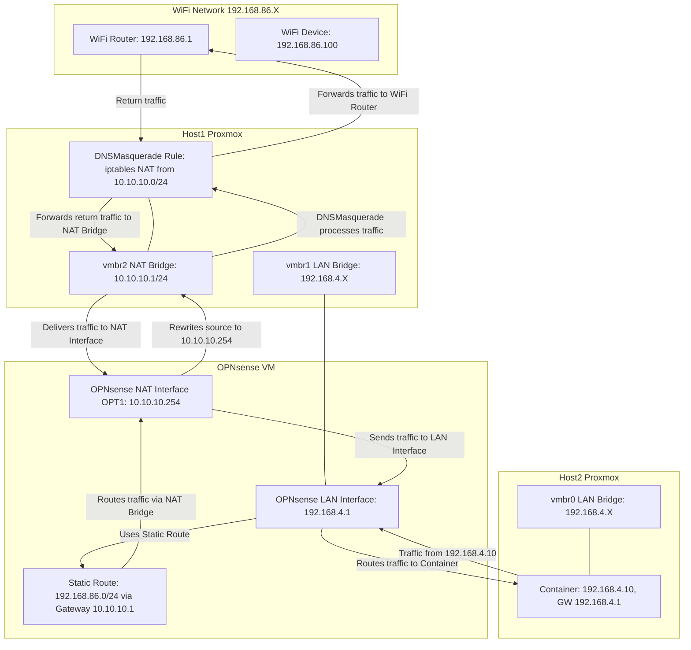

# Proxmox & OPNsense NAT Routing Setup

This guide explains how to configure a Proxmox cluster with two hosts and an OPNsense VM (running on Host 1) so that containers on Host 2 (and Host 1) using the LAN network (192.168.4.X) can reach devices on your Wi‑Fi network (192.168.86.X). The configuration uses three bridges on Host 1 and one bridge on Host 2, plus a static route and NAT configuration.

> **Note:** In this setup, the NAT for Wi‑Fi–bound traffic is handled by the Proxmox Host 1 using a dedicated NAT bridge (vmbr2) in the 10.10.10.0/24 network. OPNsense is configured with:
>
> - WAN interface on vmbr0 (192.168.1.X) – not used for Wi‑Fi routing
> - LAN interface on vmbr1 with a static IP of 192.168.4.1 (default gateway for LAN devices)
> - NAT interface (OPT1) on vmbr2 with a static IP of 10.10.10.254
> A static route directs traffic destined for the Wi‑Fi network (192.168.86.0/24) via gateway 10.10.10.1 (the IP on vmbr2 of Host 1).

---

## Table of Contents

1. [Prerequisites](#prerequisites)
2. [Network Topology](#network-topology)
3. [Step 1: Configure wlan0 on Host 1 via DHCP](#step-1-configure-wlan0-on-host1-via-dhcp)
4. [Step 2: Configure Proxmox Host 1 Bridges](#step-2-configure-proxmox-host1-bridges)
5. [Step 3: Set Up NAT on Host 1](#step-3-set-up-nat-on-host1)
6. [Step 4: Configure the OPNsense VM on Host 1](#step-4-configure-the-opnsense-vm-on-host1)
   - [4.1 Create OPNsense VM with Required Interfaces](#41-create-opnsense-vm-with-required-interfaces)
   - [4.2 Configure the NAT Interface in OPNsense](#42-configure-the-nat-interface-in-opnsense)
   - [4.3 Add a Static Route in OPNsense](#43-add-a-static-route-in-opnsense)
7. [Step 5: Configure a Container on Host 2](#step-5-configure-a-container-on-host2)
8. [Step 6: Test End-to-End Connectivity](#step-6-test-end-to-end-connectivity)
9. [Conclusion](#conclusion)

---

## Prerequisites

- Proxmox VE installed on two hosts (Host 1 and Host 2).
- OPNsense VM installed on Host 1.
- The following network configuration on Host 1:
  - **wlan0**: Wi‑Fi interface, configured via DHCP (example IP: 192.168.86.194).
  - **vmbr0**: WAN Bridge, connected to the 192.168.1.X network.
  - **vmbr1**: LAN Bridge, connected to the 192.168.4.X network.
  - **vmbr2**: NAT Bridge, configured with a static IP of 10.10.10.1/24.
- Host 2 uses a LAN bridge (vmbr0) connected to the 192.168.4.X network.

---

## Network Topology

- **Wi‑Fi Network (192.168.86.X):**
  - Wi‑Fi Router: 192.168.86.1
  - Wi‑Fi Devices: e.g., 192.168.86.100

- **Host 1 (Proxmox):**
  - **wlan0:** Wi‑Fi interface (DHCP, e.g., 192.168.86.194).
  - **vmbr0 (WAN):** 192.168.1.X (used by OPNsense WAN; not involved in Wi‑Fi NAT).
  - **vmbr1 (LAN):** 192.168.4.X (provides LAN for OPNsense).
  - **vmbr2 (NAT):** 10.10.10.1/24 (used for NAT translation).
  - **OPNsense VM:**
    - **WAN Interface:** Attached to vmbr0.
    - **LAN Interface:** Attached to vmbr1, statically set to 192.168.4.1.
    - **NAT Interface (OPT1):** Attached to vmbr2, statically set to 10.10.10.254.
    - **Static Route:** Destination 192.168.86.0/24 via gateway 10.10.10.1.
- **Host 2 (Proxmox):**
  - **vmbr0 (LAN):** Connected to the 192.168.4.X network.
  - **Container:** Assigned IP 192.168.4.10 with default gateway 192.168.4.1.

---

## Network Topology Diagram



---

**Traffic Flow Summary:**

1. A container on Host 2 sends traffic (source 192.168.4.10) destined for the Wi‑Fi network (e.g., 192.168.86.1).
2. Traffic is routed to OPNsense via its LAN interface (192.168.4.1).
3. OPNsense uses the static route to forward this traffic to the NAT bridge (gateway 10.10.10.1).
4. The underlying DNSMasquerade on Host 1 (vmbr2) masquerades the traffic, so it appears with the NAT IP.
5. Traffic exits Host 1 via the physical path to the Wi‑Fi network, reaches the Wi‑Fi Router (192.168.86.1), and return traffic follows the reverse path.

---

## Step 1: Configure wlan0 on Host 1 via DHCP

1. **Edit Network Configuration on Host 1:**
   - Ensure that the wlan0 interface is set to obtain its IP via DHCP. This is typically configured in `/etc/network/interfaces` or via your system’s network manager.
   - Example (if using `/etc/network/interfaces`):

     ```ini
     auto wlan0
     iface wlan0 inet dhcp
     ```

2. **Restart Networking or Reboot Host 1:**

   ```bash
   systemctl restart networking
   ```

3. **Verify wlan0 IP:**

   ```bash
   ip addr show wlan0
   ```

   - You should see an IP in the 192.168.86.X range (e.g., 192.168.86.194).

---

## Step 2: Configure Proxmox Host 1 Bridges

1. **vmbr0 (WAN Bridge):**
   - Already set up and connected to the 192.168.1.X network.
2. **vmbr1 (LAN Bridge):**
   - Already set up and connected to the 192.168.4.X network.
3. **vmbr2 (NAT Bridge):**
   - Configure vmbr2 with a static IP:

     ```ini
     auto vmbr2
     iface vmbr2 inet static
         address 10.10.10.1/24
         bridge_ports none
         bridge_stp off
         bridge_fd 0
     ```

4. **Verify vmbr2:**

   ```bash
   ip addr show vmbr2
   ```

   - Confirm it shows `10.10.10.1/24`.

---

## Step 3: Set Up NAT on Host 1

1. **Enable IP Forwarding:**

   ```bash
   echo "net.ipv4.ip_forward=1" >> /etc/sysctl.conf
   sysctl -p
   ```

2. **Add the NAT (Masquerade) Rule:**

   ```bash
   iptables -t nat -A POSTROUTING -s 10.10.10.0/24 -o wlan0 -j MASQUERADE
   ```

3. **Verify NAT Rule:**

   ```bash
   iptables -t nat -L POSTROUTING -n -v
   ```

   - You should see a MASQUERADE rule for 10.10.10.0/24 out via wlan0.

---

## Step 4: Configure the OPNsense VM on Host 1

### 4.1 Create the OPNsense VM and Assign Interfaces

1. **Install OPNsense VM on Host 1** (if not already installed).
2. **Configure OPNsense Interfaces in Proxmox:**
   - **WAN Interface:** Attached to vmbr0 (192.168.1.X).
   - **LAN Interface:** Attached to vmbr1; assign a static IP of 192.168.4.1.
   - **NAT Interface:**
     - Shut down OPNsense, then in the Proxmox web GUI, add a new network device to OPNsense attached to vmbr2.
     - Start OPNsense.

### 4.2 Configure the NAT Interface in OPNsense

1. **Log in to the OPNsense Web GUI** at <https://192.168.4.1>.
2. **Navigate to Interfaces > Assignments:**
   - You should see the new interface (e.g., OPT1). Click the plus sign to add it.
   - Optionally, rename it to "NAT".
3. **Configure the NAT Interface (OPT1):**
   - Enable the interface.
   - Set IPv4 Configuration Type to Static.
   - Assign the IP address **10.10.10.254/24**.
   - Save and Apply Changes.
4. **Verify:**
   - Go to **Interfaces > Overview** and confirm that OPT1 is active with IP 10.10.10.254.

### 4.3 Configure the Static Route in OPNsense

1. **Navigate to System > Routing > Static Routes.**
2. **Add a New Static Route:**
   - **Destination Network:** 192.168.86.0/24
   - **Gateway:** 10.10.10.1 (vmbr2 IP on Host 1)
   - Add a description if desired (e.g., "Route for WiFi network").
   - Save and Apply Changes.
3. **Verify:**
   - Check **Interfaces > Diagnostics > Routes** to confirm the static route is present.
   - Use **Diagnostics > Ping** from OPNsense, select the NAT interface (OPT1) as the source, and ping 192.168.86.1. You should receive replies.

---

## Step 5: Configure a Container on Host 2

1. **Create an LXC Container on Host 2:**
   - In the Proxmox web GUI on Host 2, click **Create CT**.
   - Follow the wizard and select Host 2.
2. **Configure the Container’s Network:**
   - Attach the container's network interface to Host2’s vmbr0.
   - Set a static IP in the 192.168.4.X range (e.g., 192.168.4.10).
   - Set the subnet mask to 255.255.255.0.
   - Set the default gateway to **192.168.4.1** (OPNsense).
   - Configure DNS as needed (e.g., 192.168.4.1 or public DNS).
3. **Finish and Start the Container.**
4. **Verify in the Container:**
   - Log in and run:

     ```bash
     ip addr show
     ip route
     ```

   - Confirm the container has IP 192.168.4.10 and a default route via 192.168.4.1.
5. **Test Local Connectivity:**
   - Ping OPNsense from the container:

     ```bash
     ping -c 4 192.168.4.1
     ```

---

## Step 6: Test End-to-End Connectivity

1. **From the Container on Host 2, Ping the WiFi Gateway:**

   ```bash
   ping -c 4 192.168.86.1
   ```

   - Expected: Replies from the WiFi Router (192.168.86.1).

2. **Ping a WiFi Device (if available):**

   ```bash
   ping -c 4 192.168.86.100
   ```

3. **Troubleshooting:**
   - If pings fail, use packet capture tools on OPNsense (Interfaces > Diagnostics > Packet Capture) to inspect traffic on the WAN interface.
   - Verify that packets from the container are being translated to a source IP of 10.10.10.254 (via the NAT path).
   - Confirm that the static route in OPNsense is correctly directing WiFi-bound traffic via gateway 10.10.10.1.

---

## Conclusion

If the container on Host 2 can successfully ping the WiFi gateway (192.168.86.1) and a WiFi device (e.g., 192.168.86.100), then the configuration is complete. This setup ensures that traffic from the 192.168.4.X network is routed via OPNsense with NAT performed on the 10.10.10.0/24 network and ultimately reaches the WiFi network.
