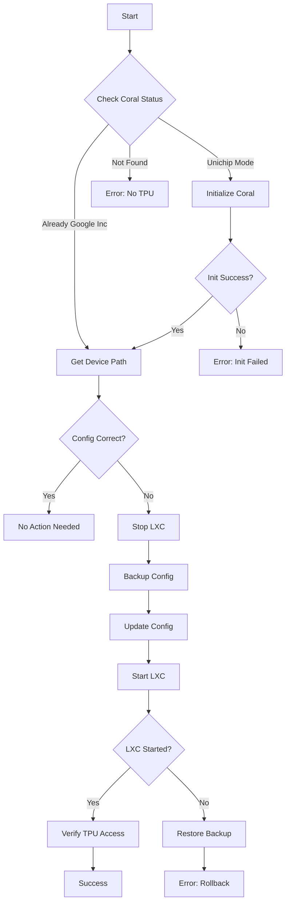

# Coral TPU Automated Initialization System

## Problem Statement
The Coral TPU USB device requires initialization after each system restart, involving:
1. Running a Python script to switch the device from "Unichip" to "Google Inc" mode
2. Finding the new USB device path
3. Updating the Frigate LXC configuration
4. Restarting the Frigate container

This automation solves this problem completely.

## Solution Architecture

### Components
1. **mock-coral-init.sh** - Main logic with full dry-run capability
2. **coral-tpu-init.sh** - Production wrapper with safety checks
3. **test-coral-automation.sh** - Test harness for validation
4. **coral-tpu-init.service** - Systemd service for boot automation
5. **deploy.sh** - Safe deployment script

### Key Features
- **Dry-run mode by default** - Nothing happens unless explicitly enabled
- **Parameterized configuration** - All paths and settings are configurable
- **Automatic backup** - LXC configs are backed up before changes
- **Comprehensive logging** - Full audit trail of all actions
- **Failure recovery** - Automatic rollback on errors
- **Test coverage** - Multiple test scenarios included
- **🔒 CRITICAL SAFETY**: Never runs initialization when Coral is already in Google mode (prevents breaking Frigate)

## Installation

### Prerequisites
```bash
# On fun-bedbug.maas:
cd /root/code
git clone https://github.com/google-coral/pycoral.git coral/pycoral
git clone https://github.com/google-coral/test_data.git test_data
pip3 install pycoral numpy
```

### Quick Deploy
```bash
# From your local machine
cd /Users/10381054/code/home/scripts/coral-tpu-automation
bash deploy.sh
```

### Manual Deploy
```bash
# Copy scripts to target
scp *.sh root@fun-bedbug.maas:/root/scripts/

# Make executable
ssh root@fun-bedbug.maas "chmod +x /root/scripts/*.sh"

# Test in dry-run mode
ssh root@fun-bedbug.maas "cd /root/scripts && DRY_RUN=true bash coral-tpu-init.sh"

# Install systemd service
scp coral-tpu-init.service root@fun-bedbug.maas:/etc/systemd/system/
ssh root@fun-bedbug.maas "systemctl daemon-reload && systemctl enable coral-tpu-init.service"
```

## Usage

### Manual Execution

#### Dry Run (Safe - Default)
```bash
cd /root/scripts
bash coral-tpu-init.sh
# or explicitly:
DRY_RUN=true bash coral-tpu-init.sh
```

#### Production Mode
```bash
cd /root/scripts
DRY_RUN=false bash coral-tpu-init.sh
```

### Automatic Execution
The systemd service runs automatically on boot:
```bash
systemctl status coral-tpu-init.service
journalctl -u coral-tpu-init.service -f
```

### Configuration Options
Environment variables control all behavior:

```bash
# Core settings
DRY_RUN=true                    # Set to false for production
DEBUG=true                       # Enable debug logging
LXC_ID=113                      # Frigate container ID

# Paths
CORAL_INIT_DIR=/root/code       # Where coral repos are cloned
BACKUP_DIR=/root/coral-backups  # Config backup location
LOG_FILE=/var/log/coral-tpu-init.log

# Commands
PYTHON_CMD=python3              # Python executable
```

## Testing

### Run Test Suite
```bash
bash test-coral-automation.sh
```

### Test Scenarios Covered
1. Coral already initialized (no action needed)
2. Coral needs initialization (Unichip → Google)
3. Device path changed (config update required)
4. Parameter validation
5. Failure recovery

### Manual Test Procedure
```bash
# 1. Check current state
lsusb | grep -E "Google|Unichip"
cat /etc/pve/lxc/113.conf | grep dev0

# 2. Run dry-run
DRY_RUN=true bash coral-tpu-init.sh

# 3. Review output carefully
# 4. If satisfied, run production
DRY_RUN=false bash coral-tpu-init.sh

# 5. Verify
pct exec 113 -- lsusb | grep Google
```

## Workflow Logic



## Monitoring

### Check Logs
```bash
# System journal
journalctl -u coral-tpu-init.service -n 50

# Application log
tail -f /var/log/coral-tpu-init.log

# LXC status
pct status 113
```

### Verify Operation
```bash
# Check if Coral is initialized
lsusb | grep "18d1:9302"

# Check inside container
pct exec 113 -- lsusb | grep Google

# Check Frigate is using TPU
pct exec 113 -- grep -i coral /etc/frigate/config.yml
```

## Critical Safety Features

### 🚨 Initialization Safety
The script includes critical safety checks to prevent breaking Frigate:

**NEVER runs initialization script when:**
- Coral is already in Google mode (`18d1:9302`)
- This would break Frigate's access to the TPU
- Only solution is reboot + manual config fix

**ONLY runs initialization when:**
- Coral is in Unichip mode (`1a6e:089a`)
- Safe to initialize without breaking existing connections

**Error Messages:**
```
SAFETY ABORT: Coral already in Google mode (18d1:9302)
Running initialization would break Frigate's access to TPU!
If you need to reinitialize, reboot first to reset device to Unichip mode
```

## Troubleshooting

### Common Issues

#### 1. Coral Not Detected
```bash
# Check USB connection
lsusb
dmesg | tail -20

# Try different USB port
# Avoid USB hubs
```

#### 2. Initialization Fails
```bash
# Check Python environment
python3 --version
pip3 list | grep pycoral

# Test manually
cd /root/code
python3 coral/pycoral/examples/classify_image.py \
  --model test_data/mobilenet_v2_1.0_224_inat_bird_quant_edgetpu.tflite \
  --labels test_data/inat_bird_labels.txt \
  --input test_data/parrot.jpg
```

#### 3. LXC Won't Start
```bash
# Check configuration
cat /etc/pve/lxc/113.conf | grep -E "dev0|usb"

# Restore backup
ls -la /root/coral-backups/
cp /root/coral-backups/lxc_113_<timestamp>.conf /etc/pve/lxc/113.conf
```

#### 4. Service Fails on Boot
```bash
# Check service status
systemctl status coral-tpu-init.service

# Check timing
# May need to adjust After= in service file
systemctl edit coral-tpu-init.service
```

## Maintenance

### Update Scripts
```bash
# Pull latest version
cd /Users/10381054/code/home/scripts/coral-tpu-automation
git pull

# Redeploy
bash deploy.sh
```

### Clean Up Backups
```bash
# Keep only last 5 backups (automatic)
# Or manually:
ls -t /root/coral-backups/*.conf | tail -n +6 | xargs rm
```

### Disable Automation
```bash
# Temporarily
systemctl stop coral-tpu-init.service
systemctl disable coral-tpu-init.service

# Permanently
systemctl disable --now coral-tpu-init.service
rm /etc/systemd/system/coral-tpu-init.service
systemctl daemon-reload
```

## Security Considerations

1. **Scripts run as root** - Required for LXC management
2. **Dry-run by default** - Prevents accidental changes
3. **Config backups** - Automatic before any changes
4. **Path validation** - Only updates known device paths
5. **Service isolation** - Runs once at boot, then exits

## Performance Impact

- Initialization: ~5-10 seconds
- Config update: < 1 second
- LXC restart: ~10-20 seconds
- Total boot delay: ~30 seconds maximum

## Future Enhancements

- [ ] Multiple TPU support
- [ ] Email notifications on failure
- [ ] Web UI for status monitoring
- [ ] Automatic fallback to CPU if TPU fails
- [ ] Integration with Proxmox API
- [ ] Docker container support

## Credits

Based on the original Coral TPU integration guide with automation enhancements for production use.